# 1 日目の復習 ＋ α

## ブラウザーの拡張機能

ブラウザーに拡張機能 Markdown Viewer をインストールすると、マークダウンファイルを良い感じで表示します。

### Google Chrome 用

<https://chrome.google.com/webstore/detail/markdown-viewer/ckkdlimhmcjmikdlpkmbgfkaikojcbjk?hl=ja>

### Microsoft Edge 用

<https://microsoftedge.microsoft.com/addons/detail/markdown-viewer/cgfmehpekedojlmjepoimbfcafopimdg>

## Excel の準備作業

### [開発] タブを表示する

<https://support.microsoft.com/ja-jp/office/-開発-タブを表示する-e1192344-5e56-4d45-931b-e5fd9bea2d45>

※注意※　バージョンにより表記に差異があります。

- 「リポンのカスタマイズ」は「リボンのユーザー設定」と表示されます

### マクロの実行を有効にする

<https://support.microsoft.com/ja-jp/office/microsoft-365-ファイルでマクロを有効または無効にする-12b036fd-d140-4e74-b45e-16fed1a7e5c6>

「マクロの設定」は「VBA マクロを有効にする（推奨しません。危険なコードが実行される可能性があります）」を選択します。

※注意※　バージョンにより表記に差異があります。

- 「セキュリティ センター」は「トランス センター」と表示されます
- 「セキュリテイ センターの設定」は「トラスト センターの設定」と表示されます

### VBA を含むファイルの拡張子

`.xlsm`　→　Excel マクロ有効ブック

## VBA

VBA （ Visual Basic for Applications ）は Excel などで行う「一連の作業」を自動化するためのプログラミング言語です。手作業で行うほとんどのことは VBA のコードに置き換え可能です。

作業には VBA に向いたもの、向かないものがあります。向いた作業を VBA に置き換えることで作業効率の向上を期待できます。しかし、向かない作業を VBA に置き換えても作業効率は上がらず、時には効率が低下します。作業を VBA に置き換える前に、その作業が VBA に向いたものかどうかの判断が必要です。

### 向いていること

- 複数のデータを同じ手順で繰り返し処理する作業
- 毎回同じ手順で処理する作業

### 向かないこと

- 1 回限りの作業
- 毎回、手順が異なる作業

## シート上にコマンドボタンを配置する

### 準備

1. Excel を起動し、空白のシートを開く

2. 拡張子 `.xlsm` で保存する

### コマンドボタンを配置

1. **開発** タブを開く

2. **挿入** をクリック　→　**Active X コントロール** 内の **コマンドボタン** をクリック

   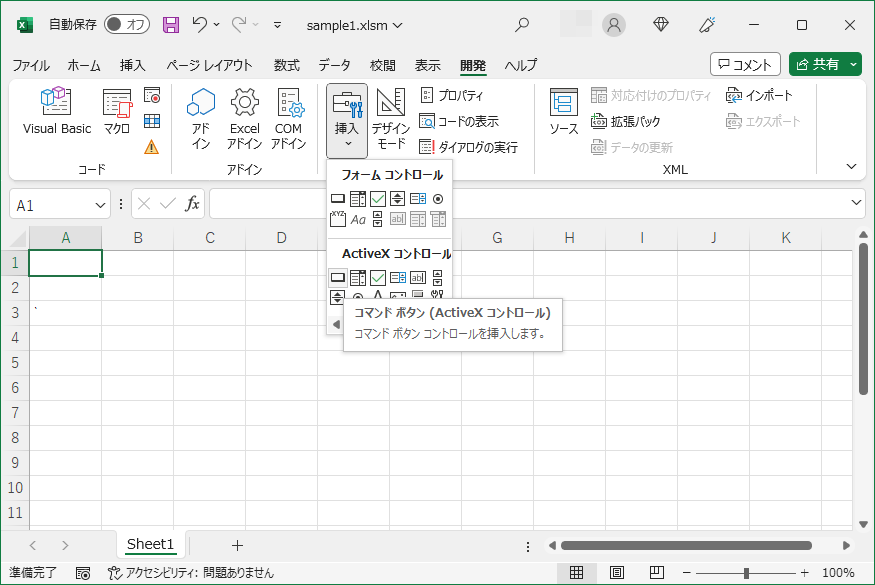

3. マウスカーソルが + に変わったらシート上に配置するボタンのサイズでドラッグ

   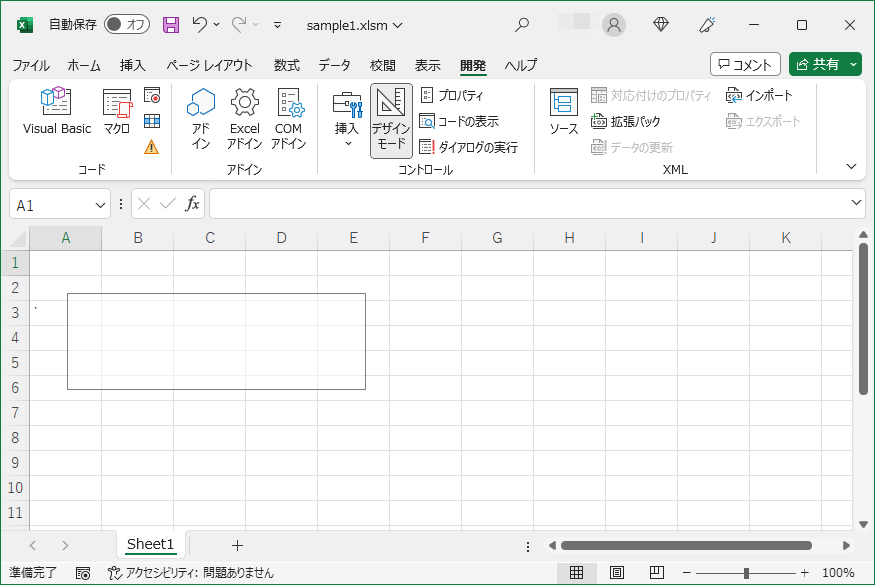

4. コマンドボタンの配置終了

   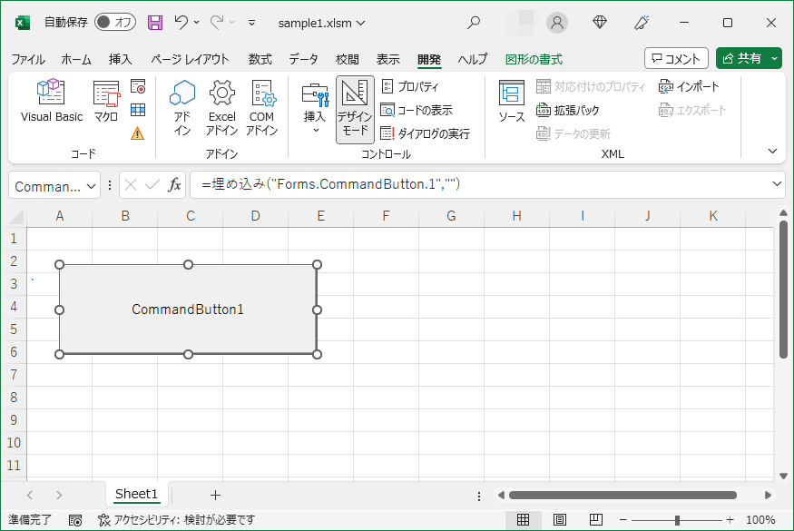

このコマンドボタンのようにシートに配置した部品のことを **オブジェクト** と呼びます。オブジェクト名はオブジェクトのプロパティで変更できます。

### 実行

1. **デザインモード** をクリック（デザインモードをオフ）

   下図のように **デザインモード** のアイコンが枠線に囲まれているときがオン状態です。**デザインモード** のアイコンをクリックするとオンとオフを切り替えられます。

   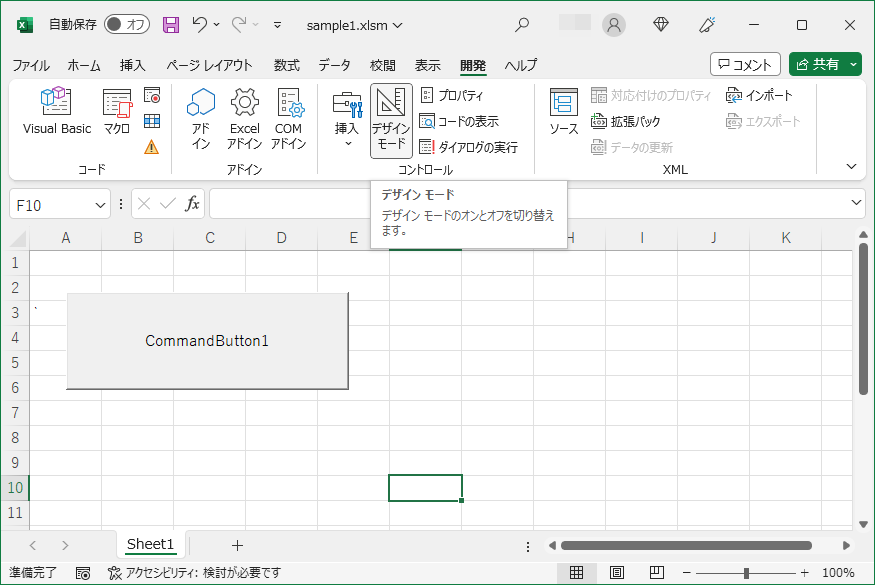

2. コマンドボタンをクリック

まだ VBA のコードを書いていないため、コマンドボタンをクリックしても何も変化しません。コマンドボタンがクリック可能なことを確認ください。

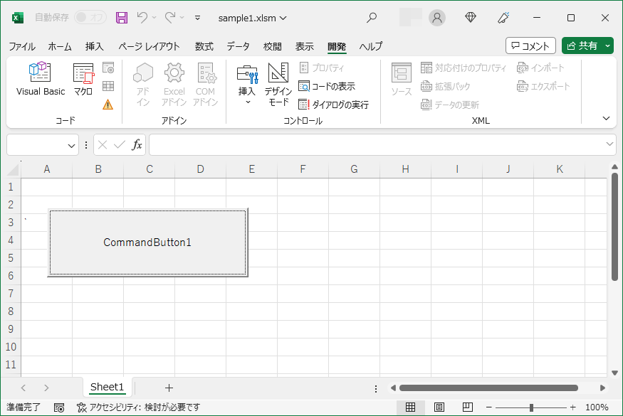

### コマンドボタンのカスタマイズ

#### 表示文字列を変更

デフォルトは「 CommandButton + 連番」です。 1 つ目のコマンドボタンは CommandButton1 、2 つ目は CommandButton2 になります。

1. **デザインモード** をオン

2. コマンドボタンを右クリック

3. **プロパティ** をクリック

   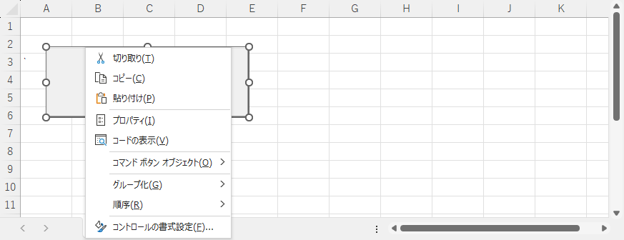

4. プロパティウインドを表示

   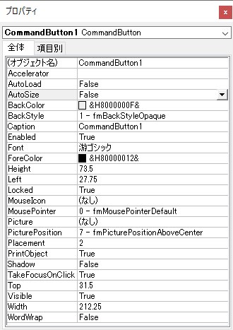

5. **Caption** と **Font** を変更（変更はコマンドボタンに直ぐに反映されます）

- Caption　→　ボタン上の文字列
- Font　→　文字のフォントやサイズ

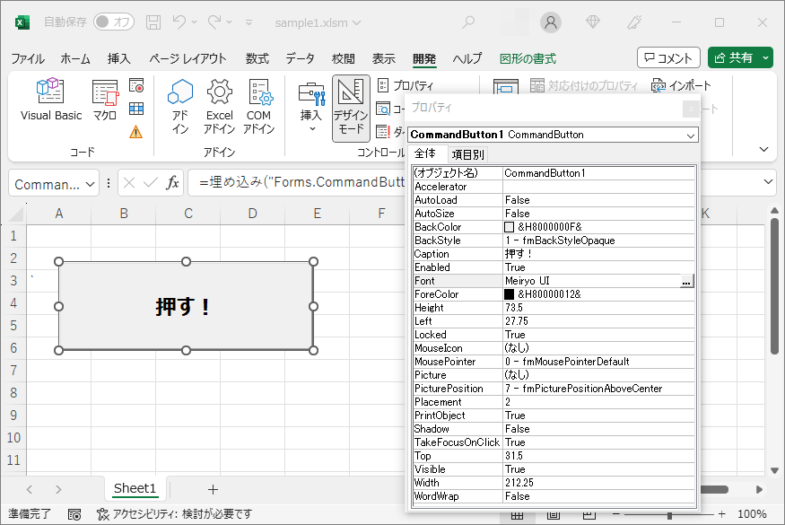

## VBA のコードを記述する

コマンドボタンをクリックしたとき、 2 つのセルの値を合計して別のセルに設定するコードを記述します。

### シートの準備

合計対象の値をセルに記入します。今回は F 列の値と G 列の値を合計し H 列に結果を設定します。

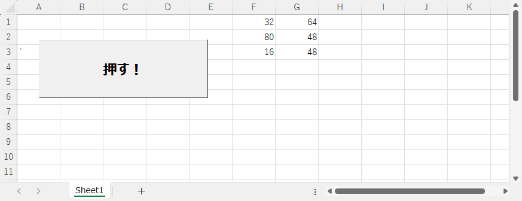

### コードの記述準備

1. **デザインモード** をオン

2. コマンドボタンを右クリック

3. **コードの表示** をクリック

   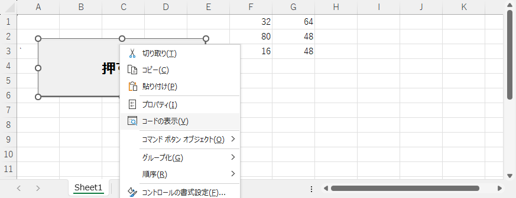

4. コードエディターを表示

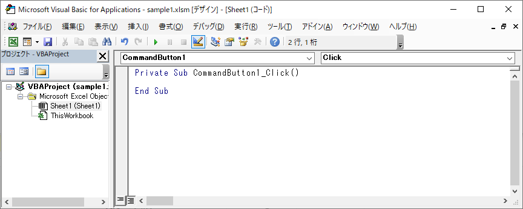

- 左側のペイン
  - シート名などの情報を表示する
  - Sheet1 (Sheet1) のカッコの中はシート名を表示している
    - シート名が abc の場合は SHeet1 (abc) になる
- 右側のペイン
  - VBA のコードを記述数r

左側のペインでシート Sheet1 が選択されているので、右側のペインはシート Sheet1 に含まれる VBA のコードを記述します。

### Sub ･･･ End Sub

#### 構文

```vb
Private Sub オブジェクト名_VBA のコードを実行するときのアクション(引数)

    VBA のコード

End Sub
```

- オブジェクト名
  - オブジェクトの名前
  - オブジェクトのプロパティの **(オブジェクト名)** で変更可能
- アクション
  - オブジェクトの動作
  - オブジェクトにこの動作が発生したときに VBA のコードを実行する
- 引数
  - VBA のコードの実行時に与えられる情報
  - 0 個以上の情報が与えられる
- VBA のコード
  - 実行する VBA のコード
  - `Sub` ･･･ `End Sub` の区切りをわかりやすくするため、インデント（字下げ）して記述する

オブジェクトの **コードの表示** で表示されるコードは、そのオブジェクトで一般的な動作の場合のものです。

#### 引数なしの例

オブジェクト CommandButoon1 がクリックされたときに VBA のコードを実行します。引数はありません。

```VB
Private Sub CommandButton1_Click()

    VBA のコード

End Sub
```

#### 引数ありの例

オブジェクト CommandButoon1 がダブルクリックされたときに VBA のコードを実行します。引数として変数 Cancel が指定されます。

```vb
Private Sub CommandButton1_DblClick(ByVal Cancel As MSForms.ReturnBoolean)

    VBA のコード

End Sub
```

引数部分のコードは VBA が自動生成します。

### セルを指定する


#### Cells

単一のセル位置を指定します。範囲指定は行えません。

```vb
Cells(行位置 , カラム位置)
```

カラム位置は "A" や "B" ではなく数字で指定します。

| カラム位置 | 指定する値 |
| :---: | :---: |
| A | 1 |
| B | 2 |
| C | 3 |

セル位置 C10 は次のように指定します。

```vb
Cells(10, 3)
```

#### Range

##### 単一のセル位置を指定する（単一指定）

```vb
Range(セル位置)
```

セル位置は "A1" などのように `"` でくくって指定します。

```vb
Range("A1")
```

##### 複数範囲のセル位置を指定する（範囲指定）

###### その 1

```vb
Range(開始セル位置:終了セル位置)
```

開始と終了のセル位置を `:` で繋げ、全体を `"` でくくって指定します。例えば、セル C1 から D10 まで指定するには次のように指定します。

```VB
Range("C1:D10")
```

###### その 2

```vb
Range(開始セル位置 , 終了セル位置)
```

開始と終了のセル位置を `,` で繋げます。それぞれのセル位置は `"` でくくります。例えば、セル C1 から D10 まで指定するには次のように指定します。

```VB
Range("C1" , "D10")
```

###### その 3

```vb
Range(Cells(開始行位置、開始カラム位置) , Cells(終了行位置、終了カラム位置))
```

`Cells` はセル位置を指定します。`Cells` で開始セル位置と終了セル位置を指定し、範囲を `Range` で指定します。例えば、セル C1 から D10 まで指定するには次のように指定します。

```vb
Range(Cells(1, 3) , Cells(10, 4))
```

### 指定したセル位置の値

セルの位置を指定する `Cells` や `Range` に続けて `.Value` を指定すると、指定したセル位置の値を指します。セル F1 の値は次のように指定します。

```vb
Range("F1").Value
```

```vb
Cells(1, 6).Value
```

セル G1 の値です。

```vb
Range("G1").Value
```

```vb
Cells(1, 7).Value
```

セル H1 の値です。

```vb
Range("H1").Value
```

```vb
Cells(1, 8).Value
```

### 文字列と数字

#### 文字列

`"` でくくったものが文字列です。

例：  
"ABC"  
"100"  ←　`"` でくくられているので文字列の 100 になります

#### 数字

数値を構成する文字　かつ　 `"` でくくられていないものが数字です。

例：  
100  
3.14

### 計算

#### 計算式

```vb
答え = 値1 演算子 値2
```

##### 算術計算の演算子

| 演算子 | 意味 | 答え | 値1 | 値2 |
| :---: | :---: | :---: | :---: | :---: |
| + | 足し算 | 7 | 5 | 2 |
| - | 引き算 | 3 | 5 | 2 |
| * | 掛け算 | 10 | 5 | 2 |
| / | 割り算 | 2 | 5 | 2 |
| Mod | 余り | 1 | 5 | 2 |
| ^ | べき乗 | 25 | 5 | 2 |

##### 文字列の結合

文字列どうし、または、文字列と数字を結合し、新しい文字列を作成できます。

| 演算子 | 意味 | 答え | 値1 | 値2 |
| :---: | :---: | :---: | :---: | :---: |
| & | 文字列を結合 | ABC | A| BC |

値2 が 10 の場合、答えは A10 になります。

### セルどうしを加算して別のセルに入れる

#### Cells を使用した場合

```vb
Private Sub CommandButton1_Click()

    Cells(1, 8).Value = Cells(1, 6).Value + Cells(1, 7).Value
    Cells(2, 8).Value = Cells(2, 6).Value + Cells(2, 7).Value
    Cells(3, 8).Value = Cells(3, 6).Value + Cells(3, 7).Value
    
End Sub
```

#### Range を使用した場合

```vb
Private Sub CommandButton1_Click()

    Range("H1").Value = Range("F1").Value + Range("G1").Value
    Range("H2").Value = Range("F2").Value + Range("G2").Value
    Range("H3").Value = Range("F3").Value + Range("G3").Value

End Sub
```

#### コマンドボタンをクリック

`Cells` 、 `Range` のどちらの場合でも同じ結果です。

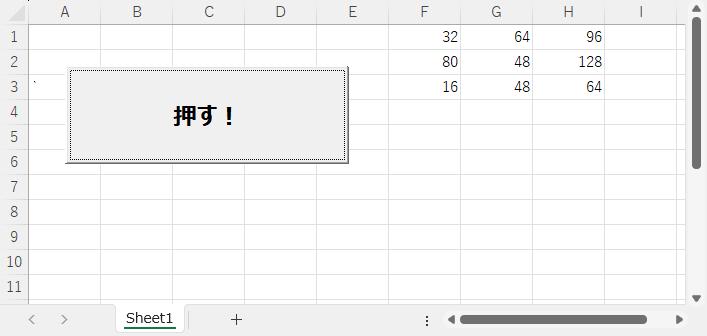

## 値

VBA は複数の種類の値を扱えます。

- 数字
  - 整数
    - 桁数の少ない整数
    - 桁数の多い整数
  - 実数（小数点以下の桁を持つ値）
    - 桁数の少ない実数
    - 桁数の多い実数
- 文字列
- オブジェクト
  - シート
  - セル（の範囲）

## 変数

### 「変数」とは

値を入れるための入れ物（容器）です。

### 変数名

変数に付けた名前です。簡潔でわかりやすく、用途が明確になる名前を付けます。変数名に全角文字の使用も可能ですが、不具合の原因になることがあるのでお勧めできません。変数名は次の様なルールで付けると良いでしょう。

- 半角文字の英大文字、英小文字、数字、`_` を組み合わせる（全角文字は使用しない）
- 1 文字以上の英大文字を含める
- 最初の文字は英大文字または英小文字にする
- VBA のコードの可読性を高めるため、型を推測できる言葉を含める

VBA には変数名として使用できない単語があります。この単語のことを「予約語」と言います。型を推測できる言葉を含めることで、予約語を回避するとともにコードの可読性を向上できます。

### 型

変数に入れることができる値の種類です。主な型と入れることができる値の種類です。

| 型 | 入れることができる値 |
| :---: | :---: |
| Long | 桁数の多い整数 |
| Double | 桁数の多い実数 |
| String | 長さが 0 以上の文字列 |

### 変数を宣言

変数名と型を組み合わせて、変数を宣言します。

```vb
Dim 変数名 As 型
```

例えば、行位置用の変数は次のように宣言します。コードを入力するとき、変数名の英字部分はすべて小文字で入力して問題ありません。VBA が変数名の宣言どおりに英大文字、英小文字まじりの変数名に自動的に変換します。

```vb
Dim Long_Row As Long
```

実際のコードの中では最初にまとめて宣言します。

```vb
Private Sub CommandButton1_Click()

    Dim Long_Row As Long

End Sub
```

変数名を「型」＋「用途を表す名前」にすることで、VBA のコードの中で宣言部分を確認することなく、変数の用途や型がわかります。

良くない例です。変数 i だけでは用途も型も推測できません。

```vb
Dim i As Long
```

## コメント

VBA のコード内に `'` を入れると、そこから行末までがコメントになります。コードの 1 桁目に `'` を入れると、その行全体がコメント（コメント行）になります。

変数宣言とコメントを組み合わせた例です。

```vb
Dim Long_Row As Long     ' 行位置
```

コードの中に適切なコメントを追加することで、コードの可読性が向上します。

```vb
Private Sub CommandButton1_Click()

    Dim Long_Row As Long                ' 行位置

    '
    ' このあとにセルの値を加算するコードを書きます
    '

End Sub
```

## 繰り返し

規則正しく変化する数値の部分を `For` ループを使用して書き直します。「ループ」とは同一の処理を繰り返し実行する仕組みのことです。今回は計算式の行位置が 1　→　2　→　3 と規則正しく変化しているので `For` ループを使用して書き直します。

Cells  
(1, 8) = (1, 6) + (1, 7)  
(2, 8) = (2, 6) + (2, 7)  
(2, 8) = (3, 6) + (3, 7)  

Range  
H1 = F1 + G1  
H2 = F2 + G2  
H3 = F3 + G3  

### For ･･･ Next

```vb
For 変数 = 初期値 To 終了値 Step 増分値

    VBA のコード

Next 変数
```

- 変数
  - 規則正しく変化する値を格納する変数（変数は要宣言）
  - 最初は初期値が設定される
  - 最後は終了値の値より大きな値が設定される
- 初期値
  - 変数に最初に設定する値
- 終了値
  - 繰り返しを終了する値
  - 変数に設定された値がこの値以下のときに VBA のコードを実行する
- 増分値
  - 繰り返すごとに変数に加算する値
- VBA のコード
  - 繰り返し実行するコード
  - `For` ･･･ `Next` の区切りをわかりやすくするため、インデント（字下げ）して記述する

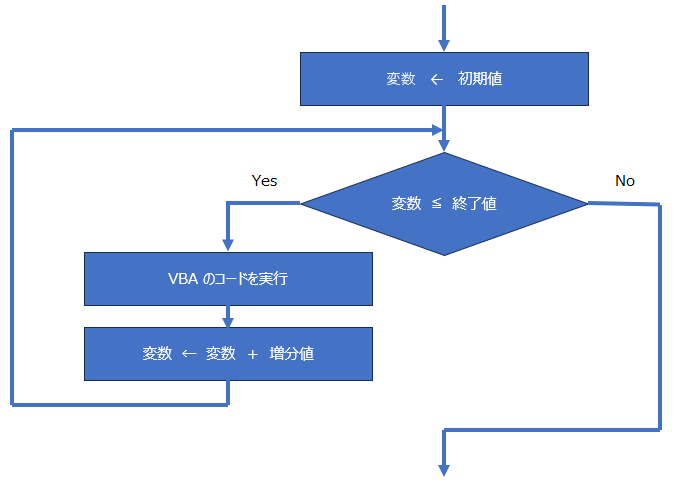

### For ループと Cells の組み合わせ

`Cells` の行位置を変数 Long_Row に置き換え、`For` ループと組み合わせることで 3 行の計算式が 1 行に置き換わりました。

```vb
Private Sub CommandButton1_Click()

    Dim Long_Row As Long                ' 行位置

    '
    ' F 列と G 列のセルを加算して H 列のセルに格納する
    '
    For Long_Row = 1 To 3 Step 1
    
        Cells(Long_Row, 8).Value = Cells(Long_Row, 6).Value + Cells(Long_Row, 7).Value
    
    Next Long_Row
    
End Sub
```

### For ループと Range の組み合わせ

`Range` のセル位置指定の行部分を変数 Long_Row に置き換え、カラム部分と演算子 `&` で文字列として結合してセル位置を作成しました。

```vb
Range(カラム部分 & Long_Row)
```

`For` ループと組み合わせることで 3 行の計算式が 1 行に置き換わりました。

```vb
Private Sub CommandButton1_Click()

    Dim Long_Row As Long                ' 行位置

    '
    ' F 列と G 列のセルを加算して H 列のセルに格納する
    '
    For Long_Row = 1 To 3 Step 1
    
        Range("H" & Long_Row).Value = Range("F" & Long_Row).Value + Range("G" & Long_Row).Value
    
    Next Long_Row

End Sub
```

カラム部分を `"` でくくらないと変数 H 、変数 F 、変数 G と解釈されます。

```vb
Private Sub CommandButton1_Click()

    Dim Long_Row As Long                ' 行位置

    '
    ' F 列と G 列のセルを加算して H 列のセルに格納する
    '
    For Long_Row = 1 To 3 Step 1
    
        Range(H & Long_Row).Value = Range(F & Long_Row).Value + Range(G & Long_Row).Value
    
    Next Long_Row

End Sub
```

変数 F 、G に値は設定されないため、実行するとエラーが発生します。

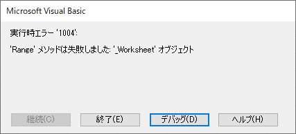

## 列の最終行を取得する

コードを書いていると列の最終行が必要になることがあります。例えば、上述のセルの値を加算するコードは 3 行目まで値が入っている場合は問題ありません。しかし、値が 1 行目だけ、値が 10 行目まで入ってるなど変更になった場合、その都度、`For` ループの終了値を書き換えなければなりません。値が入っている最終行を自動的に検出できるようにしておけば、その都度コードを書き直す必要がなくなります。

値が入っている最終行は次の計算式で求められます。

```vb
Cells(Rows.Count, カラム位置).End(xlUp).Row
```

`Rows.Count` にシートの最終行の行位置が格納されています。MS365 の Excel で確認すると最終行は 1048576 でした。F 列の最終行のセル位置は次のようになります。

```vb
Cells(Rows.Count, 6)
```

`End(xlUp)` は `Cells` で指定したセル位置から上方向に値が入っているセル位置を示します。最後の `Row` は `Cells(Rows.Count, 6).End(xlUp)` で示されたセルの行番号です。F 列の最終行は次の式で求められます。

```vb
Cells(Rows.Count, 6).End(xlUp).Row
```

終了値を上記の式に置き換えることで、セルの最終行が変更になってもコードの変更は不要です。

```vb
Private Sub CommandButton1_Click()

    Dim Long_Row As Long                ' 行位置

    '
    ' F 列と G 列のセルを加算して H 列のセルに格納する
    '
    For Long_Row = 1 To Cells(Rows.Count, 6).End(xlUp).Row Step 1
    
        Cells(Long_Row, 8).Value = Cells(Long_Row, 6).Value + Cells(Long_Row, 7).Value
    
    Next Long_Row

End Sub
```

終了値を計算式に置き換えたことで 1 行が長くなり、少し見づらくなりました。この様な場合、終了値を変数に設定するよう変更するほうが可読性の観点から望ましいです。

```vb
Private Sub CommandButton1_Click()

    Dim Long_Row     As Long            ' 行位置
    Dim Long_LastRow As Long            ' 最終行

    '
    ' 初期処理
    '
    Long_LastRow = Cells(Rows.Count, 6).End(xlUp).Row   ' 最終行を取得
    
    '
    ' F 列と G 列のセルを加算して H 列のセルに格納する
    '
    For Long_Row = 1 To Long_LastRow Step 1
    
        Cells(Long_Row, 8).Value = Cells(Long_Row, 6).Value + Cells(Long_Row, 7).Value
    
    Next Long_Row

End Sub
```

## If 文

特定の条件が成立した（不成立だった）ときにだけコードを実行したい場合 `If` 文を使用します。

```vb
If 条件式 Then
    条件が成立したとき実行する VBA のコード
Else
    条件が不成立のときに実行する VBA のコード
End If
```

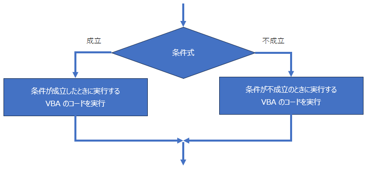

条件が不成立のときに実行するコードが不要な場合、次のとおりです。

```vb
If 条件式 Then
    条件が成立したとき実行する VBA のコード
End If
```

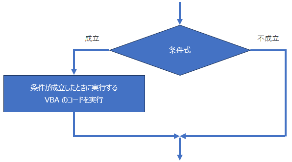

条件が成立した（不成立だった）ときに実行する VBA のコードは `If` 、 `Else` 、 `End If` が明確になるようインデント（字下げ）して記述します。

### 条件式

#### 比較演算子

比較演算子を使用して 2 つの値を比較する条件式を作成します。

```vb
値1　比較演算子　値2
```

| 比較演算子 | 成立する場合 | 値1 | 値2 | 比較した結果 |
| :---: | :---: | :---: | :---: | :---: |
| = | 値1 と 値2 が等しい | 5 | 2 | 不成立 |
| <> | 値1 と 値2 が等しくない | 5 | 2 | 成立 |
| < | 値1 が 値2 より小さい | 5 | 2 | 不成立 |
| > | 値1 が 値2 より大きい | 5 | 2 | 成立 |
| <= | 値1 が 値2 より小さいか等しい | 5 | 2 | 不成立 |
| >= | 値1 が 値2 より大きいか等しい | 5 | 2 | 成立 |

上記の 値1 と 値2 に数値を使用していますが、文字列も同様に比較できます。

#### 論理演算子

論理演算子を使用して 2 つ以上の条件式を結合して、条件式全体として成立／不成立を決定します。

```vb
条件式1　論理演算子　条件式2
```

| 比較<br>演算子 | 条件式全体として成立する場合 | 条件式1 の結果 | 条件式2 の結果| 全体としての結果 |
| :---: | :---: | :---: | :---: | :---: |
| And | 条件式1 が成立　かつ　条件式2 が成立 | 成立 | 不成立 | 不成立 |
| Or| 条件式1 が成立　または　条件式2 が成立 | 成立 | 不成立 | 成立 |

##### And のパターン

すべての条件式が成立した場合だけ全体として成立になります。それ以外は全体として不成立です。

| 条件式1 の結果 | 条件式2 の結果| 全体としての結果 |
| :---: | :---: | :---: |
| 成立 | 成立 | 成立 |
| 成立 | 不成立 | 不成立 |
| 不成立 | 成立 | 不成立 |
| 不成立 | 不成立 | 不成立 |

##### Or のパターン

すべての条件式が不成立の場合だけ全体として不成立になります。それ以外は全体として成立です。

| 条件式1 の結果 | 条件式2 の結果| 全体としての結果 |
| :---: | :---: | :---: |
| 成立 | 成立 | 成立 |
| 成立 | 不成立 | 成立 |
| 不成立 | 成立 | 成立 |
| 不成立 | 不成立 | 不成立 |

#### 論理演算子の評価の優先順位

論理演算子は 2 つ以上の条件式を結合し、全体として 1 つの条件式を構成します。条件式を結合する場合、使用する論理演算子が `And` だけ、`Or` だけの場合は上記のルールに従います。 `And` と `Or` が混在する場合 `And` が優先して比較します。

```vb
条件式1　Or　条件式2　And　条件式３
```

まず、次の条件式を評価します。

```vb
条件式2　And　条件式３
```

次に 条件1 と上記の `And` の結果を比較し、全体としての結果を決定します。

```vb
条件式1　Or　先に評価した結果
```

#### 論理演算子の評価の優先順位を変更する

条件式を `(` `)` でくくることで、論理演算子の優先順位を変更できます。

```vb
(条件式1　Or　条件式2)　And　条件式３
```

まず、カッコの中の条件式を評価します。

```vb
条件式1　Or　条件式2
```

次に 条件3 と上記の `Or` の結果を比較し、全体としての結果を決定します。

```vb
先に評価した結果 And 条件3
```

### If 文の使用例

H 列の結果を元に、条件にもとづき I 列に文字列を設定します。

| H 列の値 | I 列に設定する文字列 | 条件式 |
| :---: | :---: | :---: |
| 100 未満 | 小さい | H 列の値 < 100 |
| 101 以上　～　200 未満 | 良い | H 列の値 >= 101　And H 列の値 < 200 |
| 200 以上 | 大きい | H 列の値 >= 200 |

```vb
Private Sub CommandButton1_Click()

    Dim Long_Row     As Long            ' 行位置
    Dim Long_LastRow As Long            ' 最終行
    Dim Long_Answer  As Long            ' 計算の答え

    '
    ' 初期処理
    '
    Long_LastRow = Cells(Rows.Count, 6).End(xlUp).Row                       ' 最終行を取得
    
    '
    ' F 列と G 列のセルを加算して H 列のセルに格納する
    '
    For Long_Row = 1 To Long_LastRow Step 1
    
        ' 計算
        Long_Answer = Cells(Long_Row, 6).Value + Cells(Long_Row, 7).Value   ' 計算
        Cells(Long_Row, 8).Value = Long_Answer                              ' 計算結果を H 列に格納
        
        ' 答えを評価する
        If Long_Answer < 100 Then
            Cells(Long_Row, 9).Value = "小さい"
        End If
        If Long_Answer >= 101 And Long_Answer < 200 Then
            Cells(Long_Row, 9).Value = "良い"
        End If
        If Long_Answer >= 200 Then
            Cells(Long_Row, 9).Value = "大きい"
        End If
    
    Next Long_Row

End Sub
```

### セルの塗りつぶし

#### 色を色コードで指定

```vb
Range(セル位置).Interior.Color = 色コード
```

| 色コード | 塗りつぶしに使用する色 |
| :---: | :---: |
| vbBlack | 黒 |
| vbRed | 赤 |
| vbGreen | 緑 |
| vbYellow | 黄 |
| vbBlue | 青 |
| vbMagenta | マゼンタ |
| vbCyan | シアン |
| vbWhite | 白 |

セル H1 を黄色で塗りつぶすときは次のように指定します。

```vba
Range("H1").Interior.Color = vbYellow
```

#### 色を RGB で指定

```vb
Range(セル位置).Interior.Color = RGB(赤, 緑, 青)
```

`RGB` 内の 赤、緑、青は 0 ～ 255 のいずれかの値を設定します。光の三原則にもとづいて塗りつぶす色を決定します。色のサンプルは下記のようなサイトでご確認ください。

現色大辞典 <https://www.colordic.org/>

セル H1 をオレンジ色で塗りつぶすときは次のように指定します。

```vb
Range("H1").Interior.Color = RGB(255, 165, 0)
```

#### セルの塗りつぶしの例

H 列の結果を元に、条件にもとづき H 列を塗りつぶします。

| H 列の値 | H 列の塗りつぶしに使用する色 |
| :---: | :---: |
| 100 未満 | 赤 |
| 101 以上　～　200 未満 | 青 |
| 200 以上 | 黄 |

```vb
Private Sub CommandButton1_Click()

    Dim Long_Row     As Long            ' 行位置
    Dim Long_LastRow As Long            ' 最終行
    Dim Long_Answer  As Long            ' 計算の答え

    '
    ' 初期処理
    '
    Long_LastRow = Cells(Rows.Count, 6).End(xlUp).Row                       ' 最終行を取得
    
    '
    ' F 列と G 列のセルを加算して H 列のセルに格納する
    '
    For Long_Row = 1 To Long_LastRow Step 1
    
        ' 計算
        Long_Answer = Cells(Long_Row, 6).Value + Cells(Long_Row, 7).Value   ' 計算
        Cells(Long_Row, 8).Value = Long_Answer                              ' 計算結果を H 列に格納
        
        ' 答えを評価して H 列を塗りつぶす
        If Long_Answer < 100 Then
            Range("H" & Long_Row).Interior.Color = vbRed                    ' 赤
        End If
        If Long_Answer >= 101 And Long_Answer < 200 Then
            Range("H" & Long_Row).Interior.Color = vbBlue                   ' 青
        End If
        If Long_Answer >= 200 Then
            Range("H" & Long_Row).Interior.Color = vbYellow                 ' 黄
        End If
    
    Next Long_Row

End Sub
```

## シート

### シートを追加

シートを新規に追加する場合、次のコードを実行します。

```vb
Worksheets.Add
```

コード全体です。

```vb
Private Sub CommandButton1_Click()

    Worksheets.Add                                  ' シートを追加

End Sub
```

実行前の状態です。

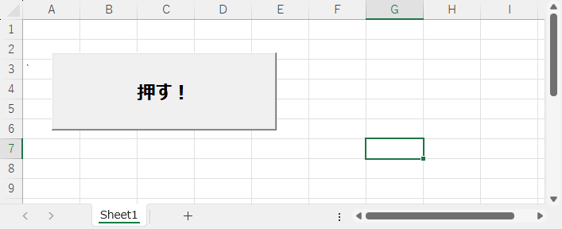

コマンドボタンをクリックしたあとの状態です。シートが追加され、追加したシートに切り替わりました。シート名は重複しないよう自動で設定されます。

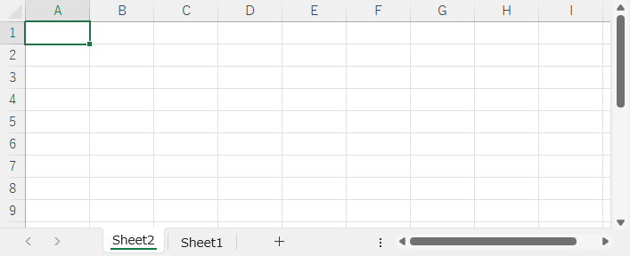

### シートの指定方法

複数枚のシートがある場合、どのシートを使用するのか指定が必要な場合があります。

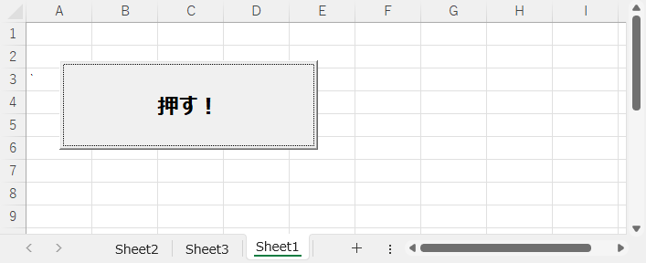

#### 番号で指定

シートは左から順番に 1 、 2 、3 、・・・とシート番号が自動的に付与されます。

| シート番号 | シート名 |
| :---: | :---: |
| 1 | Sheet2 |
| 2 | Sheet3 |
| 3 | Sheet1 |

シート番号を使用し、次のようにシートを指定します。

```vb
Worksheets(シート番号)
```

シート SHeet3 を指定するときは次のようにします。

```vb
Worksheets(2)
```

シートが増減するたびにシート番号は自動的に更新されます。

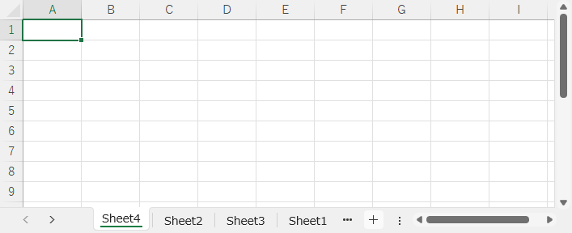

上図の場合、シート番号とシートは次のようになります。

| シート番号 | シート名 |
| :---: | :---: |
| 1 | Sheet4 |
| 2 | Sheet2 |
| 3 | Sheet3 |
| 4 | Sheet1 |

このように、シートの増減でシート番号が変更になるため、シート番号でシートを指定する場合は注意が必要です。

#### 名前で指定

シート名を指定して次のようにシートを指定します。

```vb
Worksheets(シート名)
```

シート名が ボタン の場合、次のように指定します。

```vb
Worksheets("ボタン")
```

### 末尾・先頭にシートを追加する

#### 最後（末尾）のシートのあとにシートを追加

最後（末尾）のシートの次に新規にシートを追加する場合、次のコードを実行します。

```vb
Worksheets.Add after:=Worksheets(Worksheets.Count)
```

`Worksheets.Add` に続けて、どのシートの後（ after ）にシートを追加するのかを指定します。「どのシート」の部分が `Worksheets(Worksheets.count)` です。`Worksheets.Count` に現在のシート数が格納されているので、`Worksheets(Worksheets.Count)` は最後のシートを指します（シート番号によるシートの指定）。したがって `Worksheets.Add after:=Worksheets(Worksheets.Count)` は、最後のシートの後にシートを追加します。

```vb
Private Sub CommandButton1_Click()

    Worksheets.Add after:=Worksheets(Worksheets.Count)      ' 最後のシートの次にシートを追加する

End Sub
```

#### 最初（先頭）のシートの前にシートを追加

最初（先頭）のシートの前に新規にシートを追加する場合、次のコードを実行します。

```vb
Worksheets.Add before:=Worksheets(1)
```

`Worksheets.Add` に続けて、どのシートの前（ Before ）にシートを追加するのかを指定します。「どのシート」の部分が `Worksheets(1)` です。シート番号 : 1 （先頭のシート）を指定しています。

```vb
Private Sub CommandButton1_Click()

    Worksheets.Add before:=Worksheets(1)        ' 先頭にシートを追加する

End Sub
```

### 任意の位置にシートを追加

任意の位置にシートを追加する場合、事前に次のことを決めておきます。

- どのシートを基準にするのか
- 基準のシートの前（ before ）／後（ after ）のどちらにシートを追加するのか

基準のシートは `Worksheets(シート名)` または `Worksheets(シート番号)` で指定します。

#### 基準のシートの前にシートを追加

```vb
Worksheets.Add before:=Worksheets(シート名)
```

```vb
Worksheets.Add before:=Worksheets(シート番号)
```

#### 基準のシートの後にシートを追加

```vb
Worksheets.Add after:=Worksheets(シート名)
```

```vb
Worksheets.Add after:=Worksheets(シート番号)
```

### 追加したシートにシート名を設定する

シートを追加すると、追加したシートが表示されます。この表示されているシート（アクティブなシート）を `ActiveSheet` と言います。この `Activesheet` に名前を設定します。

1. シートを追加する
2. 追加したシートに名前を設定する

```vb
Worksheets.add
Activesheet.Name = "シート名"
```

使用例です。

```vb
Private Sub CommandButton1_Click()

    Worksheets.Add after:=Worksheets(Worksheets.Count)      ' 末尾にシートを追加
    ActiveSheet.Name = "新しいシート"                       ' 追加したシートに名前を設定

End Sub
```

## シートとセル

コマンドボタンなどのオブジェクトと同一シート上のセルの操作ではシート（ワークシート）の指定は不要です。シート間でセルの値をコピーしたり、他のシートのセルの値を参照したりするときにシートの指定は必須です。シートの指定を含めたセルの指定方法は次のとおりです。

```vb
Worksheets(シート名).Cells(行位置 , カラム位置)
```

```vb
Worksheets(シート名).Range(セル位置)
```

### セルの値をコピー
