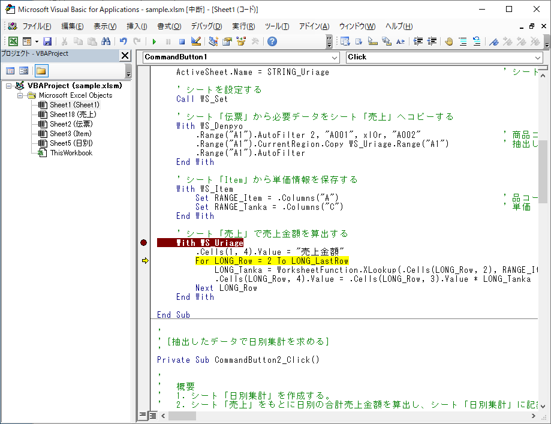
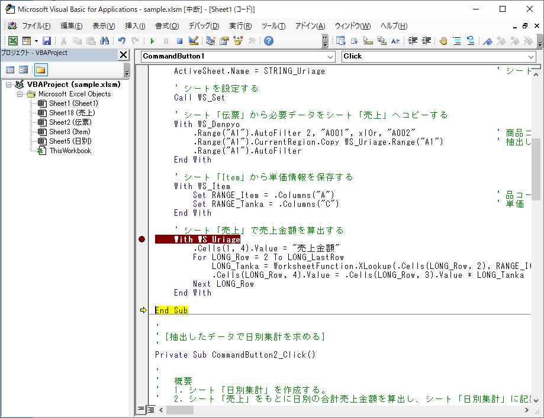
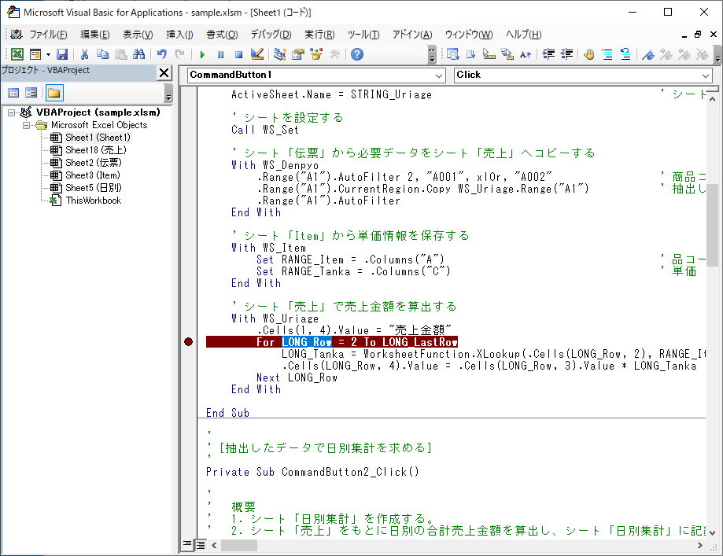

# 10 日目の復習 ＋ α

## 定数

**定数** とは、その値が変化しないものを指します。変数はいろいろな値を設定できます。しかし、定数は決まった値だけで、それを変更できません。今まで使用してきた色コードや曜日判定用の値も VBA が用意している定数の一部です。

色コード（色の定数）

| 定数 | 色 |
| :--- | :---: |
| vbBlack | 黒 |
| vbRed | 赤 |
| vbGreen | 緑 |
| vbYellow | 黄 |
| vbBlue | 青 |
| vbMagenta | マゼンタ |
| vbCyan | シアン |
| vbWhite | 白 |

曜日判定用の定数

| 定数 | 曜日 |
| :--- | :---: |
| vbSunday | 日曜日 |
| vbMonday | 月曜日 |
| vbTuesday | 火曜日 |
| vbWednesday | 水曜日 |
| vbThursday | 木曜日 |
| vbFriday | 金曜日 |
| vbSaturday | 土曜日 |

コード中に 1 とか 2 のような具体的な値を書くのは禁止されていません。しかし、その様な値は **マジックナンバー** になりやすく、多くの場合に推奨されるものではありません。定数が使用できる場合は定数を使用し、具体的な値を記述することを避けることが推奨されます。定数を使用したほうが、コードがわかりやすくなるというメリットがあります。

マジックナンバー (プログラム) - Wikipedia  
<https://ja.wikipedia.org/wiki/マジックナンバー_(プログラム)>

VBA には多数の定数があります。VBA のすべての定数は以下のページでご確認ください。

定数 (Visual Basic for Applications)  
<https://learn.microsoft.com/ja-jp/office/vba/language/reference/constants-visual-basic-for-applications?redirectedfrom=MSDN>

## 定数を作成する

定数は必要に応じて自分で作成できます。定数の構文です

```vb
Const 定数名 As データ型 = 値
```

データ型は省略できます。この場合、設定する値によりデータ型が自動的に決定されます。

```vb
Const 定数名  = 値
```

### データ型を指定して定数を作成する

9 日目に使用したコードを使用します。コード内に次の 4 つのシート名が出てきます。

- 伝票
- Item
- 売上
- 日別集計

このシート名を定数として定義します。シート名なのですべて `String` 型です。

```vb
' シート名の定数
Const STRING_Denpyo As String = "伝票"                                  ' シート「伝票」
Const STRING_Item As String = "Item"                                    ' シート「Item」
Const STRING_Uriage As String = "売上"                                  ' シート「売上」
Const STRING_Hibetsu As String = "日別"                                 ' シート「日別集計」
```

記述場所ですが、今回はすべてのプロシージャから参照されるので、グローバル変数と同じ位置にします。コードに組み込んだ結果です。シート名が変更になった場合、定数のシート名だけを変更することで対応できるようになりました。

```vb
' ワークシート用
Dim WS_Denpyo                   As Worksheet                            ' シート「伝票」
Dim WS_Item                     As Worksheet                            ' シート「Item」
Dim WS_Uriage                   As Worksheet                            ' シート「売上」
Dim WS_Hibetsu                  As Worksheet                            ' シート「日別集計」

' シート名の定数
Const STRING_Denpyo As String = "伝票"                                  ' シート「伝票」
Const STRING_Item As String = "Item"                                    ' シート「Item」
Const STRING_Uriage As String = "売上"                                  ' シート「売上」
Const STRING_Hibetsu As String = "日別"                                 ' シート「日別集計」

'
' [処理に必要なデータを抽出]
'
Private Sub CommandButton1_Click()

'
'   概要
'   1. シート「伝票」から品コード A001 と A002 のデータを取り出し、シート「売上」に保存する。
'   2. シート「Item」の情報と紐づけ、売上金額を算出する。
'
    
    Dim RANGE_Item              As Range                                ' シート「Item」の品コード（A列）
    Dim RANGE_Tanka             As Range                                ' シート「Item」の単価（C列）
    
    Dim LONG_LastRow            As Long                                 ' 最終行
    Dim LONG_Row                As Long                                 ' 行位置
    Dim LONG_Tanka              As Long                                 ' 単価
    Dim LONG_Kekka              As Long                                 ' 関数 WS_Del の実行結果

    ' シート「売上」を削除する
    LONG_Kekka = WS_Del(STRING_Uriage)
    
    ' シート「売上」を作成する
    Worksheets.Add after:=Worksheets(Worksheets.Count)                  ' 新規シートを作成
    ActiveSheet.Name = STRING_Uriage                                    ' シート名を「売上」に変更
    
    ' シートを設定する
    Call WS_Set
    
    ' シート「伝票」から必要データをシート「売上」へコピーする
    With WS_Denpyo
        .Range("A1").AutoFilter 2, "A001", xlOr, "A002"                 ' 商品コードが A001 or A002 を抽出
        .Range("A1").CurrentRegion.Copy WS_Uriage.Range("A1")           ' 抽出したデータをシート「売上」へコピー
        .Range("A1").AutoFilter
    End With
    
    ' シート「Item」から単価情報を保存する
    With WS_Item
        Set RANGE_Item = .Columns("A")                                  ' 品コード
        Set RANGE_Tanka = .Columns("C")                                 ' 単価
    End With
    
    ' シート「売上」で売上金額を算出する
    With WS_Uriage
        .Cells(1, 4).Value = "売上金額"
        LONG_LastRow = .Cells(Rows.Count, 1).End(xlUp).Row              ' 最終行取得
        For LONG_Row = 2 To LONG_LastRow
            LONG_Tanka = WorksheetFunction.XLookup(.Cells(LONG_Row, 2), RANGE_Item, RANGE_Tanka, 0) ' 単価取得
            .Cells(LONG_Row, 4).Value = .Cells(LONG_Row, 3).Value * LONG_Tanka                      ' 売上金額計算
        Next LONG_Row
    End With

End Sub

'
' [抽出したデータで日別集計を求める]
'
Private Sub CommandButton2_Click()

'
'   概要
'   1. シート「日別集計」を作成する。
'   2. シート「売上」をもとに日別の合計売上金額を算出し、シート「日別集計」に記録する。
'
    
    Dim RANGE_Date              As Range                                ' シート「売上」の日付の範囲
    
    Dim STRING_MaxDate          As String                               ' 日付の最大値
    Dim STRING_MinDate          As String                               ' 日付の最小値
    Dim STRING_Date             As String                               ' 日付

    Dim LONG_LastRow            As Long                                 ' 最終行
    Dim LONG_Row                As Long                                 ' 行位置
    Dim LONG_Kekka              As Long                                 ' 関数 WS_Del の実行結果
    
    ' シート「日別集計」を削除する
    LONG_Kekka = WS_Del(STRING_Hibetsu)
    
    ' シート「日別集計」を作成する
    Worksheets.Add after:=Worksheets(1)
    ActiveSheet.Name = STRING_Hibetsu

    ' シートを設定する
    Call WS_Set
    
    ' シート「売上」の中の最大 / 最小日付を取得する
    With WS_Uriage
        ' 日付の範囲
        Set RANGE_Date = .Columns(1)
        ' 日付の最小値を取得
        STRING_MinDate = Format(WorksheetFunction.Min(RANGE_Date), "yyyy/mm/dd")
        ' 日付の最大値を取得
        STRING_MaxDate = Format(WorksheetFunction.Max(RANGE_Date), "yyyy/mm/dd")
    End With
    
    ' シート「日別集計」の見出しを作成する等
    With WS_Hibetsu
        ' 見出し
        .Cells(1, 1) = "売上日"
        .Cells(1, 2) = "売上金額"
        ' 売上日（A 列）の書式
        With .Columns(1)
            .NumberFormatLocal = "yyyy/mm/dd"
            .ColumnWidth = 12
        End With
        ' 売上金額（B 列）の書式
        With .Columns(2)
            .NumberFormatLocal = "#,###,##0"
            .ColumnWidth = 10
        End With
        ' 日付作成
        LONG_Row = 2
        STRING_Date = STRING_MinDate
        Do Until STRING_Date > STRING_MaxDate
            .Cells(LONG_Row, 1).Value = STRING_Date
            STRING_Date = DateAdd("d", 1, STRING_Date)
            LONG_Row = LONG_Row + 1
        Loop
        ' 最終行取得
        LONG_LastRow = .Cells(Rows.Count, 1).End(xlUp).Row
    End With
    
    ' シート「売上」をもとに日別の合計売上金額を算出しシート「日別集計」に記録する
    With WS_Uriage
        For LONG_Row = 2 To LONG_LastRow Step 1
            ' シート「日別集計」の"売上日"でシート「売上」をフィルタリング
            .Range("A1").AutoFilter 1, Format(WS_Hibetsu.Cells(LONG_Row, 1).Value, "yyyy/m/d")
            ' 絞り込んだデータで合計売上金額を算出
            WS_Hibetsu.Cells(LONG_Row, 2).Value = WorksheetFunction.Subtotal(9, .Columns("D"))
            ' オートフィルターを解除
            .Range("A1").AutoFilter
        Next LONG_Row
    End With

End Sub

'
' 指定した名前のシートを削除する関数
' ・引数　：シート名
' ・戻り値： 0　→　シートを削除した
'            1　→　シートが見つからなかった
'
Private Function WS_Del(ByVal STRING_Name As String) As Long

    Dim WS_Sheet                As Worksheet                            ' 取り出したワークシート

    ' STRING_Name に設定された名前と同じシートを削除する
    WS_Del = 1                                                          ' シート未削除状態
    For Each WS_Sheet In Worksheets
        If WS_Sheet.Name = STRING_Name Then
            Application.DisplayAlerts = False
            WS_Sheet.Delete
            Application.DisplayAlerts = True
            WS_Del = 0                                                  ' シート削除状態
            Exit For
        End If
    Next WS_Sheet

End Function

'
' WorkSheet 型のグローバル変数にシートを設定するプロシージャ
'
Private Sub WS_Set()

    Dim WS_Sheet                As Worksheet                            ' 取り出したワークシート
    
    ' シートを設定する
    Set WS_Denpyo = Worksheets(STRING_Denpyo)                           ' シート「伝票」
    Set WS_Item = Worksheets(STRING_Item)                               ' シート「Item」
    Set WS_Uriage = Worksheets(STRING_Uriage)                           ' シート「売上」

    For Each WS_Sheet In Worksheets
        If WS_Sheet.Name = STRING_Hibetsu Then
            Set WS_Hibetsu = Worksheets(STRING_Hibetsu)                 ' シート「日別集計」
            Exit For
        End If
    Next WS_Sheet

End Sub
```

### データ型を指定しないで定数を作成する

データ型を指定しないで定数を作成する場合、設定する値でデータ型が決定されます。

| データ型 | 設定の方法 | 例 |
| :--- | :--- | :--- |
| String | `"` で値をくくる | "あいうえお" |
| Long | 数字の末尾に `&` を付ける | 12345& |
| Double | 数字の末尾に `#` を付ける | 123.45# |

次のように定義します。

```vb
Const STRING_Name = "あいうえお"
Const Long_Number = 12345&
Const DOUBLE_Number = 123.45#
```

## 文字列を入力する

コードの実行途中で何か値を手入力するときは `InputBox` 関数を使用します。


`InpubBox` 関数の構文です。

```vb
InputBox(入力を促すメッセージ)
```

- 入力を促すメッセージ
  - 入力を促すメッセージを書きます
  - 上図の "なにか入力してください" の部分のメッセージ部分です
- 戻り値
  - 入力した値が **文字列** として返ります
  - キャンセルボタンをクリックしたときは "" （長さ 0 の文字列）が返ります

文字列を入力し、それをシート「結果」のセル A1 に設定するコードです。

```vb
Private Sub CommandButton1_Click()

    Dim STRING_Input        As String       ' 入力した内容
    
    STRING_Input = InputBox("なにか入力してください")

    Worksheets("結果").Cells(1, 1).Value = STRING_Input

End Sub
```

実行前の状態です。


実行中の状態です。


実行後の状態です。シート「結果」のセル A1 に入力した値が設定されました。


`InputBox` 関数の戻り値は文字列です。何でも入力できますが、意図しない入力が行われることがあります。そのため、入力した値をチェックする仕組みを設けたほうが良いでしょう。

日付を入力することを期待したコードです。`IsDate` 関数を使用して、入力した値が日付の形式として正しいかどうかを確認しています。

```vb
Private Sub CommandButton1_Click()

    Dim STRING_Date         As String       ' 入力した日付
    
    STRING_Date = InputBox("日付を入力してください")

    If IsDate(STRING_Date) = True Then                       ' 日付？
        Worksheets("結果").Cells(1, 1).Value = "OK"
    Else                                                ' 日付ではない
        Worksheets("結果").Cells(1, 1).Value = "NG"
    End If

End Sub
```

## バグとデバッグ

### 「バグ」とは

コードの実行結果が意図した結果にならなかったときに「バグっている」などと言います。コードの実行中にエラーが発生したときも「バグっている」と言います。これらからわかるように **バグ** はコード内に存在する不具合を指します。なぜ不具合を **バグ** （ bug ）と呼ぶようになったのかは諸説あり、どれが本当なのかわかりません。1800 年代の後半には機械の不具合を指してバグと呼んでいる記録もあるそうなので、かなり前から慣習として使用されている言葉です。

bug = 虫 です。日本ではバグのことを「虫」と呼ぶ人もいます。

VBA は構文の不具合はコードを書くときに指摘されるので発生する可能性は少ないのですが、構文は正しいが記述する内容に不具合（バグ）があると実行時にエラーが発生します。下図は `AutoFilter` 関連で構文は正しいのですが、設定する値に誤りがあるときに表示されたエラーです。


### 「デバッグ」とは

バグを取り除く作業を **デバッグ** と呼びます。VBA の場合、次の 2 パターンがあります。

1. エラーメッセージが表示された

   

2. 実行してもエラーは出ないが、結果が正しくない

「エラーメッセージが表示された」場合は、VBA がエラーがある行を指摘してくれたり、表示されたメッセージで Google で "vba range クラスの autofilter メソッドが失敗しました。" などで検索すると原因や対応方法を教えてくれるので対応がし易いです。「実行してもエラーは出ないが、結果が正しくない」の場合は後述の方法でエラーが発生している場所や原因を探すことになります。

バグのことを虫と呼ぶ人がいるように、デバッグのことを「虫取り」と呼ぶ人もいます。

### 実行時エラー

この実行時エラーを例に進めます。


この様に実行時エラーが表示されたら、後で Google で検索するために Snipping Tools などでエラーメッセージのスクリーンショットを撮るか、メモ帳などにエラーメッセージを書き写します。

[終了] ボタンをクリックすると、コードの実行がエラーが発生した場所で終了になります。デバッグに必要な情報は何も残りません。[デバッグ] ボタンをクリックすると、エラーが発生した行でコードの実行を中断し、その行を黄色の網掛けで示します。


コードを確認すると、WS_Denpyo が示すシートのデータをオートフィルターしています。オートフィルターの条件を見ると 0 列目の値を "A001" か "A002" でフィルタリングするよう指示しています。列に 0 列目はないので、正しい列（今回は 2 ）に修正し、コードを保存します。コード修正時に黄色の網掛けは外れますが、保存後に復活します。


修正後、修正した行から実行を継続する場合は [継続 (F5)] のアイコンをクリックします。


修正後、今の処理は終了して最初から実行し直す場合は [リセット] のアイコンをクリックします。


今回は簡単な例ですが、コードを確認しても原因がわからないときは、保存したエラーメッセージをもとの Google で検索してみると良いでしょう。

今回のデバッグでは使用しませんでしたが、黄色の網掛けが表示されているときに変数にマウスカーソルを重ねると変数に設定されている値を確認できます。下図は変数 STRING_Uriage にマウスカーソルを重ねたときのものです。


### 実行してもエラーは出ないが、結果が正しくない

エラーなく実行できるが、結果が正しくない例です。

正しい実行結果です。


実行した結果です。実行時エラーは発生しませんでしたが、売上金額が空欄になっています。


このようなときは、ブレイクポイント、[F8] キーを押して 1 行ずつ実行、ウォッチ式による値のチェックを組み合わせてバグを探します。

#### ブレイクポイント

コードの各行が正しく実行されているか確認します。先頭から順番に確認していっても良いのですが、今回は売上金額が空欄になっているので、売上金額を計算するところを重点的にチェックします。

コードの左側（下図の茶色の ⚫ ）の部分をクリックすると、茶色の ⚫ と行に茶色の網掛けが設定されます。この茶色の網掛けの行をブレイクポイントを設定した行と呼びます。茶色の ⚫ をクリックするとブレイクポイントは解除されます。ブレイクポイントは複数設定が可能です。


コードを実行すると、ブレイクポイントを設定した行のコード部分が黄色の網掛けになり、実行を停止します。黄色の網掛けはこれから実行する行を示します。ここから 1 行ずつ実行します。行単位で実行するには [F8] キーを押します。[F8] キーを 1 回押した状態です。


計算するコードを実行しているか確認するため [F8] キーを押しながら 1 行ずつ実行を進めます。以下、[F8] キーを押して 1 行ずつ実行を確認した結果です。







最後まで実行しました。 1 行ずつ実行した結果、`For` ･･･ `Next` の中のコードがまったく実行されていないことがわかりました。

#### ウォッチ式

`For` 文に問題があるようなので、ブレイクポイントを `For` 文に設定しました。｀For` 文を実行する前に実行を止めて、`For` 文に使用している変数の値をチェックします。


チェックする変数名をドラッグします。下図は変数 LONG_Row をドラッグしました。



ドラッグした変数の上で右クリックをし [ウォッチ式の追加(A)...] をクリックします。


[式(E)] にドラッグした変数が設定されていることを確認し [OK] ボタンをクリックします。


ウォッチ式を追加しました。


同じ手順で変数 LONG_LastRow を追加しました。


コードを実行すると、ブレイクポイントを設定した `For` 文の行で実行を停止しました。この時点でウォッチ式に設定した変数の「値」を確認します。変数 Long_Row と Long_LastRow がともに 0 になっています。


変数 LONG_LastRow が 0 だと `For` 文は次のようになり、1 回も実行されないことがわかります。このことから、LONG_LastRow に適切な値が設定されていないことに問題があると判明します。

```vb
For LONG_Row = 2 To 0
```

[リセット] アイコンで実行を終了し、変数 LONG_LastRow に値を設定します。


最初から実行し、ブレイクポイントで実行を停止します。今回は変数 LONG_LastRow に 10 が設定されており、問題ないように見えます


[継続 (F5)] アイコンをクリックし、実行を再開します。売上金額に値が設定できました。


#### ウォッチ式を削除する

削除するウォッチ式を選択します。


[Del] キーを押すと選択したウォッチ式を削除します。


