# 2 日目の復習 ＋ α

## 型

### Boolean 型とオブジェクト型

| 型 | 入れることができる値 | メモ |
| :---: | :--- | :---: |
| Long | 桁数の多い整数 | 1 日目の内容を参照ください |
| Double | 桁数の多い実数 | 1 日目の内容を参照ください |
| String | 長さが 0 以上の文字列 | 1 日目の内容を参照ください |
| Boolean | True または False | |
| Worksheet | ワークシート | |
| Range | レンジ（セルの範囲） | |

- Boolean 型  
   `True` または `False` のどちらかの値だけを格納する
- WorkSheet 型  
   ワークシートを格納する
- Range 型  
 `Range(セル位置)` で指定するセルの範囲（単一のセル、範囲指定したセル）を格納する

### オブジェクト型

**Worksheet 型** と **Range 型** をまとめて **オブジェクト型** と呼びます。

Worksheet 型の代入文です。

```vb
Set Worksheet 型の変数 = Worksheets(シート番号)
```

```vb
Set Worksheet 型の変数 = Worksheets(シート名)
```

Range 型の代入文です。

```vb
Set Range 型の変数 = Range(セル位置)
```

```vb
Set Range 型の変数 = Range(開始セル位置:終了セル位置)
```

```vb
Set Range 型の変数 = Range(開始セル位置, 終了セル位置)
```

オブジェクト型の使用例です。

```vb
Private Sub CommandButton1_Click()
    
    Dim WS_Sheet    As Worksheet                    ' シートを保存する変数
    Dim Rng_Range   As Range                        ' セルの範囲を保存する変数
    
    ' シート「データ」のセル A1 ～ E1 を黄色で塗りつぶす
    Set WS_Sheet = Worksheets("データ")             ' シートを保存
    Set Rng_Range = WS_Sheet.Range("A1", "E1")      ' レンジを保存
    Rng_Range.Interior.Color = vbYellow             ' 指定範囲を塗りつぶし
    
End Sub
```

実行前のシート「データ」の状態です。何も登録されていません。

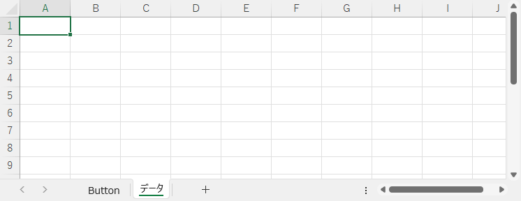

実行後のシート「データ」の状態です。セル A1 ～ E1 を黄色で塗りつぶしました。

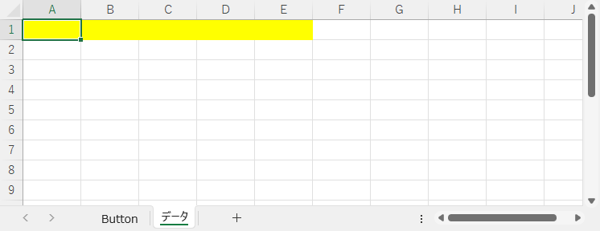

```vb
    Set WS_Sheet = Worksheets("データ")             ' シートを保存
    Set Rng_Range = WS_Sheet.Range("A1", "E1")      ' レンジを保存
    Rng_Range.Interior.Color = vbYellow             ' 指定範囲を塗りつぶし
```

上記のコードは下記のコードと同じ意味です。

```vb
    Worksheets("データ").Range("A1", "E1").Interior.Color = vbYellow  ' 指定範囲を塗りつぶし
```

## For Each ･･･ Next

データの集まりの中からデータを 1 つずつ取り出し、 `Dim` で宣言した変数に設定した後に VBA のコードを実行します。指定できる変数は **Worksheet 型** や **Range 型** などのオブジェクト型に限定されています。

```vb
For ecach 変数 In データの集まり

    VBA のコード

Next 変数
```

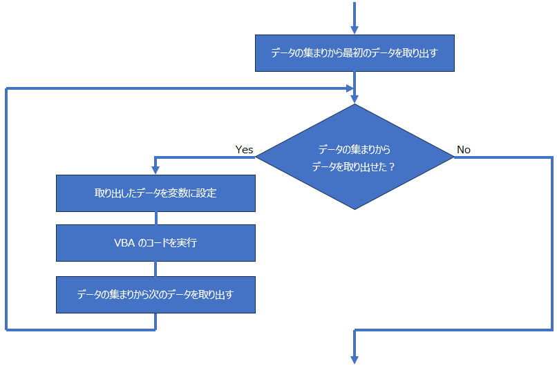

### 変数が Worksheet 型の例

シート「データ」を検索するコードです。`In` のあとの `Worksheets` はワークシートの集まりです。 `Worksheets` からシートを 1 枚ずつ取り出し、取り出したシートの名前（シート名）で検索対象のシートか判断します。

```vb
Private Sub CommandButton1_Click()
    
    Dim Bool_Flag       As Boolean          ' シート検索結果　→　True:シートあり　／　False:シートなし
    Dim WS_Sheet        As Worksheet        ' 取り出したワークシート
    
    ' 初期化
    Bool_Flag = False                       ' シートを検索する前なので見つかっていない状態
    
    ' シート検索
    For Each WS_Sheet In Worksheets
        If WS_Sheet.Name = "データ" Then    ' 取り出したシートの名前が "データ" ？
            Bool_Flag = True                '   見つかった
        End If
    Next WS_Sheet
        
    ' 結果発表
    If Bool_Flag = True Then
        MsgBox "見つけた"
    Else
        MsgBox "見つからなかった"
    End If

End Sub
```

シートの状態です。

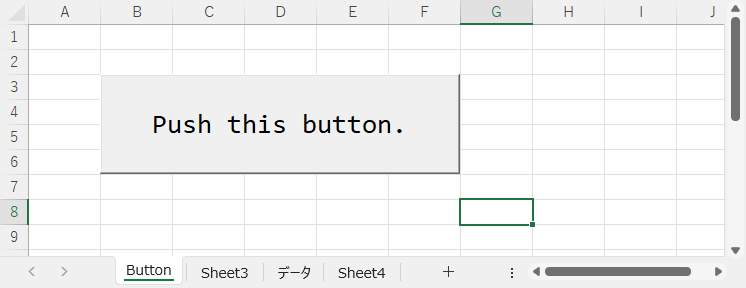

実行結果です。シート「データ」が存在するので、メッセージボックスで "見つけた" を表示しました。

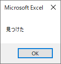

次のコードの詳細な動作内容です。

```vb
    For Each WS_Sheet In Worksheets
        If WS_Sheet.Name = "データ" Then    ' シート名が "データ" ？
```

- 1 回目のループ
  - シート「Button」を取りだす
  - シート「Button」のシート名が "データ" か判断する
- 2 回目のループ
  - シート「Sheet3」を取りだす
  - シート「Sheet3」のシート名が "データ" か判断する
- 3 回目のループ
  - シート「データ」を取りだす
  - シート「データ」のシート名が "データ" か判断する
- 4 回目のループ
  - シート「Sheet4」を取りだす
  - シート「Sheet4」のシート名が "データ" か判断する

### 変数が Range 型の例

シート「データ」のセル A1 ～ A5 に格納された値の合計値をシート「結果」のセル A1 に格納するコードです。 `In` のあとの `Worksheets("データ").Range("A1:A5")` はシート「データ」のセル A1 ～ A5 （セルの集まり）を指します。シート「データ」のセル A1 ～ A5 の範囲から 1 つずつ取り出し、取り出したセルの中の値をを加算します。

```vb
Private Sub CommandButton1_Click()
    
    Dim Rng_Cell        As Range                                ' 取り出したセル
    Dim Lng_Total       As Long                                 ' 合計値
    
    '
    ' 初期化
    '
    Lng_Total = 0                                               ' 合計値
    
    '
    ' ワークシート「データ」のセル A1 ～ A5 の値を順番に取り出し、
    ' 変数 Lng_Total に加算する
    '
    For Each Rng_Cell In Worksheets("データ").Range("A1:A5")
        Lng_Total = Lng_Total + Rng_Cell.Value                  ' 取り出したセルの値を合計
    Next Rng_Cell

    '
    ' 結果格納
    '
    Worksheets("結果").Range("A1").Value = Lng_Total

End Sub
```

実行前の各シートの状態です。

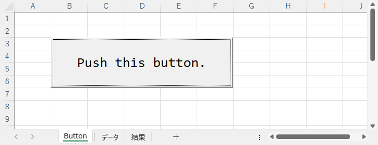

シート「データ」の状態です。セル A1 ～ A5 に加算対象の数値が設定されています。

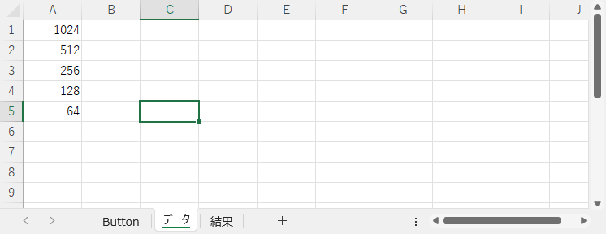

シート「結果」の状態です。実行前なのでセル A1 は空です。

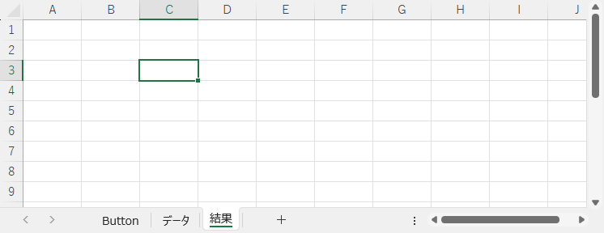

実行後のシート「結果」の状態です。セル A1 に合計値が設定されています。

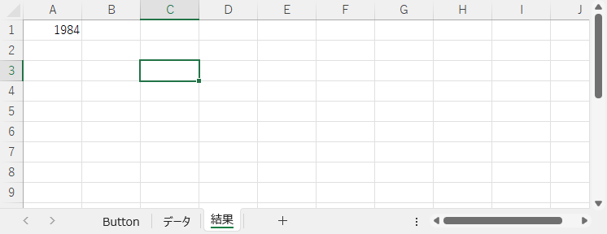

次のコードの詳細な動作内容です。

```vb
    For Each Rng_Cell In Worksheets("データ").Range("A1:A5")
        Lng_Total = Lng_Total + Rng_Cell.Value                  ' 取り出したセルの値を合計
```

- 1 回目のループ
  - ワークシート「データ」のセル A1 を取り出す
  - 変数 Lng_Total に取り出したセル A1 の値を加算
- 2 回目のループ
  - ワークシート「データ」のセル A2 を取り出す
  - 変数 Lng_Total に取り出したセル A2 の値を加算
- 3 回目のループ
  - ワークシート「データ」のセル A3 を取り出す
  - 変数 Lng_Total に取り出したセル A3 の値を加算
- 4 回目のループ
  - ワークシート「データ」のセル A4 を取り出す
  - 変数 Lng_Total に取り出したセル A1 の値を加算
- 5 回目のループ
  - ワークシート「データ」のセル A5 を取り出す
  - 変数 Lng_Total に取り出したセル A1 の値を加算

参考までに上記のコードを `For` ･･･ `Next` で書き直すと、次のとおりです。

```vb
Private Sub CommandButton1_Click()
    
    Dim Lng_Row         As Long                                 ' 行位置
    Dim Lng_Total       As Long                                 ' 合計値
    
    '
    ' 初期化
    '
    Lng_Total = 0                                               ' 合計値
    
    '
    ' ワークシート「データ」のセル A1 ～ A5 の値を順番に取り出し、
    ' 変数 Lng_Total に加算する
    '
    For Lng_Row = 1 To 5 Step 1
        Lng_Total = Lng_Total + Worksheets("データ").Range("A" & Lng_Row)
    Next Lng_Row

    '
    ' 結果格納
    '
    Worksheets("結果").Range("A1").Value = Lng_Total

End Sub
```

## シートを削除する

指定したワークシートを削除します。ワークシートの指定はシート番号またはシート名で行います。

### シート番号を指定して削除

```vb
Worksheets(シート番号).Delete
```

3 番目のシートを削除するコードです

```vb
Private Sub CommandButton1_Click()
    
    ' 3 番目のシートを削除
    Worksheets(3).Delete

End Sub
```

実行前の状態です。3 番目のシートは「 Sheet9 」です。

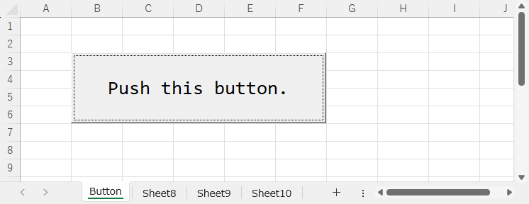

実行後の状態です。シート「 Sheet9 」が削除され、新たにシート「 Sheet10 」が 3 番目のシートになりました。

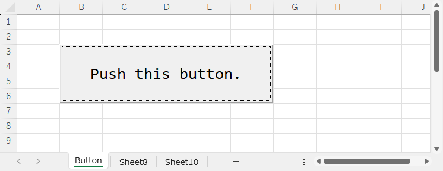

### シート名を指定して削除

```vb
Worksheets(シート名).Delete
```

シート「 Sheet8 」を削除するコードです。

```vb
Private Sub CommandButton1_Click()
    
    ' シート「Sheet8」を削除する
    Worksheets("Sheet8").Delete

End Sub
```

実行前の状態です。

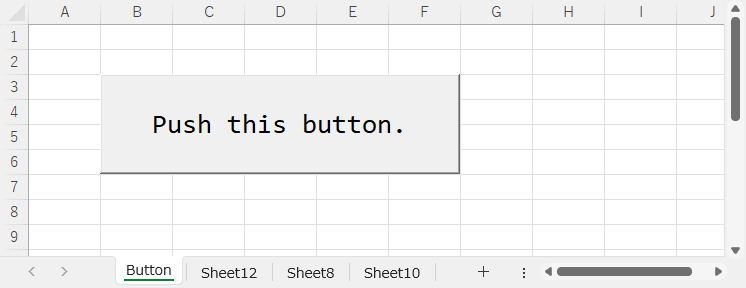

実行後の状態です。シート「 Sheet8 」が削除されました。

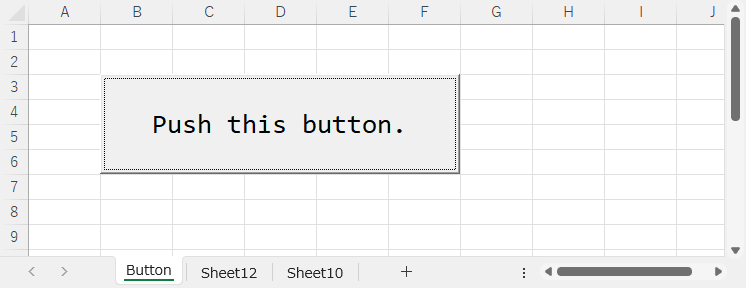

もう一度実行すると、既にシート「 Sheet8 」は削除済みのため存在しません。指定したシートが存在しないときはエラーになります。

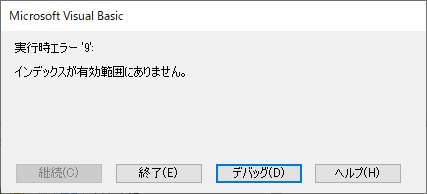

### 警告メッセージを制御する

シートを削除するとき、次の警告メッセージが表示されます。


この警告メッセージを抑制（表示しないように）するには次のコードを実行します。

```vb
Application.DisplayAlerts = False
```

警告メッセージを抑制したままだと（必要な）他の警告メッセージも表示されなくなるので、次のコードで抑制を解除します。

```vb
Application.DisplayAlerts = True
```

警告メッセージの制御を組み込んだコードの例です。

```vb
Private Sub CommandButton1_Click()
    
    Application.DisplayAlerts = False       ' 警告メッセージを抑制
    Worksheets(3).Delete                    ' シートを削除
    Application.DisplayAlerts = True        ' 警告メッセージの抑制を解除
    
End Sub
```

## 行を削除する

次のコードで行を削除します。

```vb
Rows(行番号).Delete
```

シート名を含めて指定する場合です。

```vb
Worksheets(シート番号).Rows(行番号).Delete
```

```vb
Worksheets(シート名).Rows(行番号).Delete
```

シート「データ」の 3 行目を削除するコードです。

```vb
Private Sub CommandButton1_Click()
    
    ' シート「データ」の 3 行目を削除する
    Worksheets("データ").Rows(3).Delete
    
End Sub
```

実行前の状態です。

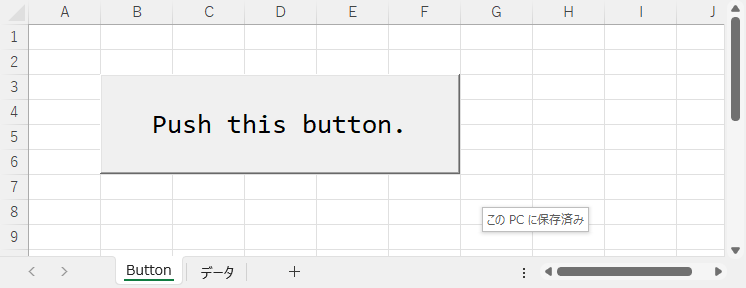

実行前のシート「データ」の状態です。

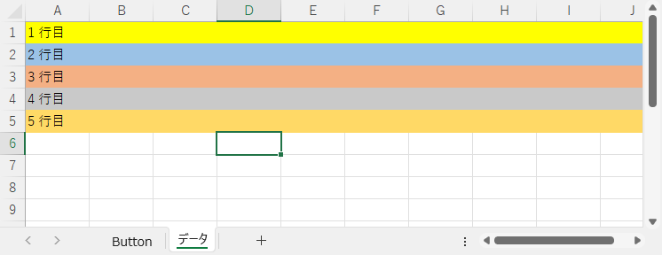

実行後のシート「データ」の状態です。 3 行目のデータを削除し、3 行目以降のデータが上方向に移動しました。

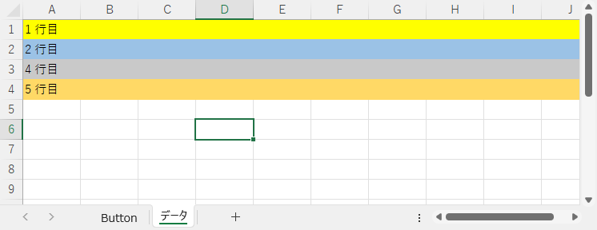
