# 4 日目の復習 ＋ α

## セル・行・列の指定方法

### セルの指定方法

#### 単一のセル : Range

```vb
Range(セル位置)
```

- 1 つのセル（単一のセル）を指定する
- セル位置は "A1" を指定する場合

   ```vb
   Range("A1")
   ```

#### 単一のセル : Cells

```vb
Cells(行位置 , カラム位置)
```

- 1 つのセル（単一のセル）を指定する
- 行位置は 1 , 2 , 3, ・・・ で、カラム（列）位置は次の表に従って変換した数値で指定する

   | カラム（列）記号 | 指定する値 |
   | :---: | :---: |
   | A | 1 |
   | B | 2 |
   | C | 3 |

- セル C2 を指定する場合

   ```vb
   Cells(2, 3)
   ```

- 数字で指定するので `For` ･･･ `Next` と組み合わせしやすい
- 後述の複数セルの指定ができない

#### 複数のセル（範囲指定のセル）

一度に複数のセル（範囲指定のセル）を指定する場合、2 とおりの方法があります。 `Cells` は複数のセルの指定はできません。

```vb
Range(開始セル位置:終了セル位置)
```

- 範囲の開始セル位置と終了セル位置を `:` で繋げて指定する
- セル A1 ～ A20 を指定するときは "A1:A20" のように全体を `"` でくくる

   ```vb
   Range("A1:A20")
   ```

```vb
Range(開始セル位置 , 終了セル位置)
```

- 範囲の開始セル位置と終了セル位置を "," で区切って指定する
- 各セル位置は "A1" のように `"` でくくる
- セル A1 ～ A20 を指定する場合

   ```vb
   Range("A1", "A20")
   ```

```vb
Range(Cells(開始行位置、開始カラム位置) , Cells(終了行位置、終了カラム位置))
```

- `Range` と `Cells` を組み合わせて複数セルを指定する
- セル A1 ～ A20 を指定する場合

   ```vb
   Range(Cells(1, 1) , Cells(20, 1))
   ```

### 行の指定方法

行全体を対象に、行番号で指定します。

#### 単一の行

```vb
Rows(行番号)
```

- 行番号で指定した値が対象の行になる
- 100 行目を指定する場合

   ```vb
   Rows(100)
   ```

#### 複数行

```vb
Rows(開始行番号:終了行番号)
```

- 開始行番号と終了行番号を `:` で繋げ、全体を `"` でくくる
- 5 ～ 10 行目を指定する場合

   ```vb
   Rows("5:10")
   ```

### 列（桁：カラム）の指定方法

列全体を対象に、列番号はカラム（列）番号で指定します。

#### 単一の列

```vb
Columns(カラム番号)
```

```vb
Columns(カラム記号)
```

#### 複数の列

```vb
Columns(開始カラム記号:終了絡む記号)
```

### コード内の指定方法

#### 基本的な指定方法

位置決めのための `Range` などを使用するときは `.` でつなげて属性などの情報（プロパティ）を設定します。複数のプロパティの指定が必要な場合、各プロパティを `.` でつなぎます。

`Value` がプロパティです。

```vb
Range("A1").Value = "ABC"          ' セル A1 に文字列 ”ABC" を設定
```

```vb
Columns("B").Value = "ABC"          ' B列のすべてのセルに文字列 "ABC" を設定
```

```vb
Rows(3).Value = "ABC"          ' 3行めのすべてのセルに文字列 "ABC" を設定
```

`Font` と `Color` の 2 つのプロパティを指定した例です。

```vb
Range("A1").Font.Color = vbRed
```

#### シートを指定しないで使用する

`Range` 、 `Cells` 、 `Columns` 、 `Rows` を使用するときにシートを指定しない場合、実行時に選択されているシート（ ActiveSheet ）が自動的に設定されます。したがって、下記の 2 つのコードは同じ意味です。

```vb
Range("A1").Value = "ABC"
```

```vb
ActiveSheet.Range("A1").Value = "ABC"
```

`ActiveSHeet` が指すシートはコードの実行の中で変更になります。シートが 1 枚のときは指すべきシートは 1 つだけなので問題になりません。しかし、シートが複数枚存在する場合、コードを見ただけでどのシートを指しているのか把握するのは難しいです。コードのわかりやすさを確保するため、 `ActiveSheet` ではなく、具体的なシートを指定します。

#### シートを指定して使用する

複数枚のシートが存在するときに `Range` 、 `Cells` 、 `Columns` 、 `Rows` を使用するときは、明示的なシートの指定が必要です。先頭に `Worksheets` で使用するシートを指定します。位置決めのための `Range` などとは `.` で結合します。

```vb
Worksheets("データ").Range("A1").Value = "ABC"
```

## 関数の定義

### 関数

0 個以上の値を与えると予め決まったルールに則って変換したり、計算したりする仕組みのこと。

### 引数

関数に与える値のこと。引数が複数の場合、引数と引数は `,` で区切ります。

### 戻り値

引数をルールに則って処理した結果のこと。

### 関数の記述パターン

#### 引数がない場合

```vb
関数名()
```

#### 引数が 1 つの場合

```vb
関数名( 引数 )
```

#### 引数が 2 つの場合

```vb
関数名( 引数1, 引数2 )
```

#### 引数が複数の場合

```vb
関数名( 引数1, 引数2, 引数3, 引数4, ・・・ 引数n )
```

## Format 関数

変数に設定された値を指定した書式に変換した文字列を返す関数です。引数を格納するセルの書式が文字列ではないときは、その書式に従った形式に変換されます。

```vb
Format(値, "書式" )
```

| 項目 | 内容 |
| :--- | :--- |
| 関数名 | Format |
| 引数1 | 値（セルの値、変数 等） |
| 引数2 | 変換する書式 |
| 戻り値 | 変換後の文字列 |

書式部分は次のいずれかを指定します。

- 書式のキーワード
- ユーザーが定義した書式

### 日時の書式のキーワード

| キーワード | 変換後の内容 |
| :--- | :--- |
| General Date | 日付と時刻 |
| Long Date | 長い日付 |
| Medium Date | 中間の長さの日付 |
| Short Date | 短い日付 |
| Long Time | 長い時間 |
| Medium Time | 中間の長さの時間 |
| Short Time | 短い時間 |

使用例です。

```vb
Private Sub CommandButton1_Click()

    With Worksheets("データ")
    
        .Range("D1").Value = Format(.Range("A1").Value, "General Date")
        .Range("D2").Value = Format(.Range("A1").Value, "Long Date")
        .Range("D3").Value = Format(.Range("A1").Value, "Medium Date")
        .Range("D4").Value = Format(.Range("A1").Value, "Short Date")
        .Range("D5").Value = Format(.Range("A1").Value, "Long Time")
        .Range("D6").Value = Format(.Range("A1").Value, "Medium Time")
        .Range("D7").Value = Format(.Range("A1").Value, "Short Time")
    
    End With
    
End Sub
```

実行前の状態です。

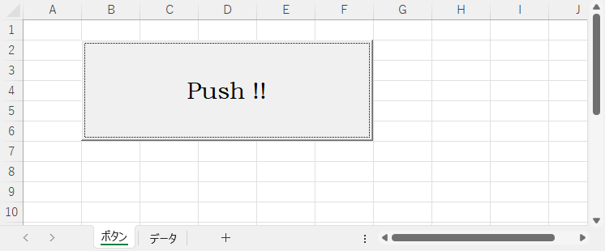

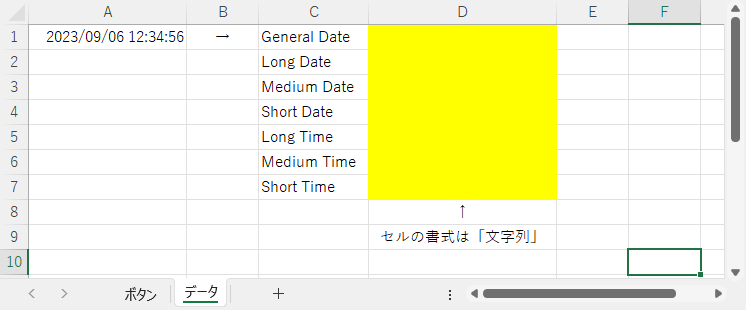

実行後の状態です。指定した書式に変換しました。

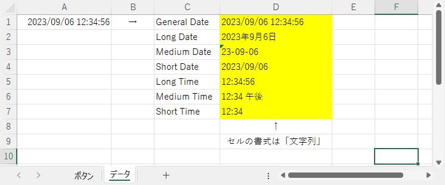

### 数値の書式のキーワード

| キーワード | 変換後の内容 |
| :--- | :--- |
| General Number | 3 桁区切り無し |
| Currency | 通貨記号 & 3 桁区切 |
| Fixed | 3 桁区切り & 整数部 1 桁以上 & 小数部 2 桁 |
| Standard | 整数部 1 桁以上 & 小数部 2 桁 |
| Scientific | 指数形式 |

使用例です。

```vb
Private Sub CommandButton1_Click()

    With Worksheets("データ")
    
        .Range("D1").Value = Format(.Range("A1").Value, "General Number")
        .Range("D2").Value = Format(.Range("A1").Value, "Currency")
        .Range("D3").Value = Format(.Range("A1").Value, "Fixed")
        .Range("D4").Value = Format(.Range("A1").Value, "Standard")
        .Range("D5").Value = Format(.Range("A1").Value, "Scientific")
    
    End With
    
End Sub
```

実行前の状態です。


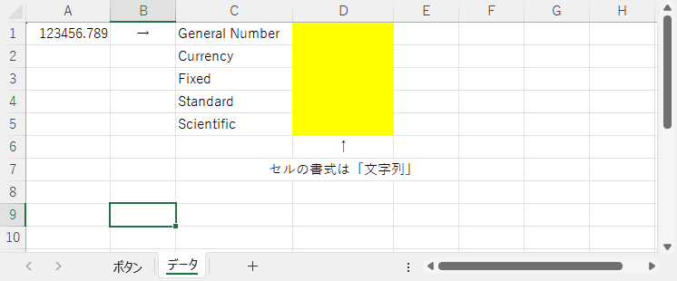

実行後の状態です。指定した書式に変換しました。

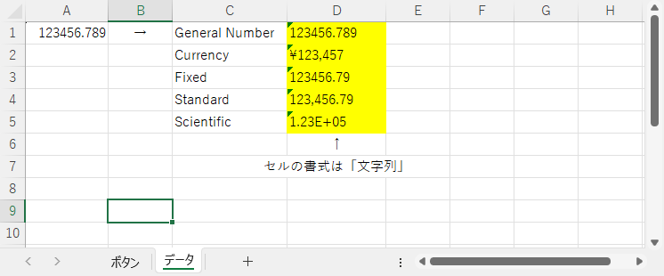

### ユーザー定義の書式

日時用

| 使用文字 | 変換後の内容 |
| :--- | :--- |
| : | 時刻の区切り文字 |
| / | 日付の区切り文字 |
| yy | 西暦の下 2 桁 |
| yyyy | 4 桁表示の西暦 |
| m | ゼロサプレスした月（ 1 ～ 12 ）
| mm | 2 桁表示の月（ 01 ～　12 ） |
| d | ゼロサプレスした日（ 1 ～ 31 ）
| dd | 2 桁表示の日（ 01 ～ 31 ） |
| w | 日付の曜日（日曜日 : 1 ～ 土曜日 : 7 ） |
| h | ゼロサプレスした時（ 0 ～ 23 ） |
| hh | 2 桁の時（ 00 ～ 23 ） |
| n | ゼロサプレスした分（ 0 ～ 59 ） |
| nn | 2 桁の分（ 0 ～ 59 ） |
| s | ゼロサプレスした秒（ 0 ～ 59 ） |
| ss | 2 桁の秒（ 0 ～ 59 ） |

数値用

| 使用文字 | 変換後の内容 |
| :--- | :--- |
| 0 | 1 桁の数字、指定した桁の数字は必ず設定 |
| # | 1 桁の数字、ゼロサプレス形式 |
| . | 小数点 |
| , | 3 桁区切り |

使用例です。

```vb
Private Sub CommandButton1_Click()

    With Worksheets("データ")
    
        .Range("D1").Value = Format(.Range("A1").Value, "yyyy/m/d")
        .Range("D2").Value = Format(.Range("A1").Value, "yyyy/mm/dd")
        .Range("D3").Value = Format(.Range("A1").Value, "yymmdd")
        .Range("D4").Value = Format(.Range("A1").Value, "Hh:nn;ss")
        .Range("D5").Value = Format(.Range("A1").Value, "h:n:s")
        .Range("D6").Value = Format(.Range("A1").Value, "yyyymmdd Hhnnss")
        .Range("D7").Value = Format(.Range("A1").Value, "yyyy/mm/dd Hh:nn:ss")
        .Range("D8").Value = Format(.Range("A8").Value, "#,###,###.###")
        .Range("D9").Value = Format(.Range("A8").Value, "0,000,000.000")
        .Range("D10").Value = Format(.Range("A8").Value, "00000000")
        .Range("D11").Value = Format(.Range("A8").Value, "########")
        .Range("D12").Value = Format(.Range("A8").Value, "#,###,##0.000")
    
    End With
    
End Sub
```

実行前の状態です。

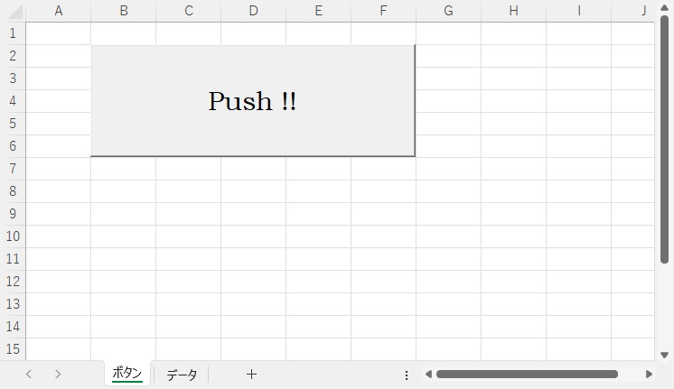

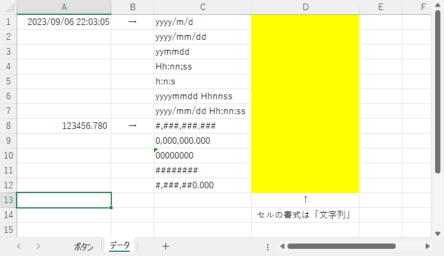

実行後の状態です。指定した書式に変換しました。

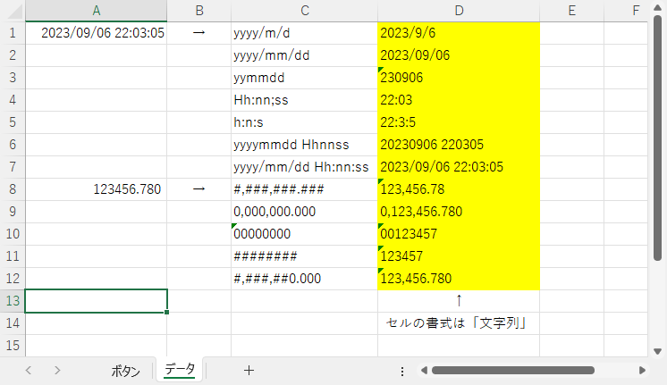

## セルに書式（表示形式）を設定する

セルに書式（表示形式）を設定します。 `Range` を使用した場合、単一セルだけではなく範囲指定で複数のセルに一括で書式を設定できます。

### 単一セルに書式を設定する

`Worksheets` でシートの指定が可能です。

```vb
Range(セル位置).NumberFormatLocal = 書式
```

```vb
cells(行位置, 桁位置).NumberFormatLocal = 書式
```

### 複数のセルに書式を設定する

`Worksheets` でシートの指定が可能です。

```vb
Range(開開始セル位置:終了セル位置).NumberFormatLocal = 書式
```

```vb
Range(開始セル位置, 終了セル位置).NumberFormatLocal = 書式
```

### 書式

書式は `"` でくくって指定します。

| 使用文字 | 表示内容 |
| :--- | :--- |
| : | 時刻の区切り文字 |
| / | 日付の区切り文字 |
| yy | 西暦の下 2 桁 |
| yyyy | 4 桁表示の西暦 |
| m | ゼロサプレスした月（ 1 ～ 12 ）
| mm | 2 桁表示の月 |
| d | ゼロサプレスした日（ 1 ～ 31 ）
| dd | 2 桁表示の日 |
| 0 | 1 桁の数字、指定した桁の数字は必ず設定 |
| # | 1 桁の数字、ゼロサプレス形式 |
| . | 小数点 |
| , | 3 桁区切り |
| h | ゼロサプレスした時（ 0 ～ 23 ） |
| hh | 2 桁の時（ 00 ～ 23 ） |
| m | ゼロサプレスした分（ 0 ～ 59 ） |
| mm | 2 桁の分（ 0 ～ 59 ） |
| s | ゼロサプレスした秒（ 0 ～ 59 ） |
| ss | 2 桁の秒（ 0 ～ 59 ） |

使用例です。

```vb
Private Sub CommandButton1_Click()

    With Worksheets("データ")
        
        ' 書式設定
        .Range("D1").NumberFormatLocal = "yy/m/d"
        .Range("D2").NumberFormatLocal = "yyyy/mm/dd"
        .Range("D3").NumberFormatLocal = "yymmdd"
        .Range("D4").NumberFormatLocal = "hh:mm:ss"
        .Range("D5").NumberFormatLocal = "h:m:s"
        .Range("D6").NumberFormatLocal = "yyyymmdd hhmmss"
        .Range("D7").NumberFormatLocal = "yyyy/mm/dd hh:mm:ss"
        .Range("D8").NumberFormatLocal = "mm/dd (aaa)"
        .Range("D9").NumberFormatLocal = "#,###,###.##"
        .Range("D10").NumberFormatLocal = "0,000,000.00"
        .Range("D11").NumberFormatLocal = "########.##"
        .Range("D12").NumberFormatLocal = "00000000.00"
        
        ' 値代入
        .Range("D1").Value = .Range("A1").Value
        .Range("D2").Value = .Range("A1").Value
        .Range("D3").Value = .Range("A1").Value
        .Range("D4").Value = .Range("A1").Value
        .Range("D5").Value = .Range("A1").Value
        .Range("D6").Value = .Range("A1").Value
        .Range("D7").Value = .Range("A1").Value
        .Range("D8").Value = .Range("A1").Value
        .Range("D9").Value = .Range("A9").Value
        .Range("D10").Value = .Range("A9").Value
        .Range("D11").Value = .Range("A9").Value
        .Range("D12").Value = .Range("A9").Value
    End With

End Sub
```

実行前の状態です。

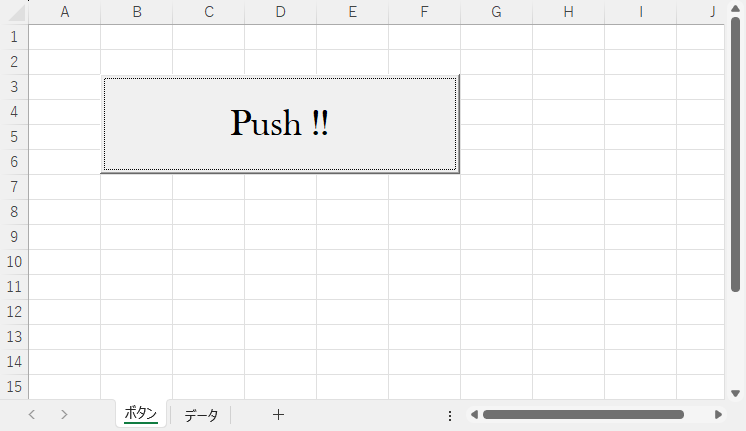

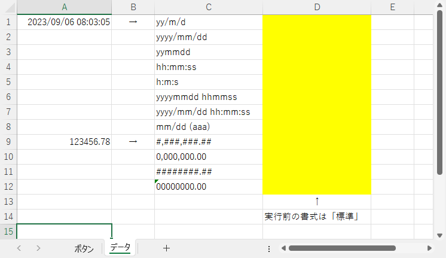

実行後の状態です。指定した書式で値を表示しました。各セルの書式は実行前は「標準」ですが、実行後は指定した書式に置き換わっています。

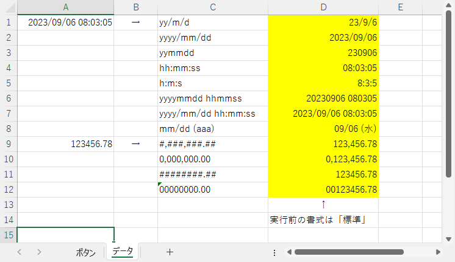

## 列の幅を変更する

### 単一列の幅を変更する

```vb
Columns(カラム番号).ColumnWidth = 列の幅
```

```vb
Columns(カラム名).ColumnWidth = 列の幅
```

### 複数列の幅を変更する

```vb
Columns(開始カラム名:終了カラム名).ColumnWidth = 列の幅
```

## セル内の値の位置を指定する

### 単一セル内の値の位置を指定する

```vb
range(セル位置).HorizontalAlignment = セル内の値の位置
```

### セルの範囲指定内の値の位置を指定する

```vb
range(開始セル位置:終了セル位置).HorizontalAlignment = セル内の値の位置
```

```vb
range(開始セル位置, 終了セル位置).HorizontalAlignment = セル内の値の位置
```

### 単一列のセル内の値の位置を指定する

```vb
Columns(カラム番号).HorizontalAlignment = セル内の値の位置
```

```vb
Columns(カラム名).HorizontalAlignment = セル内の値の位置
```

### 複数列のセル内の値の位置を指定する

```vb
Columns(開始カラム名:終了カラム名).HorizontalAlignment = セル内の値の位置
```

### セル内の位置

| セル内の値の位置 | 意味 |
| :---: | :---: |
| xlCenter | 中央揃え |
| xlLeft | 左詰め |
| xlRight | 右詰め |

使用例です。

```vb
Private Sub CommandButton1_Click()
        
    Worksheets("データ").Columns("A").ColumnWidth = 4
    Worksheets("データ").Columns("A").HorizontalAlignment = xlCenter
    Worksheets("データ").Columns("A").NumberFormatLocal = "#0"
    
    Worksheets("データ").Columns("B").ColumnWidth = 10
    
    Worksheets("データ").Columns("C").ColumnWidth = 14
    Worksheets("データ").Columns("C").NumberFormatLocal = "##,###,##0.0"
    
    Worksheets("データ").Columns("D").ColumnWidth = 20
    Worksheets("データ").Columns("D").HorizontalAlignment = xlCenter
    Worksheets("データ").Columns("D").NumberFormatLocal = "yyyy/mm/dd"

    Worksheets("データ").Rows(1).HorizontalAlignment = xlCenter

End Sub
```

実行前の状態です。

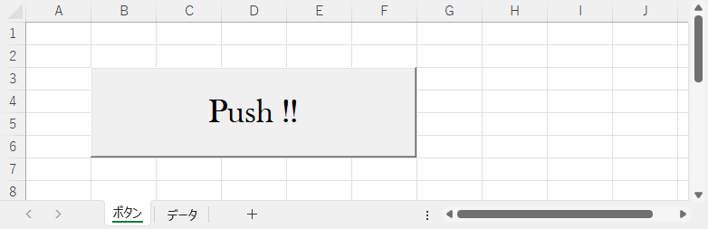

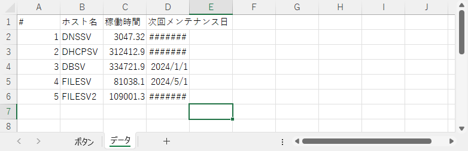

実行後のシート「データ」の状態です。指定した書式通りに表示されました。

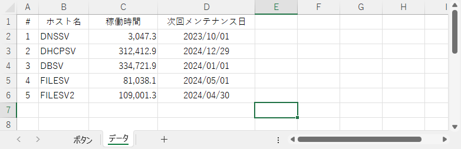

## 多重の With

次のコードでは `Worksheets("データ")` や `Columns("A")` などが繰り返し使用されています。この様なときは `With` ･･･ `End With` でまとめるとコード自体がすっきりとし可読性が向上します。

```vb
Private Sub CommandButton1_Click()
        
    Worksheets("データ").Columns("A").ColumnWidth = 4
    Worksheets("データ").Columns("A").HorizontalAlignment = xlCenter
    Worksheets("データ").Columns("A").NumberFormatLocal = "#0"
    
    Worksheets("データ").Columns("B").ColumnWidth = 10
    
    Worksheets("データ").Columns("C").ColumnWidth = 14
    Worksheets("データ").Columns("C").NumberFormatLocal = "##,###,##0.0"
    
    Worksheets("データ").Columns("D").ColumnWidth = 20
    Worksheets("データ").Columns("D").HorizontalAlignment = xlCenter
    Worksheets("データ").Columns("D").NumberFormatLocal = "yyyy/mm/dd"

    Worksheets("データ").Rows(1).HorizontalAlignment = xlCenter

End Sub
```

`With` ･･･ `End With` を使用して書き直したコードです。シートや各カラム（列）の適用範囲が明確になり、可読性が向上しました。

```vb
Private Sub CommandButton1_Click()
        
    With Worksheets("データ")
    
        ' A 列
        With .Columns("A")
            .ColumnWidth = 4                        ' 列幅
            .HorizontalAlignment = xlCenter         ' センタリング
            .NumberFormatLocal = "#0"               ' 書式
        End With
        
        ' B 列
        With .Columns("B")
            .ColumnWidth = 10                       ' 列幅
        End With
        
        ' C 列
        With .Columns("C")
            .ColumnWidth = 14                       ' 列幅
            .NumberFormatLocal = "##,###,##0.0"     ' 書式
        End With
        
        ' D 列
        With .Columns("D")
            .ColumnWidth = 20                       ' 列幅
            .HorizontalAlignment = xlCenter         ' センタリング
            .NumberFormatLocal = "yyyy/mm/dd"       ' 書式
        End With
        
        ' 見出しの位置
        .Rows(1).HorizontalAlignment = xlCenter     ' センタリング
        
    End With

End Sub
```
