# 5 日目の復習 ＋ α

## 関数

VBA で扱う関数の種類です。 VBA 関数とワークシート関数の両方に用意されている関数もあります。

- VBA 関数  
  VBA だけで使用する関数　　　　　例： `Format`  
  <https://learn.microsoft.com/ja-jp/office/vba/language/reference/functions-visual-basic-for-applications>
- ワークシート関数  
  ワークシートで使用する関数　　　例： `XLOOKUP`  
  <https://support.microsoft.com/ja-jp/office/excel-関数-機能別-5f91f4e9-7b42-46d2-9bd1-63f26a86c0eb>
- 自作の関数  
  自分で作成した関数

## ワークシート関数 XLOOKUP

キーワード（検索値）をもとにシート内を検索し、キーワードに一致する戻り値として返します。例えば、社員コード（検索値）をもとに社員名簿から社員名を取得するなどのときに `XLOOKUP` 関数を使用します。類似の関数に `VLOOKUP` があります。ですが `XLOOKUP` のほうが制約が少なく、柔軟に対応できます。

```vb
WorksheetFunction.XLookup(検索値, 検索範囲, 戻り値の範囲, 見つからなかったときの戻り値)
```

下記以外の引数に「一致モード」と「検索モード」があります。この 2 つの引数は省略可能です。2 つともデフォルト値から変更することもめったにないため、指定しないことが多いです。

- 検索値
  - 検索対象の値（キーワード）
- 検索範囲
  - 検索値と同じ値を探す範囲
  - 列（カラム）を指定することが多い　→　列の全セルの中から検索値と同じ値を探す
- 戻り値の範囲
  - 検索範囲で検索値と同じ値のセルがみつかったとき、戻り値の範囲内で見つかったセルと同一行位置の値を戻り値とする
  - 検索範囲と戻り値の範囲は同じサイズであること
- 見つからなかったときの戻り値
  - 検索範囲に検索値と同じ値がみつからなかったときの戻り値

社員名をもとに社員番号を検索するコードです。社員番号が見つからなかったときは 「いません」 と表示します。

```vb
Private Sub CommandButton1_Click()

    Dim LONG_Row    As Long         ' 行位置
    Dim WS_Meibo    As Worksheet    ' シート「名簿」用
    
    Set WS_Meibo = Worksheets("名簿")
    
    With Worksheets("データ")
    
        For LONG_Row = 2 To 6 Step 1
            .Cells(LONG_Row, 2).Value = WorksheetFunction.XLookup(.Cells(LONG_Row, 1), WS_Meibo.Columns("B"), WS_Meibo.Columns("A"), "いません")
        Next LONG_Row
    
    End With

End Sub
```

実行前の状態です。


実行後の状態です。シート「データ」の「名前」に対応する「社員番号」が設定されました。シート「名簿」に登録されていない名前は「社員番号」に「いません」が設定されました。


## ワークシート関数 COUNTIF

シート内を検索し、戻り値として検索条件に合致する値の個数を戻り値として返します。

```vb
WorksheetFunction.CountIf(検索範囲, 検索条件)
```

- 検索範囲
  - 検索条件に合致する値を検索するセルの範囲
- 検索条件
  - 検索範囲を検索する条件
  - 文字列や比較演算子などを使用して条件を設定する

### 検索条件が文字列の場合

品コードごとに売上個数を求めるコードです。

```vb
Private Sub CommandButton1_Click()

    Dim LONG_Row    As Long         ' 行位置
    Dim WS_Denpyo   As Worksheet    ' シート「売上伝票」用
    
    Set WS_Denpyo = Worksheets("売上伝票")
    
    With Worksheets("売上簿")
    
        For LONG_Row = 2 To 6 Step 1
            .Cells(LONG_Row, 2).Value = WorksheetFunction.CountIf(WS_Denpyo.Columns(2), .Cells(LONG_Row, 1))
        Next LONG_Row
    
    End With

End Sub
```

実行前の状態です。


実行後の状態です。シート「売上簿」の「売上個数」に品コードごとにカウントした個数が設定されました。売上がない品目の戻り値は 0 です。


### 検索条件が数値の場合

売上目標額を達成した得意先の数を求めるコードです。

```vb
Private Sub CommandButton1_Click()

    Dim LONG_Row    As Long         ' 行位置
    Dim WS_Uriagebo As Worksheet    ' シート「売上簿」用
    Dim WS_Kekka    As Worksheet    ' シート「売上結果」用
    
    Set WS_Uriagebo = Worksheets("売上簿")
    Set WS_Kekka = Worksheets("売上結果")
    
    WS_Uriagebo.Cells(2, 2).Value = WorksheetFunction.CountIf(WS_Kekka.Columns("B"), ">=" & WS_Uriagebo.Cells(1, 2).Value)
    
End Sub
```

検索条件の部分を抜き出しました。比較演算子 ">=" と シート「売上簿」のセル B1 の値を `&` で繋げているので検索条件は `>=100` になります。シート「売上結果」の B 列で、この条件を満たす数をカウントし、結果を戻り値とます。

```vb
">=" & WS_Uriagebo.Cells(1, 2).Value
```

実行前の状態です。


実行後のシート「売上簿」の状態です。セル B2 に売上目標額を達成した得意先の数（件数）が設定されました。


## ワークシート関数 SUM

指定したセルの範囲の値を合計し、その結果を戻り値として返します。

```vb
WorksheetFunction.Sum(セルの範囲)
```

- セルの範囲
  - 合計対象のセルの範囲

指定したセルの合計値を求めるコードです。

```vb
Private Sub CommandButton1_Click()

    With Worksheets("データ")
        .Cells(1, 2).Value = WorksheetFunction.Sum(.Range("A3", "E4"))
    End With
    
End Sub
```

実行前の状態です。


実行後の状態です。シート「データ」のセル B1 にセル A3 ～ E4 の合計値が設定されました。


## ワークシート関数 ROUND / ROUNDUP / ROUNDDOWN

指定した値や計算結果を四捨五入、切り上げ、切り捨てし、その結果を戻り値として返します。

### 四捨五入

```vb
WorksheetFunction.Round( 値または計算式, 桁数 )
```

### 切り上げ

```vb
WorksheetFunction.RoundUp( 値または計算式, 桁数 )
```

### 切り捨て

```vb
WorksheetFunction.RoundDown( 値または計算式, 桁数 )
```

- 値または計算式
  - 四捨五入 / 切り上げ / 切り捨ての対象になる値または計算式
- 桁数
  - 小数部分で残す桁数
  - 0 を指定した場合、戻り値は整数になる

使用例です。

```vb
Private Sub CommandButton1_Click()

    Dim WS_Data     As Worksheet        ' シート「データ」用
    
    Set WS_Data = Worksheets("データ")
    
    With WS_Data
        ' 小数点第 3 位を丸めて小数点第 2 位までにする
        .Cells(1, 4).Value = WorksheetFunction.Round(.Cells(1, 1).Value, 2)
        .Cells(2, 4).Value = WorksheetFunction.RoundUp(.Cells(1, 1).Value, 2)
        .Cells(3, 4).Value = WorksheetFunction.RoundDown(.Cells(1, 1).Value, 2)
    
        ' 小数点第 1 位を丸めて整数にする
        .Cells(4, 4).Value = WorksheetFunction.Round(.Cells(4, 1).Value, 0)
        .Cells(5, 4).Value = WorksheetFunction.RoundUp(.Cells(4, 1).Value, 0)
        .Cells(6, 4).Value = WorksheetFunction.RoundDown(.Cells(4, 1).Value, 0)
            
        ' 計算結果を丸めて整数にする
        .Cells(7, 4).Value = WorksheetFunction.Round(25 * 0.05, 0)
        .Cells(8, 4).Value = WorksheetFunction.RoundUp(25 * 0.05, 0)
        .Cells(9, 4).Value = WorksheetFunction.RoundDown(25 * 0.05, 0)
    End With
    
End Sub
```

実行前の状態です。


実行後の状態です。シート「データ」の D 列に指定した形式で丸めた値が設定されました。累計台数の算出はセルに埋め込んだ `SUM` 関数で行っています。


## ワークシート関数 SUBTOAL

リストの集計値を戻り値として返します。

```vb
WorksheetFunction.Subtotal(集計方法を指定する値, 集計対象範囲)
```

| 集計方法を指定する値<br>（非表示の行を含む） | 集計方法を指定する値<br>（非表示の行を除く） | 集計方法（戻り値） |
| :---: | :---: | :-- |
| 1 | 101 | 平均値 |
| 2 | 102 | 数値が入っているセルの数 |
| 3 | 103 | 値が入っているセルの数 |
| 4 | 104 | 最大値 |
| 5 | 105 | 最小値|
| 6 | 106 | 積（乗算した結果） |
| 7 | 107 | 標本を対象にした標準偏差（不偏標準偏差） |
| 8 | 108 | 母集団を対象にした標準偏差 |
| 9 | 109 | 合計値 |
| 10 | 110 | 標本を対象にした分散（不偏分散） |
| 11 | 111 | 母集団を対象にした分散 |

「非表示」は以下のページで説明されている非表示を指します。はオートフィルターで表示されていない行のことではありません。

行または列を表示または非表示にする  
<https://support.microsoft.com/ja-jp/office/行または列を表示または非表示にする-659c2cad-802e-44ee-a614-dde8443579f8>

VBA でコードを書く上で、おそらく、上述の「非表示」は使用することがないと思います。したがって、集計方法を指定する値は 1 ～ 11 を使用すれば良いでしょう。

`SUBTOTAL` 関数の集計対象範囲になるのは、`Range` で指定するセルの範囲や `Columns` で指定する列に含まれるすべてのセルです。オートフィルター後であれば、`Range` や `Columns` で指定された範囲で画面に表示されているセルが対象です（オートフィルターで非表示になった行のセルは除外されます）。

**「オートフィルター」は 7 日目の説明**をご確認ください

### 通常の使用例

#### 平均値を求める

シート「データ」のセル A1 ～ A10 に設定された値の平均値を求め、セル C1 に設定します。

```vb
Private Sub CommandButton1_Click()

    With Worksheets("データ")
        .Cells(1, 3).Value = WorksheetFunction.Subtotal(1, .Range("A1", "A10"))
    End With
    
End Sub
```

セル A1 ～ A10 以外に値が入っていないのであれば、列 A を指定できます。

```vb
Private Sub CommandButton1_Click()

    With Worksheets("データ")
        .Cells(1, 3).Value = WorksheetFunction.Subtotal(1, .Columns("A"))
    End With
    
End Sub
```

実行前の状態です。

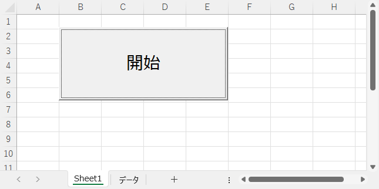

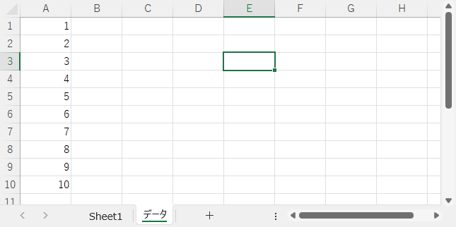

実行後のシート「データ」の状態です。平均値が設定されました。


#### 数値が入っているセルをカウントする

シート「データ」のセル A1 ～ A10 で数値が入っているセルをカウントし、その数をセル C1 に設定します。

```vb
Private Sub CommandButton1_Click()

    With Worksheets("データ")
        .Cells(1, 3).Value = WorksheetFunction.Subtotal(2, .Range("A1", "A10"))
    End With
    
End Sub
```

セル A1 ～ A10 以外に値が入っていないのであれば、列 A を指定できます。

```vb
Private Sub CommandButton1_Click()

    With Worksheets("データ")
        .Cells(1, 3).Value = WorksheetFunction.Subtotal(2, .Columns("A"))
    End With
    
End Sub
```

実行前の状態です。


実行後のシート「データ」の状態です。空や文字列が入ったセルを除き、数値が入ったセルをカウントしました。

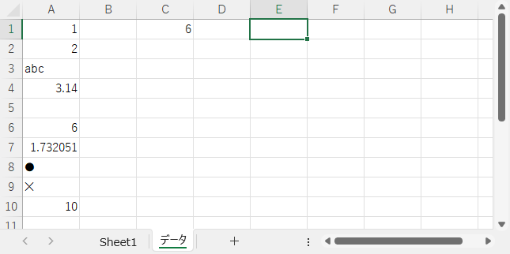

#### 値が入っているセルをカウントする

シート「データ」のセル A1 ～ A10 で何らかの値が入っているセルをカウントし、その数をセル C1 に設定します。

```vb
Private Sub CommandButton1_Click()

    With Worksheets("データ")
        .Cells(1, 3).Value = WorksheetFunction.Subtotal(3, .Range("A1", "A10"))
    End With
    
End Sub
```

セル A1 ～ A10 以外に値が入っていないのであれば、列 A を指定できます。

```vb
Private Sub CommandButton1_Click()

    With Worksheets("データ")
        .Cells(1, 3).Value = WorksheetFunction.Subtotal(3, .Columns("A"))
    End With
    
End Sub
```

実行前の状態です。


実行後のシート「データ」の状態です。空のセルを除き、何らかの値が入ったセルをカウントしました。


#### 最大値を求める

シート「データ」のセル A1 ～ A10 の中の最大値を求め、セル C1 に設定します。

```vb
Private Sub CommandButton1_Click()

    With Worksheets("データ")
        .Cells(1, 3).Value = WorksheetFunction.Subtotal(4, .Range("A1", "A10"))
    End With
    
End Sub
```

セル A1 ～ A10 以外に値が入っていないのであれば、列 A を指定できます。

```vb
Private Sub CommandButton1_Click()

    With Worksheets("データ")
        .Cells(1, 3).Value = WorksheetFunction.Subtotal(4, .Columns("A"))
    End With
    
End Sub
```

実行前の状態です。


実行後のシート「データ」の状態です。最大値を求めました。

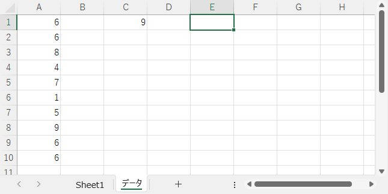

#### 最小値を求める

シート「データ」のセル A1 ～ A10 の中の最小値を求め、セル C1 に設定します。

```vb
Private Sub CommandButton1_Click()

    With Worksheets("データ")
        .Cells(1, 3).Value = WorksheetFunction.Subtotal(5, .Range("A1", "A10"))
    End With
    
End Sub
```

セル A1 ～ A10 以外に値が入っていないのであれば、列 A を指定できます。

```vb
Private Sub CommandButton1_Click()

    With Worksheets("データ")
        .Cells(1, 3).Value = WorksheetFunction.Subtotal(5, .Columns("A"))
    End With
    
End Sub
```

実行前の状態です。


実行後のシート「データ」の状態です。最小値を求めました。


#### 合計値を求める

シート「データ」のセル A1 ～ A10 に設定された値の合計値を求め、セル C1 に設定します。

```vb
Private Sub CommandButton1_Click()

    With Worksheets("データ")
        .Cells(1, 3).Value = WorksheetFunction.Subtotal(9, .Range("A1", "A10"))
    End With
    
End Sub
```

セル A1 ～ A10 以外に値が入っていないのであれば、列 A を指定できます。

```vb
Private Sub CommandButton1_Click()

    With Worksheets("データ")
        .Cells(1, 3).Value = WorksheetFunction.Subtotal(9, .Columns("A"))
    End With
    
End Sub
```

実行前の状態です。


実行後のシート「データ」の状態です。合計値が設定されました。

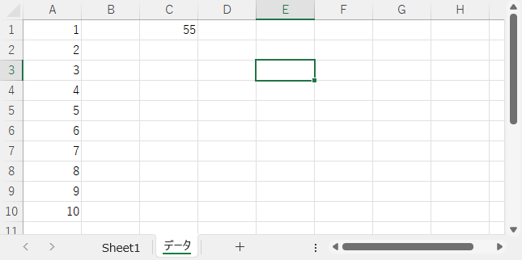

### オートフィルター後の結果に使用した例

#### オートフィルター後の平均値を求める

シート「データ」のセル A2 ～ B11 の中で A 列の値が "A" のときの B 列の平均値を求め、セル D1 に設定します。

```vb
Private Sub CommandButton1_Click()

    With Worksheets("データ")
        .Range("A1", "A11").AutoFilter 1, "A"
        .Cells(1, 4).Value = WorksheetFunction.Subtotal(1, .Range("B2", "B11"))
    End With
    
End Sub
```

セル B1 ～ B11 以外に値が入っていないのであれば、`SUBTOTAL` 関数の集計対象に B 列を指定できます。

```vb
Private Sub CommandButton1_Click()

    With Worksheets("データ")
        .Range("A1", "A11").AutoFilter 1, "A"
        .Cells(1, 4).Value = WorksheetFunction.Subtotal(1, .Columns("B"))
    End With
    
End Sub
```

実行前の状態です。


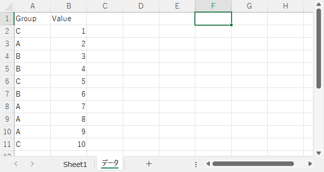

実行後のシート「データ」の状態です。オートフィルター後に表示されている値の平均値が設定されました。


#### オートフィルター後に数値が入っているセルをカウントする

シート「データ」のセル A2 ～ B11 の中で A 列の値が "A" のときの B 列で数値が入っているセルをカウントし、その数をセル D1 に設定します。

```vb
Private Sub CommandButton1_Click()

    With Worksheets("データ")
        .Range("A1", "A11").AutoFilter 1, "A"
        .Cells(1, 4).Value = WorksheetFunction.Subtotal(2, .Range("B2", "B11"))
    End With
    
End Sub
```

セル B1 ～ B11 以外に値が入っていないのであれば、`SUBTOTAL` 関数の集計対象に B 列を指定できます。

```vb
Private Sub CommandButton1_Click()

    With Worksheets("データ")
        .Range("A1", "A11").AutoFilter 1, "A"
        .Cells(1, 4).Value = WorksheetFunction.Subtotal(2, .Columns("B"))
    End With
    
End Sub
```

実行前の状態です。


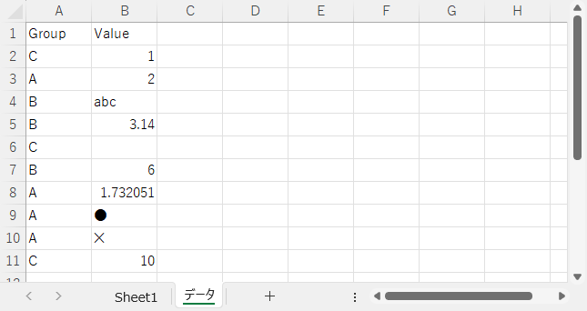

実行後のシート「データ」の状態です。文字が入ったセルを除き、数値が入ったセルをカウントしました。

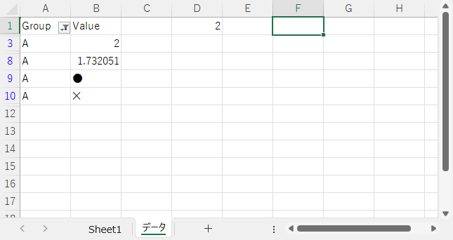

#### オートフィルター後に値が入っているセルをカウントする

シート「データ」のセル A2 ～ B11 の中で A 列の値が "A" のときの B 列で値が入っているセルをカウントし、その数をセル D1 に設定します。

```vb
Private Sub CommandButton1_Click()

    With Worksheets("データ")
        .Range("A1", "A11").AutoFilter 1, "A"
        .Cells(1, 4).Value = WorksheetFunction.Subtotal(3, .Range("B2", "B11"))
    End With
    
End Sub
```

今回は B 列全体の指定はできません。対象を B 列にすると見出し（セル B1 ）もカウントされ、正しい結果にならないためです。

実行前の状態です。


実行後のシート「データ」の状態です。オートフィルター後の値が入ったセルをカウントしました。


#### オートフィルター後の最大値を求める

シート「データ」のセル A2 ～ B11 の中で A 列の値が "A" のときの B 列の値の最大値をセル D1 に設定します。

```vb
Private Sub CommandButton1_Click()

    With Worksheets("データ")
        .Range("A1", "A11").AutoFilter 1, "A"
        .Cells(1, 4).Value = WorksheetFunction.Subtotal(4, .Range("B2", "B11"))
    End With
    
End Sub
```

セル B1 ～ B11 以外に値が入っていないのであれば、`SUBTOTAL` 関数の集計対象に B 列を指定できます。

```vb
Private Sub CommandButton1_Click()

    With Worksheets("データ")
        .Range("A1", "A11").AutoFilter 1, "A"
        .Cells(1, 4).Value = WorksheetFunction.Subtotal(4, .Columns("B"))
    End With
    
End Sub
```

実行前の状態です。


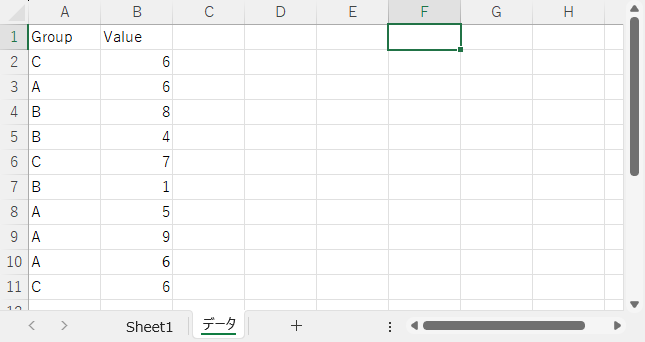

実行後のシート「データ」の状態です。オートフィルター後に表示されている値の最大値を設定しました。

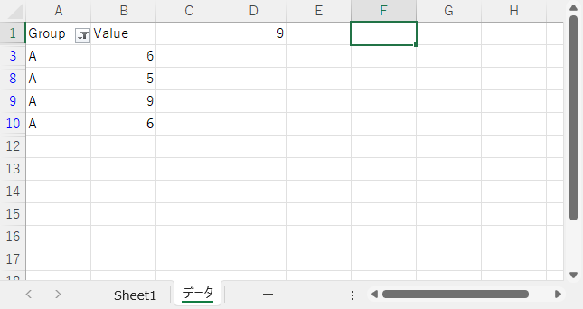

#### 最小値を求める

シート「データ」のセル A2 ～ B11 の中で A 列の値が "A" のときの B 列の値の最小値をセル D1 に設定します。

```vb
Private Sub CommandButton1_Click()

    With Worksheets("データ")
        .Range("A1", "A11").AutoFilter 1, "A"
        .Cells(1, 4).Value = WorksheetFunction.Subtotal(5, .Range("B2", "B11"))
    End With
    
End Sub
```

セル B1 ～ B11 以外に値が入っていないのであれば、`SUBTOTAL` 関数の集計対象に B 列を指定できます。

```vb
Private Sub CommandButton1_Click()

    With Worksheets("データ")
        .Range("A1", "A11").AutoFilter 1, "A"
        .Cells(1, 4).Value = WorksheetFunction.Subtotal(5, .Columns("B"))
    End With
    
End Sub
```

実行前の状態です。


実行後のシート「データ」の状態です。オートフィルター後に表示されている値の最小値を設定しました。

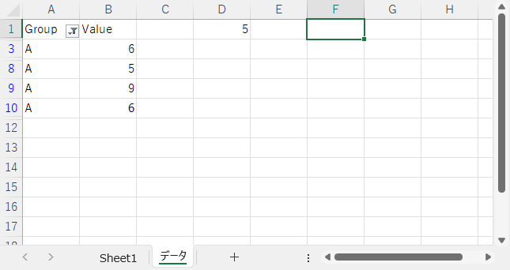

#### オートフィルター後の合計値を求める

シート「データ」のセル A2 ～ B11 の中で A 列の値が "A" のときの B 列の合計値を求め、セル D1 に設定します。比較のため、ワークシート関数 `SUM` を使用した合計値をセル E1 に設定します。

```vb
Private Sub CommandButton1_Click()

    With Worksheets("データ")
        .Range("A1", "A11").AutoFilter 1, "A"
        .Cells(1, 4).Value = WorksheetFunction.Subtotal(9, .Range("B2", "B11"))
        .Cells(1, 5).Value = WorksheetFunction.Sum(.Range("B2", "B11"))
    End With
    
End Sub
```

セル B1 ～ B11 以外に値が入っていないのであれば、集計対象に B 列を指定できます。

```vb
Private Sub CommandButton1_Click()

    With Worksheets("データ")
        .Range("A1", "A11").AutoFilter 1, "A"
        .Cells(1, 4).Value = WorksheetFunction.Subtotal(9, .Columns("B"))
        .Cells(1, 5).Value = WorksheetFunction.Sum(.Columns("B"))
    End With
    
End Sub

```

実行前の状態です。


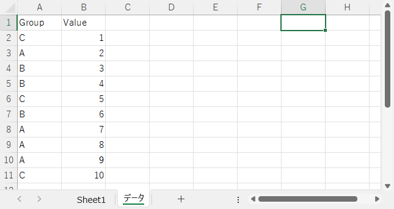

実行後のシート「データ」の状態です。セル D1 が `SUBTOTAL` の、セル E1 が `SUM` の結果です。`SUBTOTAL` はオートフィルター後の値だけで合計値を算出しました。`SUM` はオートフィルターに関係なく指定した範囲に含まれる値の合計値を算出しました。

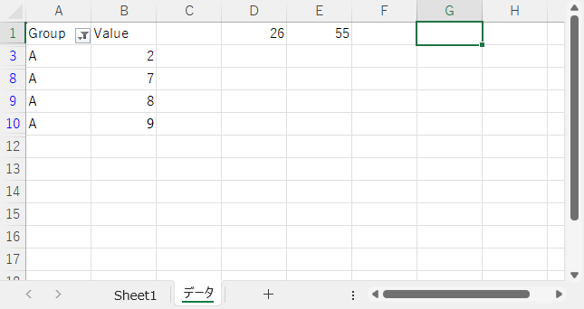

## ワークシート関数 MAX / MIN

指定した範囲に含まれる値の最大値、最小値を戻り値として返します。

### 最大値

```vb
WorksheetFunction.Max(セルの範囲)
```

- セルの範囲
  - 最大値を求めるセルの範囲

### 最小値

```vb
WorksheetFunction.Max(セルの範囲)
```

- セルの範囲
  - 最小値を求めるセルの範囲

使用例です。セル A1 ～ A10 内の最大値と最小値を求めるコードです。

```vb
Private Sub CommandButton1_Click()

    With Worksheets("データ")
        .Cells(1, 4).Value = WorksheetFunction.Max(.Range("A1", "A10"))
        .Cells(2, 4).Value = WorksheetFunction.Min(.Range("A1", "A10"))
    End With
    
End Sub
```

実行前の状態です。


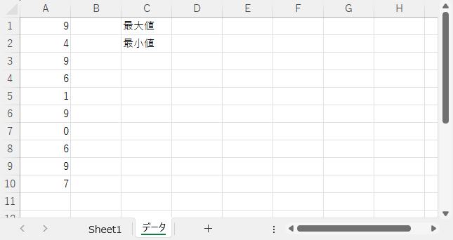

実行後のシート「データ」の状態です。最大値、最小値を求めました。

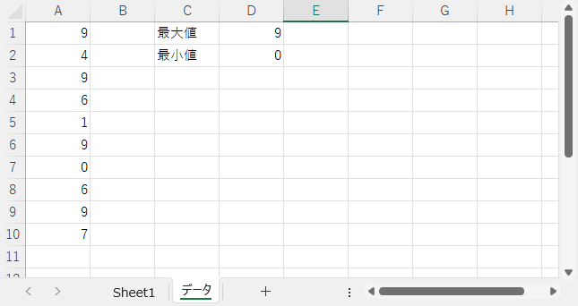

この関数を日付に使用すると、「最大値　＝　最も新しい日」、「最小値　＝　最も古い日」になります。
実行前の状態です。


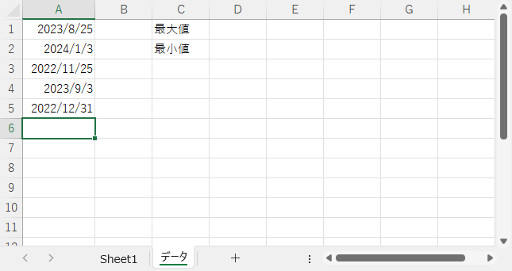

実行後のシート「データ」の状態です。最大値に最も新しい日付を、最小値に最も古い日付を求めました。

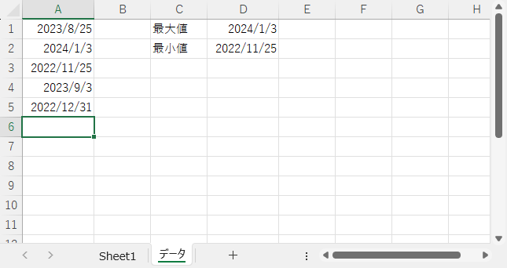

## ワークシート関数をセルに埋め込む

セルにワークシート関数を直接埋め込むことができます。  
下記のコードは 1 日の台数をもとに日別で累計台数を算出するものです。

```vb
Private Sub CommandButton1_Click()

    Dim WS_Data     As Worksheet        ' シート「データ」用
    Dim LONG_Row    As Long             ' 行番号
    
    Set WS_Data = Worksheets("データ")
    
    With WS_Data
    
        For LONG_Row = 2 To 9 Step 1
            .Cells(LONG_Row, 3).Value = "=SUM(B2:B" & LONG_Row & ")"
        Next LONG_Row
    
    End With
    
End Sub
```

実行前の状態です。セル C2 が選択されており、何も設定されていないことが確認できます。


実行後の状態です。セル C2 に `SUM` 関数が設定されているのが確認できます。


同じことをセルにワークシートを埋め込まず、計算結果を設定するよう書き直したコードです。

```vb
Private Sub CommandButton1_Click()

    Dim WS_Data     As Worksheet        ' シート「データ」用
    Dim LONG_Row    As Long             ' 行番号
    Dim Long_Total  As Long             ' 合計値
    
    Set WS_Data = Worksheets("データ")
    
    With WS_Data
    
        Long_Total = 0
        For LONG_Row = 2 To 9 Step 1
            Long_Total = Long_Total + .Cells(LONG_Row, 2).Value
            .Cells(LONG_Row, 3).Value = Long_Total
        Next LONG_Row
    
    End With
    
End Sub
```

実行後の状態です。セル C2 に計算結果が設定されています。

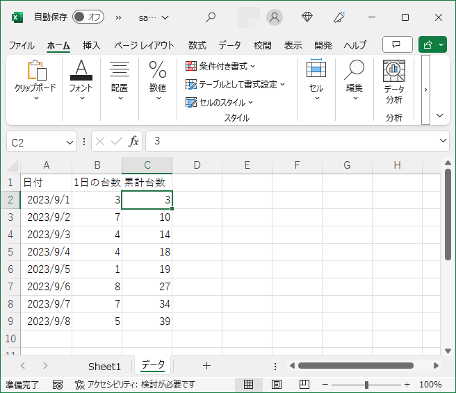

## VBA 関数 InStr

キーワードをもとに文字列内を検索し、キーワードと一致する部分の位置を戻り値として返します。複数の箇所が一致する場合、最初に一致した場所が戻り値になります。一致しない場合の戻り値は 0 です。

例えば、キーワードが "and" 、文字列が "United Kingdom of Great Britain and Northern Ireland" の場合、戻り値は 33 になります。

```vb
InStr( 検索開始位置, 検索対象の文字列, キーワード, 検索モード)
```

- 検索開始位置　・・・　省略可能
  - 文字列をキーワードで検索を開始する位置
- 検索対象の文字列
  - キーワードで検索される文字列
- キーワード
  - 検索対象の文字列内を検索するキーワード
- 検索モード　・・・　省略可能
  - 検索時の全角・半角、大文字・小文字、ひらがな・カタカナを区別するか、無視するかを指定する
  - 検索モードを指定した場合、検索開始位置も指定しなければならない
   | 検索モード | 全角・半角、大文字・小文字、ひらがな・カタカナ | 備考 |
   | :---: | :---: | :---: |
   | vbBinaryCompare | 区別する | デフォルト |
   | vbTextCompare | 区別しない |

文字列を先頭から検索し、大文字・小文字などの区別をする事が多いので、（場合によりますが）「検索開始位置」と「検索モード」は省略して問題ありません。

使用例です。

```vb
Private Sub CommandButton1_Click()

    Dim WS_Data         As Worksheet        ' シート「データ」用
    Dim LONG_Row        As Long             ' 行番号
    Dim STR_Mojiretsu   As String           ' 検索される文字列
    Dim STR_KeyWord     As String           ' キーワード
    Dim LONG_Start      As Long             ' 検索開始位置
    
    Set WS_Data = Worksheets("データ")
    
    With WS_Data
    
        For LONG_Row = 2 To 10 Step 1
        
            STR_Mojiretsu = .Cells(LONG_Row, 1).Value
            STR_KeyWord = .Cells(LONG_Row, 2).Value
        
            If .Cells(LONG_Row, 4).Value = "指定しない" Then
                If .Cells(LONG_Row, 3).Value = "指定しない" Then
                    .Cells(LONG_Row, 5).Value = InStr(STR_Mojiretsu, STR_KeyWord)
                Else
                    LONG_Start = .Cells(LONG_Row, 3).Value
                    .Cells(LONG_Row, 5).Value = InStr(LONG_Start, STR_Mojiretsu, STR_KeyWord)
                End If
            Else
                LONG_Start = .Cells(LONG_Row, 3).Value
                If .Cells(LONG_Row, 4) = "vbBinaryCompare" Then
                    .Cells(LONG_Row, 5).Value = InStr(LONG_Start, STR_Mojiretsu, STR_KeyWord, vbBinaryCompare)
                Else
                    .Cells(LONG_Row, 5).Value = InStr(LONG_Start, STR_Mojiretsu, STR_KeyWord, vbTextCompare)
                End If
            End If
        Next LONG_Row
    
    End With
    
End Sub
```

実行前の状態です。


実行後の状態です。E 列にそれぞれの `InStr` 関数の戻り値が設定されました。


`InStr` 関数は検索する文字列内にキーワードが含まれている場合、戻り値は 0 より大きくなります（ 1 以上になります）。これを利用して、セルの中に特定のキーワードが含まれるセルだけを処理対象にできます。次のコードはキーワード "Kingdom" が含まれるセルを黄色に塗りつぶします。

```vb
Private Sub CommandButton1_Click()

    Dim WS_Data         As Worksheet        ' シート「データ」用
    Dim RANGE_Cell      As Range            ' 処理対象のセル
    Dim LONG_Row        As Long             ' 行番号
    Dim STR_KeyWord     As String           ' キーワード
    
    STR_KeyWord = "Kingdom"
    Set WS_Data = Worksheets("データ")
    
    With WS_Data
    
        For LONG_Row = 1 To 11 Step 1
        
            Set RANGE_Cell = .Cells(LONG_Row, 1)
            If InStr(RANGE_Cell.Value, STR_KeyWord) > 0 Then
                RANGE_Cell.Interior.Color = vbYellow
            End If
        
        Next LONG_Row
    
    End With
    
End Sub
```

実行前の状態です。


実行後の状態です。 "kingdom" を含むセルを黄色で塗りつぶしました。


## VBA 関数 Weekday

日付を元に対応する曜日を示す値を戻り値として返します。

```vb
Weekday(日付)
```

| 戻り値 | 意味 | 定数 |
| :---: | :---: | :--- |
| 1 | 日曜日 | vbSunday |
| 2 | 月曜日 | vbMonday |
| 3 | 火曜日 | vbTuesday |
| 4 | 水曜日 | vbWednesday |
| 5 | 木曜日 | vbThursday |
| 6 | 金曜日 | vbFriday |
| 7 | 土曜日 | vbSaturday |

「定数」とは VBA が予め用意していて、決まった値が設定された変数のことです。定数に設定した値は変更できません。セルの塗りつぶしのときに使用したカラーコード（ vbYellow 等）も定数の一部です。上記の表からわかるとおり、実体は数字などです。例えば定数 vbSunday の実体は 1 です。曜日判定をしているコード内に 1 と書くより vbSunday と書いたほうがコードがよりわかりやすくなるというメリットがあります。

日付から曜日を算出し、日付を日曜日なら赤色で、土曜日なら青色で塗りつぶすコードです。

```vb
Private Sub CommandButton1_Click()

    Dim LONG_Row        As Long             ' 行番号
    Dim LONG_Week       As Long             ' 曜日
    
    With Worksheets("データ")

        For LONG_Row = 1 To 10 Step 1
            LONG_Week = Weekday(.Cells(LONG_Row, 1).Value)  ' 曜日算出
            If LONG_Week = vbSunday Then                    ' 日曜日？
                .Cells(LONG_Row, 1).Interior.Color = vbRed
            End If
            If LONG_Week = vbSaturday Then                  ' 土曜日？
                .Cells(LONG_Row, 1).Interior.Color = vbBlue
            End If
        Next LONG_Row
    
    End With
    
End Sub
```

実行前の状態です。

)


実行後の状態です。日曜日が赤色、土曜日が青色で塗りつぶしました。


VBA 関数 DateAdd

日付に指定した時間間隔を加算した結果を戻り値として返します。

```vb
DateAdd(時間間隔, 追加する時間, 加算対象の日付)
```

| 時間間隔 | 説明 |
| :---: | :---: |
| yyyy | 年 |
| q | 四半期 |
| m | 月 |
| d | 日 |
| ww | 週 |

シート「データ」のセル A1 の日付に指定した期間を加算した後の日付を算出するコードです。

```vb
Private Sub CommandButton1_Click()

    With Worksheets("データ")
        .Cells(1, 4).Value = DateAdd("yyyy", .Cells(1, 2).Value, .Cells(1, 1))
        .Cells(2, 4).Value = DateAdd("q", .Cells(2, 2).Value, .Cells(1, 1))
        .Cells(3, 4).Value = DateAdd("m", .Cells(3, 2).Value, .Cells(1, 1))
        .Cells(4, 4).Value = DateAdd("d", .Cells(4, 2).Value, .Cells(1, 1))
        .Cells(5, 4).Value = DateAdd("ww", .Cells(5, 2).Value, .Cells(1, 1))
    End With
    
End Sub
```

実行前の状態です。


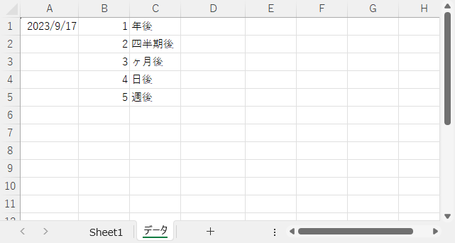

実行後のシート「データ」の状態です。D 列に指定した期間を加算した日付を設定しました。

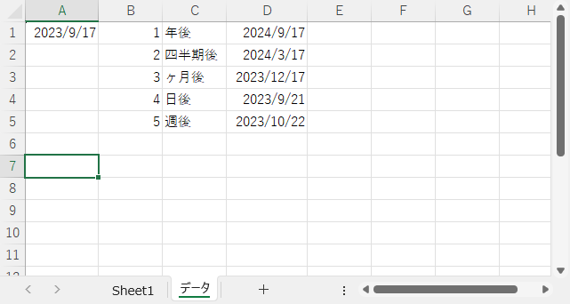

## VBA 関数 IsDate 

指定した値が日付または時刻として正しい形式になっているか確認し、なっている場合は True を、なっていない場合は False を戻り値として返します。

```vb
IsDate(値)
```

シート「データ」のセル A1 ～ A11 までの値が日付 / 時刻として正しい値になっているか確認し、その結果をセル B1 ～ B11 に記録するコードです。

```vb
Private Sub CommandButton1_Click()

    Dim LONG_Row        As Long         ' 行位置
    Dim BOOL_Result     As Boolean      ' 判定結果
       
    With Worksheets("データ")
        For LONG_Row = 1 To 11 Step 11
            BOOL_Result = IsDate(.Cells(LONG_Row, 1).Value)
            If BOOL_Result = True Then
                .Cells(LONG_Row, 1) = "OK"
            Else
                .Cells(LONG_Row, 1) = "NG"
            End If
        Next LONG_Row
    End With
    
End Sub
```

実行前の状態です。


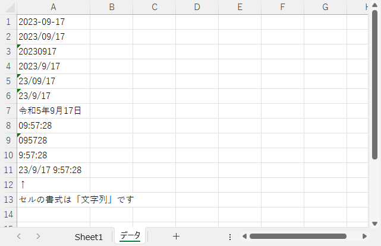

実行後のシート「データ」の状態です。「令和5年9月17日」のような和暦も日付として判断されました。

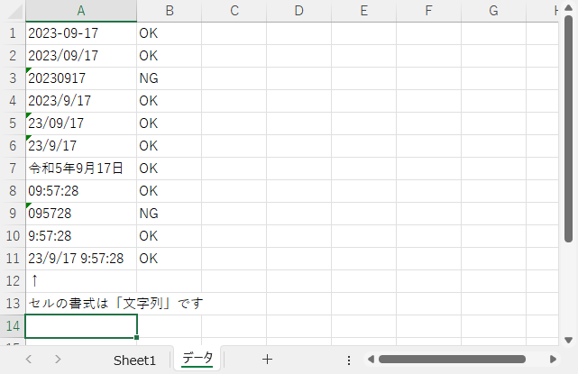
