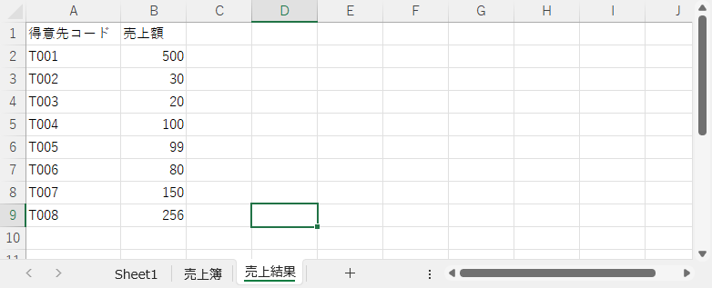
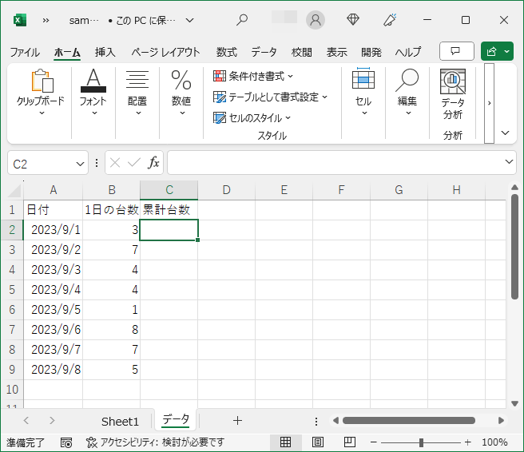

# 5 日目の復習 ＋ α

## 関数

VBA で扱う関数の種類です。 VBA 関数とワークシート関数の両方に用意されている関数もあります。

- VBA 関数  
  VBA だけで使用する関数　　　　　例： `Format`  
  <https://learn.microsoft.com/ja-jp/office/vba/language/reference/functions-visual-basic-for-applications>
- ワークシート関数  
  ワークシートで使用する関数　　　例： `XLOOKUP`  
  <https://support.microsoft.com/ja-jp/office/excel-関数-機能別-5f91f4e9-7b42-46d2-9bd1-63f26a86c0eb>
- 自作の関数  
  自分で作成した関数

## ワークシート関数 XLOOKUP

キーワード（検索値）をもとにシート内を検索し、キーワードに一致する戻り値として返します。例えば、社員コード（検索値）をもとに社員名簿から社員名を取得するなどのときに `XLOOKUP` 関数を使用します。類似の関数に `VLOOKUP` があります。ですが `XLOOKUP` のほうが制約が少なく、柔軟に対応できます。

```vb
WorksheetFunction.XLookup(検索値, 検索範囲, 戻り値の範囲, 見つからなかったときの戻り値)
```

下記以外の引数に「一致モード」と「検索モード」があります。この 2 つの引数は省略可能です。2 つともデフォルト値から変更することもめったにないため、指定しないことが多いです。

- 検索値
  - 検索対象の値（キーワード）
  )
- 検索範囲
  - 検索値と同じ値を探す範囲
  - 列（カラム）を指定することが多い　→　列の全セルの中から検索値と同じ値を探す
- 戻り値の範囲
  - 検索範囲で検索値と同じ値のセルがみつかったとき、戻り値の範囲内で見つかったセルと同一行位置の値を戻り値とする
  - 検索範囲と戻り値の範囲は同じサイズであること
- 見つからなかったときの戻り値
  - 検索範囲に検索値と同じ値がみつからなかったときの戻り値

社員名をもとに社員番号を検索するコードです。社員番号が見つからなかったときは 「いません」 と表示します。

```vb
Private Sub CommandButton1_Click()

    Dim LONG_Row    As Long         ' 行位置
    Dim WS_Meibo    As Worksheet    ' シート「名簿」用
    
    Set WS_Meibo = Worksheets("名簿")
    
    With Worksheets("データ")
    
        For LONG_Row = 2 To 6 Step 1
            .Cells(LONG_Row, 2).Value = WorksheetFunction.XLookup(.Cells(LONG_Row, 1), WS_Meibo.Columns("B"), WS_Meibo.Columns("A"), "いません")
        Next LONG_Row
    
    End With

End Sub
```

実行前の状態です。


実行後の状態です。シート「データ」の「名前」に対応する「社員番号」が設定されました。シート「名簿」に登録されていない名前は「社員番号」に「いません」が設定されました。


## ワークシート関数 COUNTIF

シート内を検索し、戻り値として検索条件に合致する値の個数を戻り値として返します。

```vb
WorksheetFunction.CountIf(検索範囲, 検索条件)
```

- 検索範囲
  - 検索条件に合致する値を検索するセルの範囲
- 検索条件
  - 検索範囲を検索する条件
  - 文字列や比較演算子などを使用して条件を設定する

### 検索条件が文字列の場合

品コードごとに売上個数を求めるコードです。

```vb
Private Sub CommandButton1_Click()

    Dim LONG_Row    As Long         ' 行位置
    Dim WS_Denpyo   As Worksheet    ' シート「売上伝票」用
    
    Set WS_Denpyo = Worksheets("売上伝票")
    
    With Worksheets("売上簿")
    
        For LONG_Row = 2 To 6 Step 1
            .Cells(LONG_Row, 2).Value = WorksheetFunction.CountIf(WS_Denpyo.Columns(2), .Cells(LONG_Row, 1))
        Next LONG_Row
    
    End With

End Sub
```

実行前の状態です。


実行後の状態です。シート「売上簿」の「売上個数」に品コードごとにカウントした個数が設定されました。売上がない品目の戻り値は 0 です。


### 検索条件が数値の場合

売上目標額を達成した得意先の数を求めるコードです。

```vb
Private Sub CommandButton1_Click()

    Dim LONG_Row    As Long         ' 行位置
    Dim WS_Uriagebo As Worksheet    ' シート「売上簿」用
    Dim WS_Kekka    As Worksheet    ' シート「売上結果」用
    
    Set WS_Uriagebo = Worksheets("売上簿")
    Set WS_Kekka = Worksheets("売上結果")
    
    WS_Uriagebo.Cells(2, 2).Value = WorksheetFunction.CountIf(WS_Kekka.Columns("B"), ">=" & WS_Uriagebo.Cells(1, 2).Value)
    
End Sub
```

検索条件の部分を抜き出しました。比較演算子 ">=" と シート「売上簿」のセル B1 の値を `&` で繋げているので検索条件は `>=100` になります。シート「売上結果」の B 列で、この条件を満たす数をカウントし、結果を戻り値とます。

```vb
">=" & WS_Uriagebo.Cells(1, 2).Value
```

実行前の状態です。




実行後のシート「売上簿」の状態です。セル B2 に売上目標額を達成した得意先の数（件数）が設定されました。


## ワークシート関数 SUM

指定したセルの範囲の値を合計し、その結果を戻り値として返します。

```vb
WorksheetFunction.Sum(セルの範囲)
```

- セルの範囲
  - 合計対象のセルの範囲

指定したセルの合計値を求めるコードです。

```vb
Private Sub CommandButton1_Click()

    With Worksheets("データ")
        .Cells(1, 2).Value = WorksheetFunction.Sum(.Range("A3", "E4").Value)
    End With
    
End Sub
```

実行前の状態です。


実行後の状態です。シート「データ」のセル B1 にセル A3 ～ E4 の合計値が設定されました。


## ワークシート関数 ROUND / ROUNDUP / ROUNDDOWN

指定した値や計算結果を四捨五入、切り上げ、切り捨てし、その結果を戻り値として返します。

### 四捨五入

```vb
WorksheetFunction.Round( 値または計算式, 桁数 )
```

### 切り上げ

```vb
WorksheetFunction.RoundUp( 値または計算式, 桁数 )
```

### 切り捨て

```vb
WorksheetFunction.RoundDown( 値または計算式, 桁数 )
```

- 値または計算式
  - 四捨五入 / 切り上げ / 切り捨ての対象になる値または計算式
- 桁数
  - 小数部分で残す桁数
  - 0 を指定した場合、戻り値は整数になる

使用例です。

```vb
Private Sub CommandButton1_Click()

    Dim WS_Data     As Worksheet        ' シート「データ」用
    
    Set WS_Data = Worksheets("データ")
    
    With WS_Data
        ' 小数点第 3 位を丸めて小数点第 2 位までにする
        .Cells(1, 4).Value = WorksheetFunction.Round(.Cells(1, 1).Value, 2)
        .Cells(2, 4).Value = WorksheetFunction.RoundUp(.Cells(1, 1).Value, 2)
        .Cells(3, 4).Value = WorksheetFunction.RoundDown(.Cells(1, 1).Value, 2)
    
        ' 小数点第 1 位を丸めて整数にする
        .Cells(4, 4).Value = WorksheetFunction.Round(.Cells(4, 1).Value, 0)
        .Cells(5, 4).Value = WorksheetFunction.RoundUp(.Cells(4, 1).Value, 0)
        .Cells(6, 4).Value = WorksheetFunction.RoundDown(.Cells(4, 1).Value, 0)
            
        ' 計算結果を丸めて整数にする
        .Cells(7, 4).Value = WorksheetFunction.Round(25 * 0.05, 0)
        .Cells(8, 4).Value = WorksheetFunction.RoundUp(25 * 0.05, 0)
        .Cells(9, 4).Value = WorksheetFunction.RoundDown(25 * 0.05, 0)
    End With
    
End Sub
```

実行前の状態です。


実行後の状態です。シート「データ」の D 列に指定した形式で丸めた値が設定されました。累計台数の算出はセルに埋め込んだ `SUM` 関数で行っています。


## ワークシート関数をセルに埋め込む

セルにワークシート関数を直接埋め込むことができます。  
下記のコードは 1 日の台数をもとに日別で累計台数を算出するものです。

```vb
Private Sub CommandButton1_Click()

    Dim WS_Data     As Worksheet        ' シート「データ」用
    Dim LONG_Row    As Long             ' 行番号
    
    Set WS_Data = Worksheets("データ")
    
    With WS_Data
    
        For LONG_Row = 2 To 9 Step 1
            .Cells(LONG_Row, 3).Value = "=SUM(B2:B" & LONG_Row & ")"
        Next LONG_Row
    
    End With
    
End Sub
```

実行前の状態です。セル C2 が選択されており、何も設定されていないことが確認できます。



実行後の状態です。セル C2 に `SUM` 関数が設定されているのが確認できます。


参考までにセルにワークシートを埋め込まず、計算結果を設定するコードです。

```vb
Private Sub CommandButton1_Click()

    Dim WS_Data     As Worksheet        ' シート「データ」用
    Dim LONG_Row    As Long             ' 行番号
    Dim Long_Total  As Long             ' 合計値
    
    Set WS_Data = Worksheets("データ")
    
    With WS_Data
    
        Long_Total = 0
        For LONG_Row = 2 To 9 Step 1
            Long_Total = Long_Total + .Cells(LONG_Row, 2).Value
            .Cells(LONG_Row, 3).Value = Long_Total
        Next LONG_Row
    
    End With
    
End Sub
```

実行後の状態です。セル C2 に計算結果が設定されています。


## VBA 関数 InStr

## VBA 関数 Left / Right / Mid
