# 6 日目の復習 ＋ α

## グラフを描画するサンプル

### With ･･･ End With を使用しないコード

```vb
Private Sub CommandButton1_Click()

    
    '
    ' 1 つめのグラフの作成
    '
    
    ' グラフの表示領域作成
    Worksheets("グラフ").Shapes.AddChart                                                                                  ' グラフの表示領域を追加 = グラフの土台を作成
    
    ' グラフの表示場所
    Worksheets("グラフ").ChartObjects(1).Width = Worksheets("グラフ").Range("A1:J15").Width                               ' グラフの横幅
    Worksheets("グラフ").ChartObjects(1).Height = Worksheets("グラフ").Range("A1:J15").Height                             ' グラフの高さ
    Worksheets("グラフ").ChartObjects(1).Top = Worksheets("グラフ").Range("A1:J15").Top                                   ' グラフのトップ位置
    Worksheets("グラフ").ChartObjects(1).Left = Worksheets("グラフ").Range("A1:J15").Left                                 ' グラフの左側の位置
    
    ' 1 系列目のグラフ
    Worksheets("グラフ").ChartObjects(1).Chart.SetSourceData Worksheets("データ").Range("A1:A11,C1:C11")                  ' データの範囲：横軸→A列、データ→C列
    Worksheets("グラフ").ChartObjects(1).Chart.ChartType = xlColumnClustered                                              ' データの種類：棒グラフ
    Worksheets("グラフ").ChartObjects(1).Chart.SeriesCollection(1).Name = Worksheets("データ").Range("C1").Value          ' 系列名
    Worksheets("グラフ").ChartObjects(1).Chart.SeriesCollection(1).Format.Fill.ForeColor.RGB = RGB(169, 209, 142)         ' 棒グラフの塗りつぶしの色
    
    ' 2 系列目のグラフ
    Worksheets("グラフ").ChartObjects(1).Chart.SeriesCollection.NewSeries                                                 ' 新しいグラフの系列を追加　→　2 系列目
    Worksheets("グラフ").ChartObjects(1).Chart.SeriesCollection(2).AxisGroup = 2                                          ' 第 2 軸
    Worksheets("グラフ").ChartObjects(1).Chart.SeriesCollection(2).Name = Worksheets("データ").Range("D1").Value          ' 系列名
    Worksheets("グラフ").ChartObjects(1).Chart.SeriesCollection(2).Values = Worksheets("データ").Range("D2:D11").Value    ' データの範囲
    Worksheets("グラフ").ChartObjects(1).Chart.SeriesCollection(2).ChartType = xlLine                                     ' データの種類：折れ線
    Worksheets("グラフ").ChartObjects(1).Chart.SeriesCollection(2).Format.Line.ForeColor.RGB = RGB(192, 0, 0)             ' 折れ線の色
    Worksheets("グラフ").ChartObjects(1).Chart.SeriesCollection(2).Format.Line.Weight = 2                                 ' 折れ線の太さ
    
    ' 軸の書式設定
    Worksheets("グラフ").ChartObjects(1).Chart.HasTitle = True                                                            ' タイトル表示 On
    Worksheets("グラフ").ChartObjects(1).Chart.ChartTitle.Text = "インストール進捗実績表"                                 ' タイトル
    Worksheets("グラフ").ChartObjects(1).Chart.ChartTitle.Format.TextFrame2.TextRange.Font.Size = 16                      ' タイトルのフォントサイズ
    Worksheets("グラフ").ChartObjects(1).Chart.Axes(xlCategory, 1).TickLabels.NumberFormatLocal = "m/d"                   ' 書式
    Worksheets("グラフ").ChartObjects(1).Chart.Axes(xlCategory, 1).HasTitle = True                                        ' ラベル表示 On
    Worksheets("グラフ").ChartObjects(1).Chart.Axes(xlCategory, 1).AxisTitle.Text = "インストール日"                      ' ラベル
    Worksheets("グラフ").ChartObjects(1).Chart.Axes(xlValue, 1).TickLabels.NumberFormatLocal = "#,##0"                    ' 書式
    Worksheets("グラフ").ChartObjects(1).Chart.Axes(xlValue, 1).HasTitle = True                                           ' ラベル表示 On
    Worksheets("グラフ").ChartObjects(1).Chart.Axes(xlValue, 1).AxisTitle.Text = "延べインストール台数(台)"               ' ラベル
    Worksheets("グラフ").ChartObjects(1).Chart.Axes(xlValue, 1).MinimumScale = 0                                          ' 軸の値の最小値
    Worksheets("グラフ").ChartObjects(1).Chart.Axes(xlValue, 1).MaximumScale = 50                                         ' 軸の値の最大値
    Worksheets("グラフ").ChartObjects(1).Chart.Axes(xlValue, 2).TickLabels.NumberFormatLocal = "0%"                       ' 書式
    Worksheets("グラフ").ChartObjects(1).Chart.Axes(xlValue, 2).HasTitle = True                                           ' ラベル表示 On
    Worksheets("グラフ").ChartObjects(1).Chart.Axes(xlValue, 2).AxisTitle.Text = "進捗率(%)"                              ' ラベル
    Worksheets("グラフ").ChartObjects(1).Chart.Axes(xlValue, 2).MinimumScale = 0                                          ' 軸の値の最小値
    Worksheets("グラフ").ChartObjects(1).Chart.Axes(xlValue, 2).MaximumScale = 1                                          ' 軸の値の最大値
    
    '
    ' 2 つめのグラフの作成
    '

    ' グラフの表示領域作成
    Worksheets("グラフ").Shapes.AddChart                                                                                  ' グラフの表示領域を追加 = グラフの土台を作成
    
    ' グラフの表示場所
    Worksheets("グラフ").ChartObjects(2).Width = Worksheets("グラフ").Range("A17:J32").Width                              ' グラフの横幅
    Worksheets("グラフ").ChartObjects(2).Height = Worksheets("グラフ").Range("A17:J32").Height                            ' グラフの高さ
    Worksheets("グラフ").ChartObjects(2).Top = Worksheets("グラフ").Range("A17:J32").Top                                  ' グラフのトップ位置
    Worksheets("グラフ").ChartObjects(2).Left = Worksheets("グラフ").Range("A17:J32").Left                                ' グラフの左側の位置
    
    ' 1 系列目のグラフ
    Worksheets("グラフ").ChartObjects(2).Chart.SetSourceData Worksheets("データ").Range("A1:A11,B1:B11")                  ' データの範囲：横軸→A列、データ→B列
    Worksheets("グラフ").ChartObjects(2).Chart.ChartType = xlColumnClustered                                              ' データの種類：棒グラフ
    Worksheets("グラフ").ChartObjects(2).Chart.SeriesCollection(1).Name = Worksheets("データ").Range("B1").Value          ' 系列名
    Worksheets("グラフ").ChartObjects(2).Chart.SeriesCollection(1).Format.Fill.ForeColor.RGB = RGB(0, 128, 0)             ' 棒グラフの塗りつぶしの色
    
    ' 2 系列目のグラフ
    Worksheets("グラフ").ChartObjects(2).Chart.SeriesCollection.NewSeries                                                 ' 新しいグラフの系列を追加　→　2 系列目
    Worksheets("グラフ").ChartObjects(2).Chart.SeriesCollection(2).AxisGroup = 1                                          ' 第 1 軸
    Worksheets("グラフ").ChartObjects(2).Chart.SeriesCollection(2).Name = Worksheets("データ").Range("C1").Value          ' 系列名
    Worksheets("グラフ").ChartObjects(2).Chart.SeriesCollection(2).Values = Worksheets("データ").Range("C2:C11").Value    ' データの範囲
    Worksheets("グラフ").ChartObjects(2).Chart.SeriesCollection(2).ChartType = xlColumnClustered                          ' データの種類：棒グラフ
    Worksheets("グラフ").ChartObjects(2).Chart.SeriesCollection(2).Format.Fill.ForeColor.RGB = RGB(169, 209, 142)         ' 棒グラフの塗りつぶしの色
    
    ' 軸の書式設定
    Worksheets("グラフ").ChartObjects(2).Chart.HasTitle = True                                                            ' タイトル表示 On
    Worksheets("グラフ").ChartObjects(2).Chart.ChartTitle.Text = "インストール台数実績表"                                 ' タイトル
    Worksheets("グラフ").ChartObjects(2).Chart.ChartTitle.Format.TextFrame2.TextRange.Font.Size = 16                      ' タイトルのフォントサイズ
    Worksheets("グラフ").ChartObjects(2).Chart.Axes(xlCategory, 1).TickLabels.NumberFormatLocal = "m/d"                   ' 書式
    Worksheets("グラフ").ChartObjects(2).Chart.Axes(xlCategory, 1).HasTitle = True                                        ' ラベル表示 On
    Worksheets("グラフ").ChartObjects(2).Chart.Axes(xlCategory, 1).AxisTitle.Text = "インストール日"                      ' ラベル
    Worksheets("グラフ").ChartObjects(2).Chart.Axes(xlValue, 1).TickLabels.NumberFormatLocal = "#,##0"                    ' 書式
    Worksheets("グラフ").ChartObjects(2).Chart.Axes(xlValue, 1).HasTitle = True                                           ' ラベル表示 On
    Worksheets("グラフ").ChartObjects(2).Chart.Axes(xlValue, 1).AxisTitle.Text = "インストール台数(台)"                   ' ラベル
    Worksheets("グラフ").ChartObjects(2).Chart.Axes(xlValue, 1).MinimumScale = 0                                          ' 軸の値の最小値
    Worksheets("グラフ").ChartObjects(2).Chart.Axes(xlValue, 1).MaximumScale = 50                                         ' 軸の値の最大値
 
End Sub
```

### With ･･･ End With を使用したコード

```vb
Private Sub CommandButton1_Click()

    Dim WS_Data             As Worksheet                    ' シート「データ」
    Dim WS_Graph            As Worksheet                    ' シート「グラフ」
    Dim RNG_Graph           As Range                        ' グラフの表示場所
    
    '
    ' 初期処理
    '
    Set WS_Data = Worksheets("データ")
    Set WS_Graph = Worksheets("グラフ")
    
    '
    ' 1 つめのグラフの作成
    '
    With WS_Graph
    ' グラフの表示領域作成
        .Shapes.AddChart                                        ' グラフの表示領域を追加 = グラフの土台を作成
        
        With .ChartObjects(1)
        
            ' グラフの表示場所
            Set RNG_Graph = WS_Graph.Range("A1:J15")            ' このセルの範囲にグラフを表示する
            .Width = RNG_Graph.Width                            ' グラフの横幅
            .Height = RNG_Graph.Height                          ' グラフの高さ
            .Top = RNG_Graph.Top                                ' グラフのトップ位置
            .Left = RNG_Graph.Left                              ' グラフの左側の位置
            
            With .Chart
            
                ' 1 系列目のグラフ
                .SetSourceData WS_Data.Range("A1:A11,C1:C11")   ' データの範囲：横軸→A列、データ→C列
                .ChartType = xlColumnClustered                  ' データの種類：棒グラフ
    
                With .SeriesCollection(1)
                    .Name = WS_Data.Range("C1").Value           ' 系列名
                    With .Format.Fill
                        .ForeColor.RGB = RGB(169, 209, 142)     ' 棒グラフの塗りつぶしの色
                    End With
                End With
                
                ' 2 系列目のグラフ
                .SeriesCollection.NewSeries                     ' 新しいグラフの系列を追加　→　2 系列目
                With .SeriesCollection(2)                       ' 2 系列め
                
                    .AxisGroup = 2                              ' 第 2 軸
                    .Name = WS_Data.Range("D1").Value           ' 系列名
                    .Values = WS_Data.Range("D2:D11").Value     ' データの範囲
                    .ChartType = xlLine                         ' データの種類：折れ線
                    
                    With .Format.Line
                        .ForeColor.RGB = RGB(192, 0, 0)         ' 折れ線の色
                        .Weight = 2                             ' 折れ線の太さ
                    End With
                
                End With
                
                ' 軸の書式設定
                .HasTitle = True                                ' タイトル表示 On
                With .ChartTitle
                    .Text = "インストール進捗実績表"            ' タイトル
                    .Format.TextFrame2.TextRange.Font.Size = 16 ' タイトルのフォントサイズ
                End With
                
                With .Axes(xlCategory, 1)                       ' 横軸
                    .TickLabels.NumberFormatLocal = "m/d"           ' 書式
                    .HasTitle = True                                ' ラベル表示 On
                    .AxisTitle.Text = "インストール日"              ' ラベル
                End With
                
                With .Axes(xlValue, 1)                          ' 縦軸：第1軸
                    .TickLabels.NumberFormatLocal = "#,##0"         ' 書式
                    .HasTitle = True                                ' ラベル表示 On
                    .AxisTitle.Text = "延べインストール台数(台)"    ' ラベル
                    .MinimumScale = 0                               ' 軸の値の最小値
                    .MaximumScale = 50                              ' 軸の値の最大値
                End With
            
                With .Axes(xlValue, 2)                          ' 縦軸：第2軸
                    .TickLabels.NumberFormatLocal = "0%"            ' 書式
                    .HasTitle = True                                ' ラベル表示 On
                    .AxisTitle.Text = "進捗率(%)"                   ' ラベル
                    .MinimumScale = 0                               ' 軸の値の最小値
                    .MaximumScale = 1                               ' 軸の値の最大値
                End With
        
            End With
        
        End With
    End With
    
    '
    ' 2 つめのグラフの作成
    '
    With WS_Graph
        ' グラフの表示領域作成
        .Shapes.AddChart                                        ' グラフの表示領域を追加 = グラフの土台を作成
        
        With .ChartObjects(2)
        
            ' グラフの表示場所
            Set RNG_Graph = WS_Graph.Range("A17:J32")           ' このセルの範囲にグラフを表示する
            .Width = RNG_Graph.Width                            ' グラフの横幅
            .Height = RNG_Graph.Height                          ' グラフの高さ
            .Top = RNG_Graph.Top                                ' グラフのトップ位置
            .Left = RNG_Graph.Left                              ' グラフの左側の位置
        
            With .Chart
                ' 1 系列目のグラフ
                .SetSourceData WS_Data.Range("A1:A11,B1:B11")   ' データの範囲：横軸→A列、データ→B列
                .ChartType = xlColumnClustered                  ' データの種類：棒グラフ
                
                With .SeriesCollection(1)
                    .Name = WS_Data.Range("B1").Value           ' 系列名
                    With .Format.Fill
                        .ForeColor.RGB = RGB(0, 128, 0)         ' 棒グラフの塗りつぶしの色
                    End With
                End With
                
                ' 2 系列目のグラフ
                .SeriesCollection.NewSeries                     ' 新しいグラフの系列を追加　→　2 系列目
                With .SeriesCollection(2)                       ' 2 系列め
                
                    .AxisGroup = 1                              ' 第 1 軸
                    .Name = WS_Data.Range("C1").Value           ' 系列名
                    .Values = WS_Data.Range("C2:C11").Value     ' データの範囲
                    .ChartType = xlColumnClustered              ' データの種類：棒グラフ
                    
                    With .Format.Fill
                        .ForeColor.RGB = RGB(169, 209, 142)     ' 棒グラフの塗りつぶしの色
                    End With
                
                End With
            
                ' 軸の書式設定
                .HasTitle = True                                ' タイトル表示 On
                With .ChartTitle
                    .Text = "インストール台数実績表"            ' タイトル
                    .Format.TextFrame2.TextRange.Font.Size = 16 ' タイトルのフォントサイズ
                End With
                
                With .Axes(xlCategory, 1)                       ' 横軸
                    .TickLabels.NumberFormatLocal = "m/d"           ' 書式
                    .HasTitle = True                                ' ラベル表示 On
                    .AxisTitle.Text = "インストール日"              ' ラベル
                End With
                
                With .Axes(xlValue, 1)                          ' 縦軸：第1軸
                    .TickLabels.NumberFormatLocal = "#,##0"         ' 書式
                    .HasTitle = True                                ' ラベル表示 On
                    .AxisTitle.Text = "インストール台数(台)"        ' ラベル
                    .MinimumScale = 0                               ' 軸の値の最小値
                    .MaximumScale = 50                              ' 軸の値の最大値
                End With
        
            End With
        
        End With

    End With

End Sub
```

### 実行前の状態（With ･･･ End With を使用しない／したコード 共通）

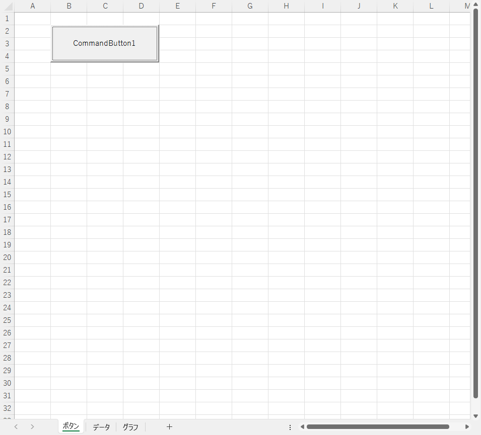

グラフのもとになるデータです。

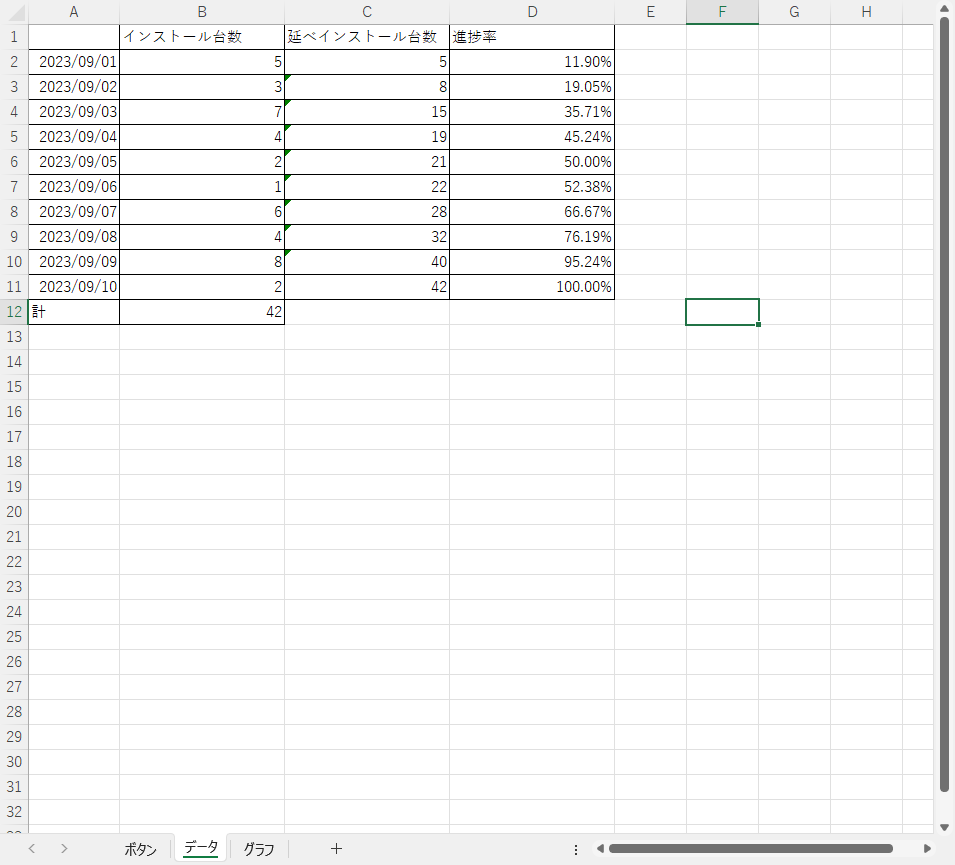

グラフを描画する前の状態です。なにもありません。

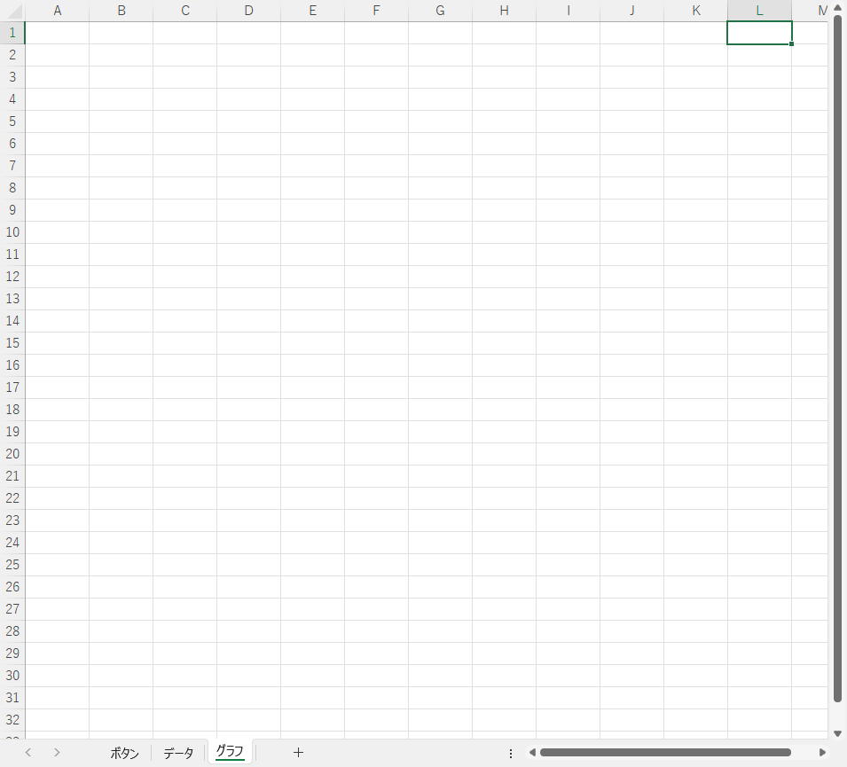

### 実行後の状態（With ･･･ End With を使用しない／したコード 共通）

実行後の状態です。 2 つのグラフを描画しました。

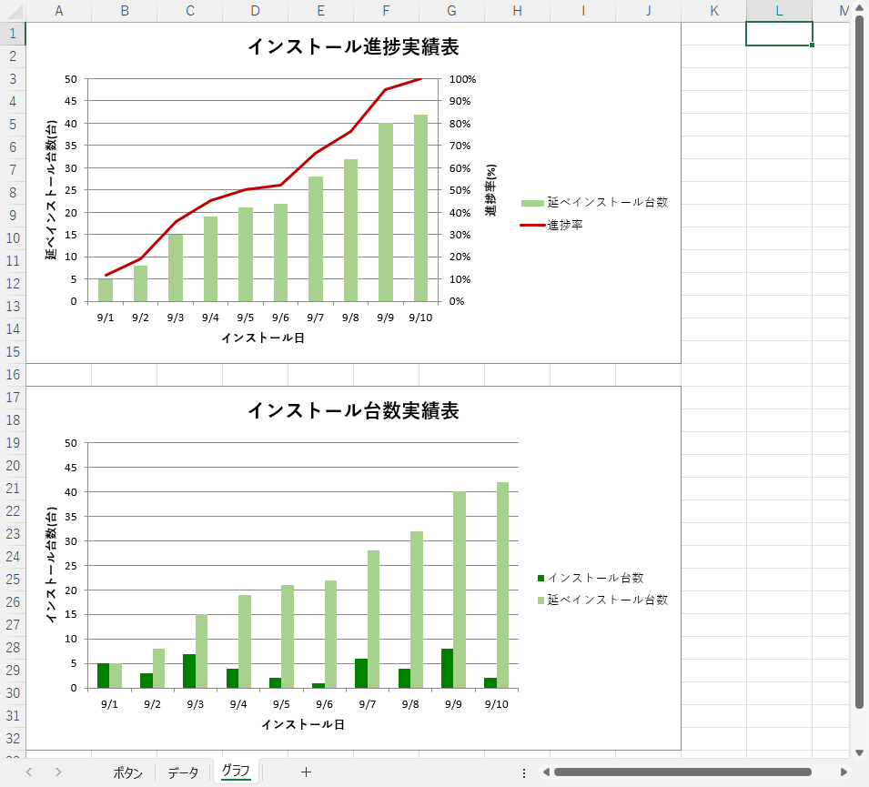

## グラフの設定方法

### 基本的な考え方

グラフの土台となる ChartObject を作成します。この時点でグラフはありません。次にこの土台にグラフ部分にあたる SeriesCollection を積み上げます。同じ土台の上に描画するグラフを増やす場合 SeriesCollection を積み重ねます。

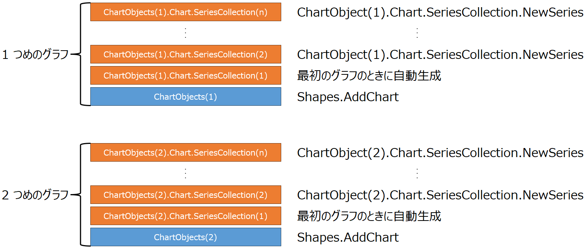

### コードの書き方

「`With` ･･･ `End With` を使用しないコード」でわかるとおり、グラフを描画するにあたってコードの 1 つ 1 つに多数のプロパティが必要です。これらのプロパティをすべて記述すると記述量が増え、効率が悪く、ミスをしやすくなります。これらのマイナス要因を避けるため `with` ･･･ `End With` で用途ごとにプロパティをまとめて記述します。次のコードはグラフを描画するための基本的な構造です。

```vb
Private Sub CommandButton1_Click()

    Dim WS_Data             As Worksheet                    ' シート「データ」
    Dim WS_Graph            As Worksheet                    ' シート「グラフ」
    Dim RNG_Graph           As Range                        ' グラフの表示場所
    
    '
    ' 初期処理
    '
    Set WS_Data = Worksheets("データ")
    Set WS_Graph = Worksheets("グラフ")
    
    '
    ' 1 つめのグラフの作成
    '
    With WS_Graph
    ' グラフの表示領域作成
        .Shapes.AddChart                                        ' グラフの表示領域を追加 = グラフの土台を作成
        
        With .ChartObjects(1)
        
            ' グラフの表示場所

            グラフの表示位置・サイズに関するコードを記述
            
            With .Chart
            
                ' 1 系列目のグラフ

                1 系列目のグラフに関するコードを記述

                
                ' 2 系列目のグラフ
                .SeriesCollection.NewSeries                     ' 新しいグラフの系列を追加　→　2 系列目
                With .SeriesCollection(2)                       ' 2 系列め
                
                    2 系列目のグラフに関するコードを記述
                
                End With
                
                ' 3 系列目のグラフ
                .SeriesCollection.NewSeries                     ' 新しいグラフの系列を追加　→　2 系列目
                With .SeriesCollection(3)                       ' 3 系列め
                
                    3 系列目のグラフに関するコードを記述
                
                End With
                
                ' 軸の書式設定
                .HasTitle = True                                ' タイトル表示 On
                With .ChartTitle
                    
                    タイトルに関するコードを記述

                End With
                
                With .Axes(xlCategory, 1)                       ' 横軸
                    
                    横軸に関するコードを記述

                End With
                
                With .Axes(xlValue, 1)                          ' 縦軸：第1軸
                    
                    縦軸（第 1 軸）に関するコードを記述

                End With
            
                With .Axes(xlValue, 2)                          ' 縦軸：第2軸
                    
                    縦軸（第 2 軸）に関するコードを記述

                End With
        
            End With
        
        End With
        
    End With
    
    '
    ' 2 つめのグラフの作成
    '
    With WS_Graph
        ' グラフの表示領域作成
        .Shapes.AddChart                                        ' グラフの表示領域を追加 = グラフの土台を作成
        
        With .ChartObjects(2)
        
            2 つめのグラフに関するコードを記述
            構造は 1 つめのグラフと同じ

        End With
        
    End With

    
    '
    ' 3 つめのグラフの作成
    '
    With WS_Graph
        ' グラフの表示領域作成
        .Shapes.AddChart                                        ' グラフの表示領域を追加 = グラフの土台を作成
        
        With .ChartObjects(3)
        
            3 つめのグラフに関するコードを記述
            構造は 1 つめのグラフと同じ

        End With
        
    End With

End Sub
```

`With` ･･･ `End With` の範囲がわかるよう外側からオレンジ、青、緑、グレーで色分けしました。

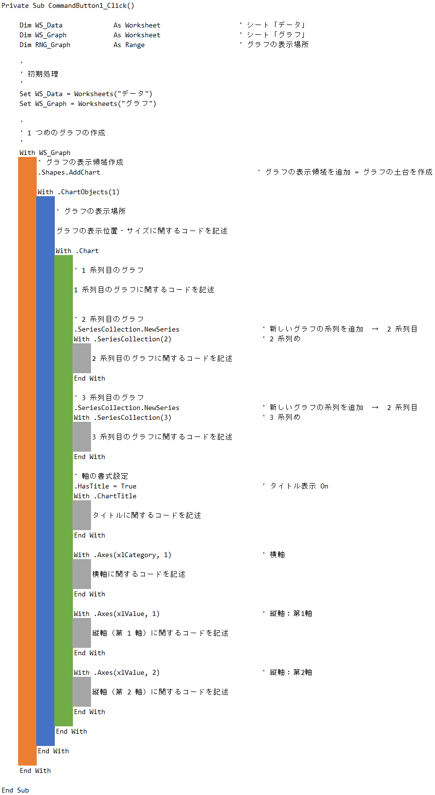

左側からみたとき、色の重なりが多いほど `With` ･･･ `End With` のネスト（多重度）が深いことになります。 `With` ･･･ `End With` で補完されるコードは次のとおりです。

- オレンジ
  - `Worksheets("グラフ")`　→　実際は Worksheet 型の変数 `WS_Graph`
- 青
  - `WS_Graph.ChartObject(1)`
- 緑
  - `WS_Graph.ChartObject(1).Chart`
- グレー
  - 場所により異なります。上から順に次のとおりです。
    - `WS_Graph.ChartObject(1).Chart.SeriesCollection(2)`
    - `WS_Graph.ChartObject(1).Chart.SeriesCollection(3)`
    - `WS_Graph.ChartObject(1).Chart.ChartTitle`
    - `WS_Graph.ChartObject(1).Chart.Axes(xlCategory, 1)`
    - `WS_Graph.ChartObject(1).Chart.Axes(xlValue, 1)`
    - `WS_Graph.ChartObject(1).Chart.Axes(xlValue, 2)`

例えば

```vb
.Shapes.AddChart
```

はオレンジなので

```vb
WS_Graph.Shapes.AddChart
```

と記述したのと同じになります。同様に

```vb
.SeriesCollection.NewSeries
```

は緑なので

```vb
WS_Graph.ChartObject(1).Chart.SeriesCollection.NewSeries 
```

と記述したのと同じになります。このように `With` ･･･ `End With` を使用することで、記述する量を減らし、効率よくコードを書くことができ、コードを目的ごとにまとめることで可読性を向上し、ミスを低減できます。

## グラフのコード

### 土台（ ChartObjects ）を作成する

実際は特定のシート（今回はシート「グラフ」）内にグラフを描画することになります。したがって、グラフに関する全てのコードは特定のシートの中に含まれるよう `With シート名` ･･･ `End With` の間に記述します。

```vb
Private Sub CommandButton1_Click()

    Dim WS_Graph            As Worksheet                    ' シート「グラフ」
    
    '
    ' 初期処理
    '
    Set WS_Graph = Worksheets("グラフ")
    
    '
    ' 1 つめのグラフの作成
    '
    With WS_Graph

        グラフに関するコードを記述

    End With

End Sub
```

`Shapes.AddChart` で土台となる `ChartObjects` を作成します。

```vb
Private Sub CommandButton1_Click()

    Dim WS_Graph            As Worksheet                    ' シート「グラフ」
    
    '
    ' 初期処理
    '
    Set WS_Graph = Worksheets("グラフ")
    
    '
    ' 1 つめのグラフの作成
    '
    With WS_Graph
    ' グラフの表示領域作成
        .Shapes.AddChart                                        ' グラフの表示領域を追加 = グラフの土台を作成

        グラフに関するコードを記述

    End With

End Sub
```

この時点で参照するシート（シート「データ」）も併せて定義しておくと後々便利です。

```vb
Private Sub CommandButton1_Click()

    Dim WS_Data             As Worksheet                    ' シート「データ」
    Dim WS_Graph            As Worksheet                    ' シート「グラフ」
    
    '
    ' 初期処理
    '
    Set WS_Data = Worksheets("データ")
    Set WS_Graph = Worksheets("グラフ")
    
    '
    ' 1 つめのグラフの作成
    '
    With WS_Graph
    ' グラフの表示領域作成
        .Shapes.AddChart                                        ' グラフの表示領域を追加 = グラフの土台を作成

        グラフに関するコードを記述

    End With

End Sub
```

続けて `ChartObjects` の上に必要な情報を積み重ねていきます。`ChartObject(1)` の `(1)` は 1 つ目の `ChartObjects` を意味します。`Shapes.AddChart` を実行するたびにカッコの中の数字は 1 → 2 → 3 → ・・・ と増加します。すべて `ChartObjects` に含まれるので `With` ･･･ `End With` でくくって定義します。

```vb
Private Sub CommandButton1_Click()

    Dim WS_Data             As Worksheet                    ' シート「データ」
    Dim WS_Graph            As Worksheet                    ' シート「グラフ」
    
    '
    ' 初期処理
    '
    Set WS_Data = Worksheets("データ")
    Set WS_Graph = Worksheets("グラフ")
    
    '
    ' 1 つめのグラフの作成
    '
    With WS_Graph
    ' グラフの表示領域作成
        .Shapes.AddChart                                        ' グラフの表示領域を追加 = グラフの土台を作成
        
        With .ChartObjects(1)

            1 つめのグラフに関するコードを記述

        End With

    End With

End Sub
```

### グラフの表示サイズと位置を設定する

土台を作成した直後の状態です。表示されている四角が `Worksheets("グラフ").ChartObjects(1)` です。グラフもなにもありません。表示サイズや位置も上記の「実行後の状態」と異なります。

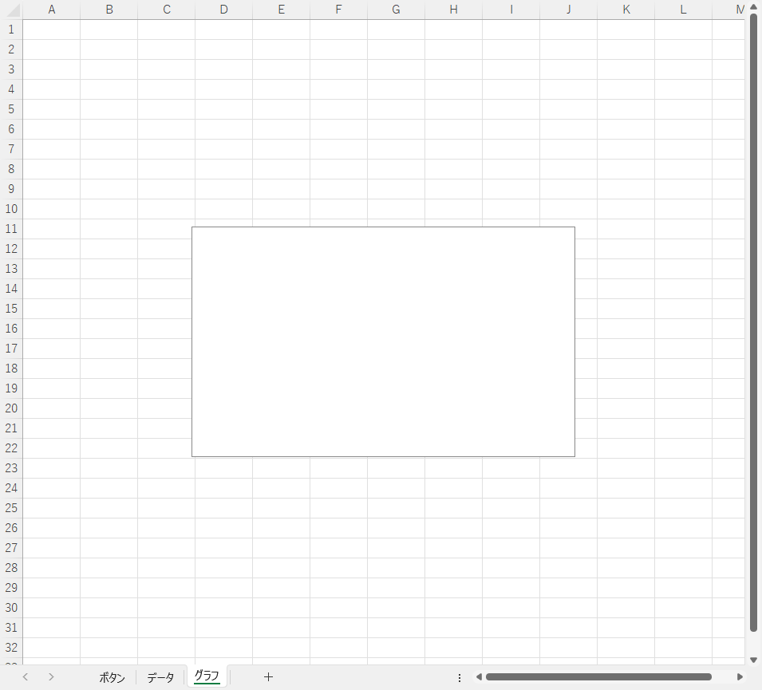

まず表示サイズと位置を決定します。今回は黄色の塗りつぶした位置にグラフを表示します。サイズは横幅 : 10 列分 × 高さ :  15 行分です。表示位置は指定したセルの範囲（ A1 ～ J15 ）の左上の座標です。

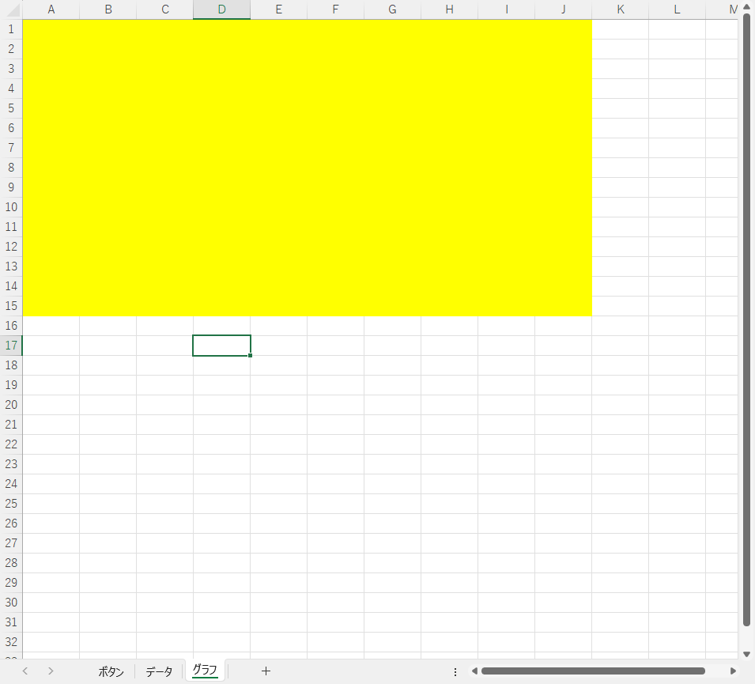

**CHART_Graph** の表示位置（セルの範囲指定）を決定します。表示位置の情報は複数回使用するので `Range` 型の変数 **RNG_Graph** に格納します。

```vb
Private Sub CommandButton1_Click()

    Dim WS_Data             As Worksheet                    ' シート「データ」
    Dim WS_Graph            As Worksheet                    ' シート「グラフ」
    Dim RNG_Graph           As Range                        ' グラフの表示場所
    
    '
    ' 初期処理
    '
    Set WS_Data = Worksheets("データ")
    Set WS_Graph = Worksheets("グラフ")
    
    '
    ' 1 つめのグラフの作成
    '
    With WS_Graph
    ' グラフの表示領域作成
        .Shapes.AddChart                                        ' グラフの表示領域を追加 = グラフの土台を作成
        
        With .ChartObjects(1)
        
            ' グラフの表示場所
            Set RNG_Graph = WS_Graph.Range("A1:J15")            ' このセルの範囲にグラフを表示する
```

表示サイズ、位置が決定したら `Worksheets("グラフ").ChartObjects(1)` 内の各項目に設定します。

| 設定する内容 | 項目 | 設定する値 |
| :--- | :--- | :--- |
| グラフの横幅 | Worksheets("グラフ").ChartObjects(1).Width | Worksheets("グラフ").Range("A1:J15").Width |
| グラフの高さ | Worksheets("グラフ").ChartObjects(1).Height | Worksheets("グラフ").Range("A1:J15").Height |
| グラフの表示位置の上端 | Worksheets("グラフ").ChartObjects(1).Top | Worksheets("グラフ").Range("A1:J15").Top |
| グラフの表示位置の左端 | Worksheets("グラフ").ChartObjects(1).Left | Worksheets("グラフ").Range("A1:J15").Left |

```vb
Private Sub CommandButton1_Click()

    Dim WS_Data             As Worksheet                    ' シート「データ」
    Dim WS_Graph            As Worksheet                    ' シート「グラフ」
    Dim RNG_Graph           As Range                        ' グラフの表示場所
    
    '
    ' 初期処理
    '
    Set WS_Data = Worksheets("データ")
    Set WS_Graph = Worksheets("グラフ")
    
    '
    ' 1 つめのグラフの作成
    '
    With WS_Graph
    ' グラフの表示領域作成
        .Shapes.AddChart                                        ' グラフの表示領域を追加 = グラフの土台を作成
        
        With .ChartObjects(1)
        
            ' グラフの表示場所
            Set RNG_Graph = WS_Graph.Range("A1:J15")            ' このセルの範囲にグラフを表示する
            .Width = RNG_Graph.Width                            ' グラフの横幅
            .Height = RNG_Graph.Height                          ' グラフの高さ
            .Top = RNG_Graph.Top                                ' グラフのトップ位置
            .Left = RNG_Graph.Left                              ' グラフの左側の位置
```

ここまでの実行結果です。土台部分が指定したサイズに変更され、指定位置に移動しました。

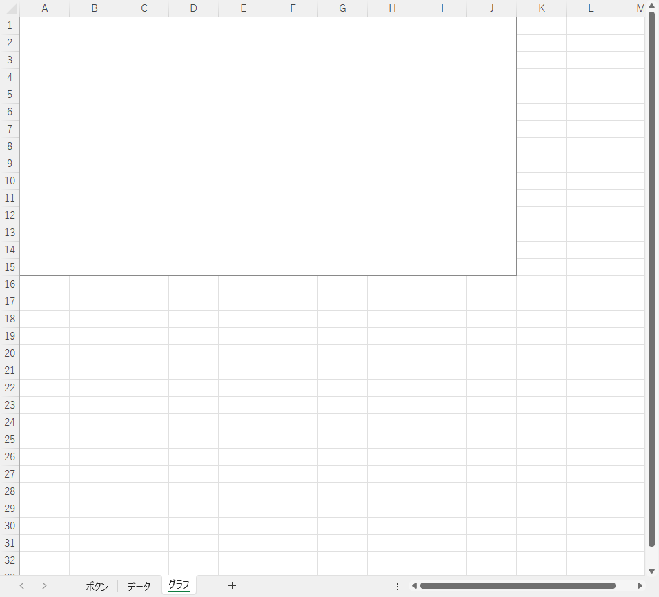

### グラフを描画する

#### 1 系列目のグラフ

グラフは `Worksheets("グラフ").ChartObjects(1).Chart` 内に定義します。`With` ･･･ `End With` でくくって定義します。

```vb
Private Sub CommandButton1_Click()

    Dim WS_Data             As Worksheet                    ' シート「データ」
    Dim WS_Graph            As Worksheet                    ' シート「グラフ」
    Dim RNG_Graph           As Range                        ' グラフの表示場所
    
    '
    ' 初期処理
    '
    Set WS_Data = Worksheets("データ")
    Set WS_Graph = Worksheets("グラフ")
    
    '
    ' 1 つめのグラフの作成
    '
    With WS_Graph
    ' グラフの表示領域作成
        .Shapes.AddChart                                        ' グラフの表示領域を追加 = グラフの土台を作成
        
        With .ChartObjects(1)
        
            ' グラフの表示場所
            Set RNG_Graph = WS_Graph.Range("A1:J15")            ' このセルの範囲にグラフを表示する
            .Width = RNG_Graph.Width                            ' グラフの横幅
            .Height = RNG_Graph.Height                          ' グラフの高さ
            .Top = RNG_Graph.Top                                ' グラフのトップ位置
            .Left = RNG_Graph.Left                              ' グラフの左側の位置
            
            With .Chart

                グラフを描画するコードを記述

            End With
        
        End With

    End With

End SUb
```

グラフは `Worksheets("グラフ").ChartObjects(1).Chart.SeriesCollection(1)` に描画します。`.SeriesCollection(1)` の `(1)` は 1 つ目のグラフを指します。2 つ目、3 つ目と描画するグラフが増えるとカッコの中の数字も 1 → 2 → 3 → ・・・ と増加します。

`Worksheets("グラフ").ChartObjects(1).Chart.SeriesCollection.NewSeries` を実行して `SeriesCollection` を作成しますが、 1 つ目のグラフのときだけ自動で用意されます。

グラフのもとになるデータです。今回は A 列の日付と C 列の延べインストール台数を使用してグラフを作成します。

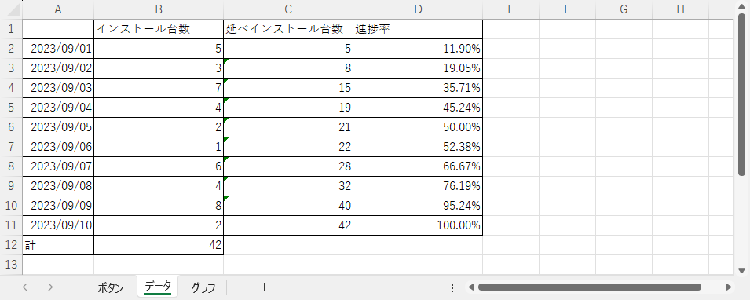

`Worksheets("グラフ").ChartObjects(1).Chart.SetSourceData` にデータの範囲を設定します。

```vb
Private Sub CommandButton1_Click()

    Dim WS_Data             As Worksheet                    ' シート「データ」
    Dim WS_Graph            As Worksheet                    ' シート「グラフ」
    Dim RNG_Graph           As Range                        ' グラフの表示場所
    
    '
    ' 初期処理
    '
    Set WS_Data = Worksheets("データ")
    Set WS_Graph = Worksheets("グラフ")
    
    '
    ' 1 つめのグラフの作成
    '
    With WS_Graph
    ' グラフの表示領域作成
        .Shapes.AddChart                                        ' グラフの表示領域を追加 = グラフの土台を作成
        
        With .ChartObjects(1)
        
            ' グラフの表示場所
            Set RNG_Graph = WS_Graph.Range("A1:J15")            ' このセルの範囲にグラフを表示する
            .Width = RNG_Graph.Width                            ' グラフの横幅
            .Height = RNG_Graph.Height                          ' グラフの高さ
            .Top = RNG_Graph.Top                                ' グラフのトップ位置
            .Left = RNG_Graph.Left                              ' グラフの左側の位置
            
            With .Chart
            
                ' 1 系列目のグラフ
                .SetSourceData WS_Data.Range("A1:A11,C1:C11")   ' データの範囲：横軸→A列、データ→C列
```

データの範囲が設定されるとすぐにグラフが描画されます。

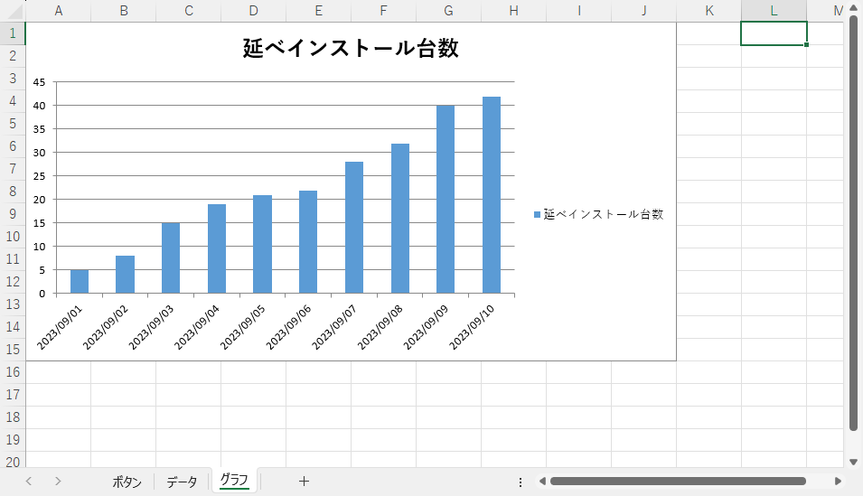

描画したグラフをカスタマイズします。カスタマイズ内容はグラフの種類と色です。折れ線グラフの場合、線の太さもカスタマイズできます。

- 線の種類 : `Worksheets("グラフ").ChartObjects(1).Chart.ChartType`

   | 指定する値 | グラフの種類 |
   | :---: | :---: |
   | xlColumnClustered | 集合縦棒 |
   | xlLine | 折れ線 |

- 系列名、グラフの色（棒の色、線の色）、折れ線の太さ
  - 系列名
    - `Worksheets("グラフ").ChartObjects(1).Chart.SeriesCollection(1).Name`
  - グラフの色
    - RGB でグラフの描画カラーを指定する
    - 集合縦棒
      - `Worksheets("グラフ").ChartObjects(1).Chart.SeriesCollection(1).Format.Fill.ForeColor.RGB`
    - 折れ線
      - `Worksheets("グラフ").ChartObjects(1).Chart.SeriesCollection(1).Format.Line.ForeColor.RGB`
  - 折れ線の太さ
    - `Worksheets("グラフ").ChartObjects(1).Chart.SeriesCollection(1).Format.Line.Weight`
    - 値が大きいほど線は太くなる

系列名はグラフの右横の凡例部分の名前です。今回はシート「データ」のセル C1 の値を使用しました。

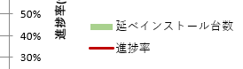

棒グラフの場合です。

```vb
                .ChartType = xlColumnClustered                  ' データの種類：棒グラフ
    
                With .SeriesCollection(1)
                    .Name = WS_Data.Range("C1").Value           ' 系列名
                    With .Format.Fill
                        .ForeColor.RGB = RGB(169, 209, 142)     ' 棒グラフの塗りつぶしの色
                    End With
                End With
```

折れ線グラフの場合です。

```vb
                .ChartType = xlLine                             ' データの種類：折れ線
            
                With .SeriesCollection(1)
                    .Name = WS_Data.Range("C1").Value           ' 系列名
                    With .Format.line
                        .ForeColor.RGB = RGB(192, 0, 0)         ' 折れ線の色
                        .Weight = 2                             ' 折れ線の太さ
                    End With
                End With
```

ここまでのコードの全体です。

```vb
Private Sub CommandButton1_Click()

    Dim WS_Data             As Worksheet                    ' シート「データ」
    Dim WS_Graph            As Worksheet                    ' シート「グラフ」
    Dim RNG_Graph           As Range                        ' グラフの表示場所
    
    '
    ' 初期処理
    '
    Set WS_Data = Worksheets("データ")
    Set WS_Graph = Worksheets("グラフ")
    
    '
    ' 1 つめのグラフの作成
    '
    With WS_Graph
    ' グラフの表示領域作成
        .Shapes.AddChart                                        ' グラフの表示領域を追加 = グラフの土台を作成
        
        With .ChartObjects(1)
        
            ' グラフの表示場所
            Set RNG_Graph = WS_Graph.Range("A1:J15")            ' このセルの範囲にグラフを表示する
            .Width = RNG_Graph.Width                            ' グラフの横幅
            .Height = RNG_Graph.Height                          ' グラフの高さ
            .Top = RNG_Graph.Top                                ' グラフのトップ位置
            .Left = RNG_Graph.Left                              ' グラフの左側の位置
            
            With .Chart
            
                ' 1 系列目のグラフ
                .SetSourceData WS_Data.Range("A1:A11,C1:C11")   ' データの範囲：横軸→A列、データ→C列
                .ChartType = xlColumnClustered                  ' データの種類：棒グラフ
    
                With .SeriesCollection(1)
                    .Name = WS_Data.Range("C1").Value           ' 系列名
                    With .Format.Fill
                        .ForeColor.RGB = RGB(169, 209, 142)     ' 棒グラフの塗りつぶしの色
                    End With
                End With
                
                ' 2 系列目のグラフ

                ここに 2 系列目のグラフのコードを記述


            End With

        End With

    End With

End Sub
```

ここまでの実行結果です。グラフが 1 系列だけの場合はグラフの軸などの編集に進みます。 2 系列目以降のグラフがあるのであれば、引き続きグラフの定義を行います。

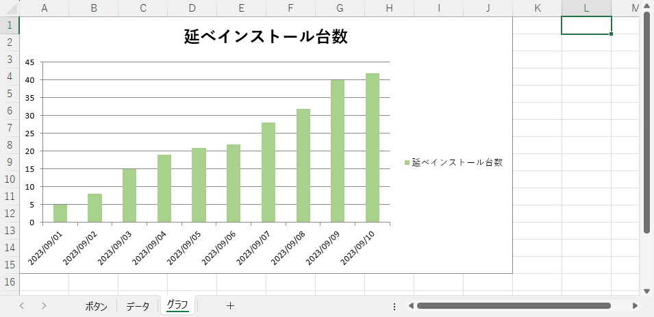

#### 2 系列目のグラフ

2 系列目のグラフの作成準備として `Worksheets("グラフ").ChartObjects(1).Chart.SeriesCollection.NewSeries` を実行して新しい `SeriesCollection` を作成します。 2 系列目なので `Worksheets("グラフ").ChartObjects(1).Chart.SeriesCollection(2)` になります。

```vb
Private Sub CommandButton1_Click()

    Dim WS_Data             As Worksheet                    ' シート「データ」
    Dim WS_Graph            As Worksheet                    ' シート「グラフ」
    Dim RNG_Graph           As Range                        ' グラフの表示場所
    
    '
    ' 初期処理
    '
    Set WS_Data = Worksheets("データ")
    Set WS_Graph = Worksheets("グラフ")
    
    '
    ' 1 つめのグラフの作成
    '
    With WS_Graph
    ' グラフの表示領域作成
        .Shapes.AddChart                                        ' グラフの表示領域を追加 = グラフの土台を作成
        
        With .ChartObjects(1)
        
            ' グラフの表示場所
            Set RNG_Graph = WS_Graph.Range("A1:J15")            ' このセルの範囲にグラフを表示する
            .Width = RNG_Graph.Width                            ' グラフの横幅
            .Height = RNG_Graph.Height                          ' グラフの高さ
            .Top = RNG_Graph.Top                                ' グラフのトップ位置
            .Left = RNG_Graph.Left                              ' グラフの左側の位置
            
            With .Chart
            
                ' 1 系列目のグラフ
                .SetSourceData WS_Data.Range("A1:A11,C1:C11")   ' データの範囲：横軸→A列、データ→C列
                .ChartType = xlColumnClustered                  ' データの種類：棒グラフ
    
                With .SeriesCollection(1)
                    .Name = WS_Data.Range("C1").Value           ' 系列名
                    With .Format.Fill
                        .ForeColor.RGB = RGB(169, 209, 142)     ' 棒グラフの塗りつぶしの色
                    End With
                End With
                
                ' 2 系列目のグラフ
                .SeriesCollection.NewSeries                     ' 新しいグラフの系列を追加　→　2 系列目
                With .SeriesCollection(2)                       ' 2 系列め

                    2 系列目のグラフの詳細を記述
                
                End With

            End With

        END With

End Sub
```

2 系列目のグラフのコードを書く前に決めることです。

- 縦軸は第 1 軸（左側の縦軸）、第 2 軸（右側の縦軸）を使用するのか？
  - `Worksheets("グラフ").ChartObjects(1).Chart.SeriesCollection(2).AxisGroup`
- 系列名は？
  - `Worksheets("グラフ").ChartObjects(1).Chart.SeriesCollection(2).Name`
- データの範囲は？
  - `Worksheets("グラフ").ChartObjects(1).Chart.SeriesCollection(2).Values`
- グラフの集合縦棒か、折れ線か？
  - `Worksheets("グラフ").ChartObjects(1).Chart.SeriesCollection(2).ChartType`
- グラフの色は？
  - `Worksheets("グラフ").ChartObjects(1).Chart.SeriesCollection(2).Format.Line.ForeColor.RGB`
- 折れ線の場合、線の太さは？
  - `Worksheets("グラフ").ChartObjects(1).Chart.SeriesCollection(2).Format.Line.Weight`

今回は次のようにします。

- 第 2 軸
- 系列名はシート「データ」のセル D1 の値
- データの範囲はシート「データ」のセル D2 ～ D11
- 折れ線グラフ
- グラフの色は (128, 0, 0)
- 太さは 2

```vb
                ' 2 系列目のグラフ
                .SeriesCollection.NewSeries                     ' 新しいグラフの系列を追加　→　2 系列目
                With .SeriesCollection(2)                       ' 2 系列め
                
                    .AxisGroup = 2                              ' 第 2 軸
                    .Name = WS_Data.Range("D1").Value           ' 系列名
                    .Values = WS_Data.Range("D2:D11").Value     ' データの範囲
                    .ChartType = xlLine                         ' データの種類：折れ線
                    
                    With .Format.Line
                        .ForeColor.RGB = RGB(192, 0, 0)         ' 折れ線の色
                        .Weight = 2                             ' 折れ線の太さ
                    End With
                
                End With
```

3 系列目、4 系列目のグラフがある場合、2 系列目と同じ方法で繰り返し定義します。

ここまでのコードです。

```vb
Private Sub CommandButton1_Click()

    Dim WS_Data             As Worksheet                    ' シート「データ」
    Dim WS_Graph            As Worksheet                    ' シート「グラフ」
    Dim RNG_Graph           As Range                        ' グラフの表示場所
    
    '
    ' 初期処理
    '
    Set WS_Data = Worksheets("データ")
    Set WS_Graph = Worksheets("グラフ")
    
    '
    ' 1 つめのグラフの作成
    '
    With WS_Graph
    ' グラフの表示領域作成
        .Shapes.AddChart                                        ' グラフの表示領域を追加 = グラフの土台を作成
        
        With .ChartObjects(1)
        
            ' グラフの表示場所
            Set RNG_Graph = WS_Graph.Range("A1:J15")            ' このセルの範囲にグラフを表示する
            .Width = RNG_Graph.Width                            ' グラフの横幅
            .Height = RNG_Graph.Height                          ' グラフの高さ
            .Top = RNG_Graph.Top                                ' グラフのトップ位置
            .Left = RNG_Graph.Left                              ' グラフの左側の位置
            
            With .Chart
            
                ' 1 系列目のグラフ
                .SetSourceData WS_Data.Range("A1:A11,C1:C11")   ' データの範囲：横軸→A列、データ→C列
                .ChartType = xlColumnClustered                  ' データの種類：棒グラフ
    
                With .SeriesCollection(1)
                    .Name = WS_Data.Range("C1").Value           ' 系列名
                    With .Format.Fill
                        .ForeColor.RGB = RGB(169, 209, 142)     ' 棒グラフの塗りつぶしの色
                    End With
                End With
                
                ' 2 系列目のグラフ
                .SeriesCollection.NewSeries                     ' 新しいグラフの系列を追加　→　2 系列目
                With .SeriesCollection(2)                       ' 2 系列め
                
                    .AxisGroup = 2                              ' 第 2 軸
                    .Name = WS_Data.Range("D1").Value           ' 系列名
                    .Values = WS_Data.Range("D2:D11").Value     ' データの範囲
                    .ChartType = xlLine                         ' データの種類：折れ線
                    
                    With .Format.Line
                        .ForeColor.RGB = RGB(192, 0, 0)         ' 折れ線の色
                        .Weight = 2                             ' 折れ線の太さ
                    End With
                
                End With
            
            End With

        End With

    End With

End Sub
```

ここまでの実行結果です。


### 軸の書式を設定する

軸の書式では次の 4 項目を設定します。

- タイトル
- 横軸
- 縦軸 : 第 1 軸
- 縦軸 : 第 2 軸

#### タイトルの書式を設定する

- タイトル表示の有無
  - `Worksheets("グラフ").ChartObjects(1).Chart.HasTitle`

      | 設定する値 | 動作 |
      | :---: | :---: |
      | True | 表示する |
      | False | 表示しない |

- タイトルに表示する文字列
  - `Worksheets("グラフ").ChartObjects(1).Chart.ChartTitle.Text`
- タイトルに表示する文字列のフォントサイズ
  - `Worksheets("グラフ").ChartObjects(1).Chart.ChartTitle.Format.TextFrame2.TextRange.Font.Size`

#### 横軸の書式を設定する

- 横軸の値の書式
  - `Worksheets("グラフ").ChartObjects(1).Chart.Axes(xlCategory, 1).TickLabels.NumberFormatLocal`
- 横軸のラベルの表示の有無
  - `Worksheets("グラフ").ChartObjects(1).Chart.Axes(xlCategory, 1).HasTitle`

      | 設定する値 | 動作 |
      | :---: | :---: |
      | True | 表示する |
      | False | 表示しない |

- 横軸のラベルに表示する文字列
  - `Worksheets("グラフ").ChartObjects(1).Chart.Axes(xlCategory, 1).AxisTitle.Text`

#### 縦軸 : 第 1 軸（左側の縦軸）の書式を設定する

- 横軸（第 1 軸）の値の書式
  - `Worksheets("グラフ").ChartObjects(1).Chart.Axes(xlValue, 1).TickLabels.NumberFormatLocal`
- 横軸（第 1 軸）のラベルの表示の有無
  - `Worksheets("グラフ").ChartObjects(1).Chart.Axes(xlValue, 1).HasTitle`

      | 設定する値 | 動作 |
      | :---: | :---: |
      | True | 表示する |
      | False | 表示しない |

- 横軸（第 1 軸）のラベルに表示する文字列
  - `Worksheets("グラフ").ChartObjects(1).Chart.Axes(xlValue, 1).AxisTitle.Text`
- 横軸（第 1 軸）の値の最小値
  - `Worksheets("グラフ").ChartObjects(1).Chart.Axes(xlValue, 1).MinimumScale`
- 横軸（第 1 軸）の値の最大値
  - `Worksheets("グラフ").ChartObjects(1).Chart.Axes(xlValue, 1).MaximumScale`

#### 縦軸 : 第 2 軸（右側の縦軸）の書式を設定する

- 横軸（第 2 軸）の書式
  - `Worksheets("グラフ").ChartObjects(1).Chart.Axes(xlValue, 2).TickLabels.NumberFormatLocal`
- 横軸（第 2 軸）のラベルの表示の有無
  - `Worksheets("グラフ").ChartObjects(1).Chart.Axes(xlValue, 2).HasTitle`

      | 設定する値 | 動作 |
      | :---: | :---: |
      | True | 表示する |
      | False | 表示しない |

- 横軸（第 2 軸）のラベルに表示する文字列
  - `Worksheets("グラフ").ChartObjects(1).Chart.Axes(xlValue, 2).AxisTitle.Text`
- 横軸（第 2 軸）の値の最小値
  - `Worksheets("グラフ").ChartObjects(1).Chart.Axes(xlValue, 2).MinimumScale`
- 横軸（第 2 軸）の値の最大値
  - `Worksheets("グラフ").ChartObjects(1).Chart.Axes(xlValue, 2).MaximumScale`

#### 設定する値

| | タイトル | 横軸 | 横軸（第 1 軸） | 横軸（第 2 軸） |
| :---: | :---: | :---: | :---: | :---: |
| タイトル / ラベルの有無 | 有 | 有 | 有 | 有 |
| タイトル / ラベルの文字列 | インストール進捗実績表 | インストール日 | 延べインストール台数(台) | 進捗率(%) |
| タイトル / ラベルのフォント | 16 | - | - | - |
| タイトル / ラベルの値の書式 | - | m/d | #,##0 | 0% |
| 軸の値の最小値 | - | - | 0 | 0 |
| 軸の値の最大値 | - | - | 50 | 1 |

```vb
                ' 軸の書式設定
                .HasTitle = True                                ' タイトル表示 On
                With .ChartTitle
                    .Text = "インストール進捗実績表"            ' タイトル
                    .Format.TextFrame2.TextRange.Font.Size = 16 ' タイトルのフォントサイズ
                End With
                
                With .Axes(xlCategory, 1)                       ' 横軸
                    .TickLabels.NumberFormatLocal = "m/d"           ' 書式
                    .HasTitle = True                                ' ラベル表示 On
                    .AxisTitle.Text = "インストール日"              ' ラベル
                End With
                
                With .Axes(xlValue, 1)                          ' 縦軸：第1軸
                    .TickLabels.NumberFormatLocal = "#,##0"         ' 書式
                    .HasTitle = True                                ' ラベル表示 On
                    .AxisTitle.Text = "延べインストール台数(台)"    ' ラベル
                    .MinimumScale = 0                               ' 軸の値の最小値
                    .MaximumScale = 50                              ' 軸の値の最大値
                End With
            
                With .Axes(xlValue, 2)                          ' 縦軸：第2軸
                    .TickLabels.NumberFormatLocal = "0%"            ' 書式
                    .HasTitle = True                                ' ラベル表示 On
                    .AxisTitle.Text = "進捗率(%)"                   ' ラベル
                    .MinimumScale = 0                               ' 軸の値の最小値
                    .MaximumScale = 1                               ' 軸の値の最大値
                End With
```

ここまでのコードです。

```vb
Private Sub CommandButton1_Click()

    Dim WS_Data             As Worksheet                    ' シート「データ」
    Dim WS_Graph            As Worksheet                    ' シート「グラフ」
    Dim RNG_Graph           As Range                        ' グラフの表示場所
    
    '
    ' 初期処理
    '
    Set WS_Data = Worksheets("データ")
    Set WS_Graph = Worksheets("グラフ")
    
    '
    ' 1 つめのグラフの作成
    '
    With WS_Graph
    ' グラフの表示領域作成
        .Shapes.AddChart                                        ' グラフの表示領域を追加 = グラフの土台を作成
        
        With .ChartObjects(1)
        
            ' グラフの表示場所
            Set RNG_Graph = WS_Graph.Range("A1:J15")            ' このセルの範囲にグラフを表示する
            .Width = RNG_Graph.Width                            ' グラフの横幅
            .Height = RNG_Graph.Height                          ' グラフの高さ
            .Top = RNG_Graph.Top                                ' グラフのトップ位置
            .Left = RNG_Graph.Left                              ' グラフの左側の位置
            
            With .Chart
            
                ' 1 系列目のグラフ
                .SetSourceData WS_Data.Range("A1:A11,C1:C11")   ' データの範囲：横軸→A列、データ→C列
                .ChartType = xlColumnClustered                  ' データの種類：棒グラフ
    
                With .SeriesCollection(1)
                    .Name = WS_Data.Range("C1").Value           ' 系列名
                    With .Format.Fill
                        .ForeColor.RGB = RGB(169, 209, 142)     ' 棒グラフの塗りつぶしの色
                    End With
                End With
                
                ' 2 系列目のグラフ
                .SeriesCollection.NewSeries                     ' 新しいグラフの系列を追加　→　2 系列目
                With .SeriesCollection(2)                       ' 2 系列め
                
                    .AxisGroup = 2                              ' 第 2 軸
                    .Name = WS_Data.Range("D1").Value           ' 系列名
                    .Values = WS_Data.Range("D2:D11").Value     ' データの範囲
                    .ChartType = xlLine                         ' データの種類：折れ線
                    
                    With .Format.Line
                        .ForeColor.RGB = RGB(192, 0, 0)         ' 折れ線の色
                        .Weight = 2                             ' 折れ線の太さ
                    End With
                
                End With
                
                ' 軸の書式設定
                .HasTitle = True                                ' タイトル表示 On
                With .ChartTitle
                    .Text = "インストール進捗実績表"            ' タイトル
                    .Format.TextFrame2.TextRange.Font.Size = 16 ' タイトルのフォントサイズ
                End With
                
                With .Axes(xlCategory, 1)                       ' 横軸
                    .TickLabels.NumberFormatLocal = "m/d"           ' 書式
                    .HasTitle = True                                ' ラベル表示 On
                    .AxisTitle.Text = "インストール日"              ' ラベル
                End With
                
                With .Axes(xlValue, 1)                          ' 縦軸：第1軸
                    .TickLabels.NumberFormatLocal = "#,##0"         ' 書式
                    .HasTitle = True                                ' ラベル表示 On
                    .AxisTitle.Text = "延べインストール台数(台)"    ' ラベル
                    .MinimumScale = 0                               ' 軸の値の最小値
                    .MaximumScale = 50                              ' 軸の値の最大値
                End With
            
                With .Axes(xlValue, 2)                          ' 縦軸：第2軸
                    .TickLabels.NumberFormatLocal = "0%"            ' 書式
                    .HasTitle = True                                ' ラベル表示 On
                    .AxisTitle.Text = "進捗率(%)"                   ' ラベル
                    .MinimumScale = 0                               ' 軸の値の最小値
                    .MaximumScale = 1                               ' 軸の値の最大値
                End With
        
            End With
        
        End With
        
    End With

End Sub
```

ここまでの実行結果です。

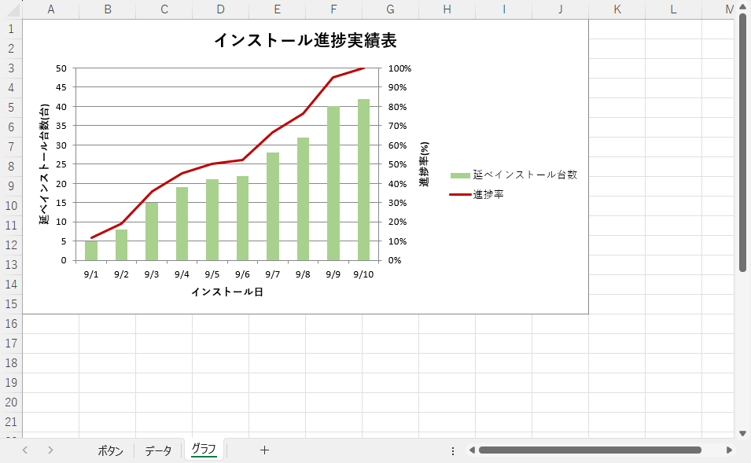

2 つめのグラフを作成する場合は `WS_Graph.Shapes.AddChart` から同様に定義します。
