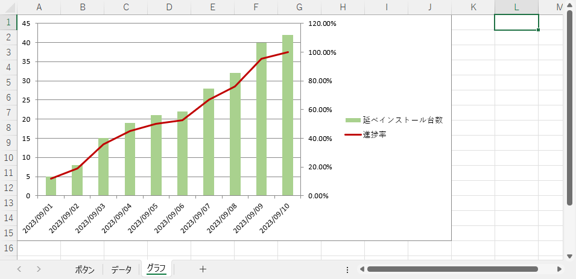

# 6 日目の復習 ＋ α

## グラフを描画するサンプル

### コード

```vb
Private Sub CommandButton1_Click()

    Dim WS_Data             As Worksheet                    ' シート「データ」
    Dim WS_Graph            As Worksheet                    ' シート「グラフ」
    Dim CHART_Graph         As ChartObject                  ' グラフの表示領域
    Dim RNG_Graph           As Range                        ' グラフの表示場所
    
    '
    ' 初期処理
    '
    Set WS_Data = Worksheets("データ")
    Set WS_Graph = Worksheets("グラフ")
    
    '
    ' 1 つめのグラフの作成
    '
    
    ' グラフの表示領域作成
    WS_Graph.Shapes.AddChart                                ' グラフの表示領域を追加 = グラフの土台を作成
    Set CHART_Graph = WS_Graph.ChartObjects(1)
    
    With CHART_Graph
    
        ' グラフの表示場所
        Set RNG_Graph = WS_Graph.Range("A1:J15")            ' このセルの範囲にグラフを表示する
        .Width = RNG_Graph.Width                            ' グラフの横幅
        .Height = RNG_Graph.Height                          ' グラフの高さ
        .Top = RNG_Graph.Top                                ' グラフのトップ位置
        .Left = RNG_Graph.Left                              ' グラフの左側の位置
        
        With .Chart
        
            ' 1 系列目のグラフ
            .SetSourceData WS_Data.Range("A1:A11,C1:C11")   ' データの範囲：見出し→A列、データ→C列
            .ChartType = xlColumnClustered                  ' データの種類：棒グラフ

            With .SeriesCollection(1)
                .Name = WS_Data.Range("C1")                 ' 系列名
                With .Format.Fill
                    .ForeColor.RGB = RGB(169, 209, 142)     ' 棒グラフの塗りつぶしの色
                End With
            End With
            
            ' 2 系列目のグラフ
            .SeriesCollection.NewSeries                     ' 新しいグラフの系列を追加　→　2 系列目
            With .SeriesCollection(2)                       ' 2 系列め
            
                .AxisGroup = 2                              ' 第 2 軸
                .Name = WS_Data.Range("D1")                 ' 系列名
                .Values = WS_Data.Range("D2:D11")           ' データの範囲
                .ChartType = xlLine                         ' データの種類：折れ線
                
                With .Format.Line
                    .ForeColor.RGB = RGB(192, 0, 0)         ' 折れ線の色
                    .Weight = 2                             ' 折れ線の太さ
                End With
            
            End With
            
            ' 軸の書式設定
            .HasTitle = True                                ' タイトル表示 On
            With .ChartTitle
                .Text = "インストール進捗実績表"            ' タイトル
                .Format.TextFrame2.TextRange.Font.Size = 16 ' タイトルのフォントサイズ
            End With
            
            With .Axes(xlCategory, 1)                       ' 横軸
                .TickLabels.NumberFormatLocal = "m/d"           ' 書式
                .HasTitle = True                                ' ラベル表示 On
                .AxisTitle.Text = "インストール日"              ' ラベル
            End With
            
            With .Axes(xlValue, 1)                          ' 縦軸：第1軸
                .TickLabels.NumberFormatLocal = "#,##0"         ' 書式
                .HasTitle = True                                ' ラベル表示 On
                .AxisTitle.Text = "延べインストール台数(台)"    ' ラベル
                .MinimumScale = 0                               ' 軸の値の最小値
                .MaximumScale = 50                              ' 軸の値の最大値
            End With
        
            With .Axes(xlValue, 2)                          ' 縦軸：第2軸
                .TickLabels.NumberFormatLocal = "0%"            ' 書式
                .HasTitle = True                                ' ラベル表示 On
                .AxisTitle.Text = "進捗率(%)"                   ' ラベル
                .MinimumScale = 0                               ' 軸の値の最小値
                .MaximumScale = 1                               ' 軸の値の最大値
            End With
    
        End With
    
    End With
    
    '
    ' 2 つめのグラフの作成
    '
    
    ' グラフの表示領域作成
    WS_Graph.Shapes.AddChart                                ' グラフの表示領域を追加 = グラフの土台を作成
    Set CHART_Graph = WS_Graph.ChartObjects(2)
    
    With CHART_Graph
    
        ' グラフの表示場所
        Set RNG_Graph = WS_Graph.Range("A17:J32")           ' このセルの範囲にグラフを表示する
        .Width = RNG_Graph.Width                            ' グラフの横幅
        .Height = RNG_Graph.Height                          ' グラフの高さ
        .Top = RNG_Graph.Top                                ' グラフのトップ位置
        .Left = RNG_Graph.Left                              ' グラフの左側の位置
    
        With .Chart
            ' 1 系列目のグラフ
            .SetSourceData WS_Data.Range("A1:A11,B1:B11")   ' データの範囲：見出し→A列、データ→B列
            .ChartType = xlColumnClustered                  ' データの種類：棒グラフ
            
            With .SeriesCollection(1)
                .Name = WS_Data.Range("B1")                 ' 系列名
                With .Format.Fill
                    .ForeColor.RGB = RGB(0, 128, 0)         ' 棒グラフの塗りつぶしの色
                End With
            End With
            
            ' 2 系列目のグラフ
            .SeriesCollection.NewSeries                     ' 新しいグラフの系列を追加　→　2 系列目
            With .SeriesCollection(2)                       ' 2 系列め
            
                .AxisGroup = 1                              ' 第 1 軸
                .Name = WS_Data.Range("C1")                 ' 系列名
                .Values = WS_Data.Range("C2:C11")           ' データの範囲
                .ChartType = xlColumnClustered              ' データの種類：棒グラフ
                
                With .Format.Fill
                    .ForeColor.RGB = RGB(169, 209, 142)     ' 棒グラフの塗りつぶしの色
                End With
            
            End With
        
            ' 軸の書式設定
            .HasTitle = True                                ' タイトル表示 On
            With .ChartTitle
                .Text = "インストール台数実績表"            ' タイトル
                .Format.TextFrame2.TextRange.Font.Size = 16 ' タイトルのフォントサイズ
            End With
            
            With .Axes(xlCategory, 1)                       ' 横軸
                .TickLabels.NumberFormatLocal = "m/d"           ' 書式
                .HasTitle = True                                ' ラベル表示 On
                .AxisTitle.Text = "インストール日"              ' ラベル
            End With
            
            With .Axes(xlValue, 1)                          ' 縦軸：第1軸
                .TickLabels.NumberFormatLocal = "#,##0"         ' 書式
                .HasTitle = True                                ' ラベル表示 On
                .AxisTitle.Text = "インストール台数(台)"        ' ラベル
                .MinimumScale = 0                               ' 軸の値の最小値
                .MaximumScale = 50                              ' 軸の値の最大値
            End With
    
        End With
    
    End With

End Sub
```

### 実行前の状態


グラフのもとになるデータです。


グラフを描画する前の状態です。なにもありません。


### 実行後の状態

実行後の状態です。 2 つのグラフを描画しました。


## グラフの設定方法

### 基本的な考え方

グラフの土台となる ChartObject を作成します。この時点でグラフはありません。次にこの土台にグラフ部分にあたる SeriesCollection を積み上げます。同じ土台の上に描画するグラフを増やす場合 SeriesCollection を積み重ねます。


### コードの書き方

グラフを描画するにあたってコードの 1 つ 1 つに多数のプロパティが必要です。これらのプロパティをすべて記述すると記述量が増え、効率が悪く、ミスをしやすくなります。これらのマイナス要因を避けるため `with` ･･･ `End With` で用途ごとにプロパティをまとめて記述します。次のコードはグラフを描画するための基本的な構造です。

```vb
Private Sub CommandButton1_Click()

    Dim WS_Graph            As Worksheet                    ' シート「グラフ」
    Dim CHART_Graph         As ChartObject                  ' グラフの表示領域
    
    '
    ' 初期処理
    '
    Set WS_Graph = Worksheets("グラフ")
    
    '
    ' 1 つめのグラフの作成
    '
    
    ' グラフの表示領域作成
    WS_Graph.Shapes.AddChart                                ' グラフの表示領域を追加 = グラフの土台を作成
    Set CHART_Graph = WS_Graph.ChartObjects(1)
    
    With CHART_Graph
    
        ' グラフの表示場所

        グラフの表示サイズ・位置に関するコード

        With .Chart
        
            ' 1 系列目のグラフ

            1 系列目のグラフに関するコード

            ' 2 系列目のグラフ
            .SeriesCollection.NewSeries                     ' 新しいグラフの系列を追加　→　2 系列目
            With .SeriesCollection(2)                       ' 2 系列め
            
                2 系列目のグラフに関するコード
            
            End With
            
            ' 3 系列目のグラフ
            .SeriesCollection.NewSeries                     ' 新しいグラフの系列を追加　→　2 系列目
            With .SeriesCollection(3)                       ' 3 系列め
            
                3 系列目のグラフに関するコード
            
            End With

            ' 軸の書式設定
            .HasTitle = True                                ' タイトル表示 On（タイトルを表示するときだけ必要）
            With .ChartTitle

                タイトルに関するコード

            End With
            
            With .Axes(xlCategory, 1)                       ' 横軸

                横軸に関するコード

            End With
            
            With .Axes(xlValue, 1)                          ' 縦軸：第1軸

                縦軸：第 1 軸（左側の縦軸）に関するコード

            End With
        
            With .Axes(xlValue, 2)                          ' 縦軸：第2軸

                縦軸：第 2 軸（右側の縦軸）に関するコード

            End With
    
        End With
    
    End With
    
    '
    ' 2 つめのグラフの作成
    '
    
    ' グラフの表示領域作成
    WS_Graph.Shapes.AddChart                                ' グラフの表示領域を追加 = グラフの土台を作成
    Set CHART_Graph = WS_Graph.ChartObjects(2)　←　2 つめの ChartObject なのでカッコの中の数字は 2
    
    With CHART_Graph
    
        2 つめのグラフに関するコード
        構造は 1 つめのグラフと同じ
    
    End With

    
    '
    ' 3 つめのグラフの作成
    '
    
    ' グラフの表示領域作成
    WS_Graph.Shapes.AddChart                                ' グラフの表示領域を追加 = グラフの土台を作成
    Set CHART_Graph = WS_Graph.ChartObjects(3)　←　3 つめの ChartObject なのでカッコの中の数字は 3
    
    With CHART_Graph
    
        3 つめのグラフに関するコード
        構造は 1 つめのグラフと同じ
    
    End With

End Sub
```

## グラフのコード

### 土台（ ChartObjects ）を作成する

`Shapes.AddChart` で土台となる `ChartObjects` を作成します。実際は特定のシート内にグラフを描画することになるので、シートも併せて指定します。

```vb
Private Sub CommandButton1_Click()

    Dim WS_Graph            As Worksheet                    ' シート「グラフ」

    Set WS_Graph = Worksheets("グラフ")

    WS_Graph.Shapes.AddChart                                ' グラフの表示領域を追加 = グラフの土台を作成
```

作成した `ChartObjects` は今後あちこちで使用するので `ChartObject` 型のオブジェクト変数 **CHART_Graph** に格納します。 `ChartObject(1)` の `(1)` は 1 つ目の `ChartObjects` を意味します。`Shapes.AddChart` を実行するたびにカッコの中の数字は 2 → 3 → ・・・ と増加します。

```vb
Private Sub CommandButton1_Click()

    Dim WS_Graph            As Worksheet                    ' シート「グラフ」
    Dim CHART_Graph         As ChartObject                  ' グラフの表示領域

    Set WS_Graph = Worksheets("グラフ")

    WS_Graph.Shapes.AddChart                                ' グラフの表示領域を追加 = グラフの土台を作成
    Set CHART_Graph = WS_Graph.ChartObjects(1)
```

この時点で参照するシートも併せて定義しておくと後々便利です。

```vb
Private Sub CommandButton1_Click()

    Dim WS_Data             As Worksheet                    ' シート「データ」
    Dim WS_Graph            As Worksheet                    ' シート「グラフ」
    Dim CHART_Graph         As ChartObject                  ' グラフの表示領域
    
    '
    ' 初期処理
    '
    Set WS_Data = Worksheets("データ")
    Set WS_Graph = Worksheets("グラフ")
    
    '
    ' 1 つめのグラフの作成
    '
    
    ' グラフの表示領域作成
    WS_Graph.Shapes.AddChart                                ' グラフの表示領域を追加 = グラフの土台を作成
    Set CHART_Graph = WS_Graph.ChartObjects(1)
```

続けて `ChartObjects` の上に必要な情報を積み重ねていきます。すべて `ChartObjects` に含まれるので `With` ･･･ `End With` でくくって定義します。

```vb
With Worksheets("グラフ").ChartObjects(1)

        ここにグラフの中身のコードを書く

End With
```

上記でも良いのですが `Worksheets("グラフ").ChartObjectS(1)` は `ChartObject` 型の変数 **CHART_Graph** に格納済みなので、次のように書き換えます。

```vb
Private Sub CommandButton1_Click()

    Dim WS_Data             As Worksheet                    ' シート「データ」
    Dim WS_Graph            As Worksheet                    ' シート「グラフ」
    Dim CHART_Graph         As ChartObject                  ' グラフの表示領域
    Dim RNG_Graph           As Range                        ' グラフの表示場所
    
    '
    ' 初期処理
    '
    Set WS_Data = Worksheets("データ")
    Set WS_Graph = Worksheets("グラフ")
    
    '
    ' 1 つめのグラフの作成
    '
    
    ' グラフの表示領域作成
    WS_Graph.Shapes.AddChart                                ' グラフの表示領域を追加 = グラフの土台を作成
    Set CHART_Graph = WS_Graph.ChartObjects(1)
    
    With CHART_Graph

        ここにグラフの中身のコードを書く

    End With

End SUb
```

### グラフの表示サイズと位置を設定する

土台を作成した直後の状態です。表示されている四角が `Worksheets("グラフ").ChartObjects(1)` = **CHART_Graph** です。グラフもなにもありません。表示サイズや位置も上記の「実行後の状態」と異なります。


まず表示サイズと位置を決定します。今回は黄色の塗りつぶした位置にグラフを表示します。サイズは横幅 : 10 列分 × 高さ :  15 行分です。表示位置は指定したセルの範囲（ A1 ～ J15 ）の左上の座標です。


**CHART_Graph** の表示位置（セルの範囲指定）を決定します。表示位置の情報は複数回使用するので `Range` 型の変数 **RNG_Graph** に格納します。

```vb
Private Sub CommandButton1_Click()

    Dim WS_Data             As Worksheet                    ' シート「データ」
    Dim WS_Graph            As Worksheet                    ' シート「グラフ」
    Dim CHART_Graph         As ChartObject                  ' グラフの表示領域
    Dim RNG_Graph           As Range                        ' グラフの表示場所
    
    '
    ' 初期処理
    '
    Set WS_Data = Worksheets("データ")
    Set WS_Graph = Worksheets("グラフ")
    
    '
    ' 1 つめのグラフの作成
    '
    
    ' グラフの表示領域作成
    WS_Graph.Shapes.AddChart                                ' グラフの表示領域を追加 = グラフの土台を作成
    Set CHART_Graph = WS_Graph.ChartObjects(1)
    
    With CHART_Graph
    
        ' グラフの表示場所
        Set RNG_Graph = WS_Graph.Range("A1:J15")            ' このセルの範囲にグラフを表示する
```

表示サイズ、位置が決定したら **CHART_Graph** に設定します。

```vb
Private Sub CommandButton1_Click()

    Dim WS_Data             As Worksheet                    ' シート「データ」
    Dim WS_Graph            As Worksheet                    ' シート「グラフ」
    Dim CHART_Graph         As ChartObject                  ' グラフの表示領域
    Dim RNG_Graph           As Range                        ' グラフの表示場所
    
    '
    ' 初期処理
    '
    Set WS_Data = Worksheets("データ")
    Set WS_Graph = Worksheets("グラフ")
    
    '
    ' 1 つめのグラフの作成
    '
    
    ' グラフの表示領域作成
    WS_Graph.Shapes.AddChart                                ' グラフの表示領域を追加 = グラフの土台を作成
    Set CHART_Graph = WS_Graph.ChartObjects(1)
    
    With CHART_Graph
    
        ' グラフの表示場所
        Set RNG_Graph = WS_Graph.Range("A1:J15")            ' このセルの範囲にグラフを表示する
        .Width = RNG_Graph.Width                            ' グラフの横幅
        .Height = RNG_Graph.Height                          ' グラフの高さ
        .Top = RNG_Graph.Top                                ' グラフのトップ位置
        .Left = RNG_Graph.Left                              ' グラフの左側の位置
```

ここまでの実行結果です。土台部分が指定したサイズに変更され、指定位置に移動しました。


### グラフを描画する

#### 1 系列目のグラフ

グラフは `Worksheets("グラフ").ChartObjects(1).Chart` 内に定義します。

```vb
Private Sub CommandButton1_Click()

    Dim WS_Data             As Worksheet                    ' シート「データ」
    Dim WS_Graph            As Worksheet                    ' シート「グラフ」
    Dim CHART_Graph         As ChartObject                  ' グラフの表示領域
    Dim RNG_Graph           As Range                        ' グラフの表示場所
    
    '
    ' 初期処理
    '
    Set WS_Data = Worksheets("データ")
    Set WS_Graph = Worksheets("グラフ")
    
    '
    ' 1 つめのグラフの作成
    '
    
    ' グラフの表示領域作成
    WS_Graph.Shapes.AddChart                                ' グラフの表示領域を追加 = グラフの土台を作成
    Set CHART_Graph = WS_Graph.ChartObjects(1)
    
    With CHART_Graph
    
        ' グラフの表示場所
        Set RNG_Graph = WS_Graph.Range("A1:J15")            ' このセルの範囲にグラフを表示する
        .Width = RNG_Graph.Width                            ' グラフの横幅
        .Height = RNG_Graph.Height                          ' グラフの高さ
        .Top = RNG_Graph.Top                                ' グラフのトップ位置
        .Left = RNG_Graph.Left                              ' グラフの左側の位置
        
        With .Chart

            グラフの描画のコードを書く

        End With

    End With

End SUb
```

グラフは `Worksheets("グラフ").ChartObjects(1).Chart.SeriesCollection(1)` に描画します。`.SeriesCollection(1)` の `(1)` は 1 つ目のグラフを指します。2 つ目、3 つ目と描画するグラフが増えるとカッコの中の数字も 1 → 2 → 3 → ・・・ と増加します。

`Worksheets("グラフ").ChartObjects(1).Chart.SeriesCollection.NewSeries` を実行して `SeriesCollection` を作成しますが、 1 つ目のグラフのときだけ自動で用意されます。

グラフのもとになるデータです。今回は A 列の日付と C 列の延べインストール台数を使用してグラフを作成します。


`Worksheets("グラフ").ChartObjects(1).Chart.SetSourceData` にデータの範囲を設定します。

```vb
Private Sub CommandButton1_Click()

    Dim WS_Data             As Worksheet                    ' シート「データ」
    Dim WS_Graph            As Worksheet                    ' シート「グラフ」
    Dim CHART_Graph         As ChartObject                  ' グラフの表示領域
    Dim RNG_Graph           As Range                        ' グラフの表示場所
    
    '
    ' 初期処理
    '
    Set WS_Data = Worksheets("データ")
    Set WS_Graph = Worksheets("グラフ")
    
    '
    ' 1 つめのグラフの作成
    '
    
    ' グラフの表示領域作成
    WS_Graph.Shapes.AddChart                                ' グラフの表示領域を追加 = グラフの土台を作成
    Set CHART_Graph = WS_Graph.ChartObjects(1)
    
    With CHART_Graph
    
        ' グラフの表示場所
        Set RNG_Graph = WS_Graph.Range("A1:J15")            ' このセルの範囲にグラフを表示する
        .Width = RNG_Graph.Width                            ' グラフの横幅
        .Height = RNG_Graph.Height                          ' グラフの高さ
        .Top = RNG_Graph.Top                                ' グラフのトップ位置
        .Left = RNG_Graph.Left                              ' グラフの左側の位置
        
        With .Chart
        
            ' 1 系列目のグラフ
            .SetSourceData WS_Data.Range("A1:A11,C1:C11")   ' データの範囲：見出し→A列、データ→B列
```

データの範囲が設定されるとすぐにグラフが描画されます。


描画したグラフをカスタマイズします。カスタマイズ内容はグラフの種類と色です。折れ線グラフの場合、線の太さもカスタマイズできます。

- 線の種類 : `Worksheets("グラフ").ChartObjects(1).Chart.ChartType`

   | 指定する値 | グラフの種類 |
   | :---: | :---: |
   | xlColumnClustered | 集合縦棒 |
   | xlLine | 折れ線 |

- 系列名、グラフの色（棒の色、線の色）、折れ線の太さ
  - 系列名
    - `Worksheets("グラフ").ChartObjects(1).Chart.SeriesCollection(1).Name`
  - グラフの色
    - RGB でグラフの描画カラーを指定する
    - 集合縦棒
      - `Worksheets("グラフ").ChartObjects(1).Chart.SeriesCollection(1).Format.Fill.ForeColor.RGB`
    - 折れ線
      - `Worksheets("グラフ").ChartObjects(1).Chart.SeriesCollection(1).Format.Line.ForeColor.RGB`
  - 折れ線の太さ
    - `Worksheets("グラフ").ChartObjects(1).Chart.SeriesCollection(1).Format.Line.Weight`
    - 値が大きいほど線は太くなる

系列名はグラフの右横の凡例部分の名前です。今回はシート「データ」のセル C1 の値を使用しました。


棒グラフの場合です。

```vb
            .ChartType = xlColumnClustered                  ' データの種類：棒グラフ

            With .SeriesCollection(1)
                .Name = WS_Data.Range("C1")                 ' 系列名
                With .Format.Fill
                    .ForeColor.RGB = RGB(169, 209, 142)     ' 棒グラフの塗りつぶしの色
                End With
            End With
```

折れ線グラフの場合です。

```vb
            .ChartType = xlLine                             ' データの種類：折れ線
            
            With .SeriesCollection(1)
                .Name = WS_Data.Range("C1")                 ' 系列名
                With .Format.line
                    .ForeColor.RGB = RGB(192, 0, 0)         ' 折れ線の色
                    .Weight = 2                             ' 折れ線の太さ
                End With
            End With
```

ここまでのコードの全体です。

```vb
Private Sub CommandButton1_Click()

    Dim WS_Data             As Worksheet                    ' シート「データ」
    Dim WS_Graph            As Worksheet                    ' シート「グラフ」
    Dim CHART_Graph         As ChartObject                  ' グラフの表示領域
    Dim RNG_Graph           As Range                        ' グラフの表示場所
    
    '
    ' 初期処理
    '
    Set WS_Data = Worksheets("データ")
    Set WS_Graph = Worksheets("グラフ")
    
    '
    ' 1 つめのグラフの作成
    '
    
    ' グラフの表示領域作成
    WS_Graph.Shapes.AddChart                                ' グラフの表示領域を追加 = グラフの土台を作成
    Set CHART_Graph = WS_Graph.ChartObjects(1)
    
    With CHART_Graph
    
        ' グラフの表示場所
        Set RNG_Graph = WS_Graph.Range("A1:J15")            ' このセルの範囲にグラフを表示する
        .Width = RNG_Graph.Width                            ' グラフの横幅
        .Height = RNG_Graph.Height                          ' グラフの高さ
        .Top = RNG_Graph.Top                                ' グラフのトップ位置
        .Left = RNG_Graph.Left                              ' グラフの左側の位置
        
        With .Chart
        
            ' 1 系列目のグラフ
            .SetSourceData WS_Data.Range("A1:A11,C1:C11")   ' データの範囲：見出し→A列、データ→C列
            .ChartType = xlColumnClustered                  ' データの種類：棒グラフ

            With .SeriesCollection(1)
                .Name = WS_Data.Range("C1")                 ' 系列名
                With .Format.Fill
                    .ForeColor.RGB = RGB(169, 209, 142)     ' 棒グラフの塗りつぶしの色
                End With
            End With
            
            ' 2 系列目のグラフ

            ここに 2 系列目のグラフのコードを書く

        End With

    End With

End Sub
```

ここまでの実行結果です。グラフが 1 系列だけの場合はグラフの軸などの編集に進みます。 2 系列目以降のグラフがあるのであれば、引き続きグラフの定義を行います。


#### 2 系列目のグラフ

2 系列目のグラフの作成準備として `Worksheets("グラフ").ChartObjects(1).Chart.SeriesCollection.NewSeries` を実行して新しい `SeriesCollection` を作成します。 2 系列目なので `Worksheets("グラフ").ChartObjects(1).Chart.SeriesCollection(2)` になります。

```vb
Private Sub CommandButton1_Click()

    Dim WS_Data             As Worksheet                    ' シート「データ」
    Dim WS_Graph            As Worksheet                    ' シート「グラフ」
    Dim CHART_Graph         As ChartObject                  ' グラフの表示領域
    Dim RNG_Graph           As Range                        ' グラフの表示場所
    
    '
    ' 初期処理
    '
    Set WS_Data = Worksheets("データ")
    Set WS_Graph = Worksheets("グラフ")
    
    '
    ' 1 つめのグラフの作成
    '
    
    ' グラフの表示領域作成
    WS_Graph.Shapes.AddChart                                ' グラフの表示領域を追加 = グラフの土台を作成
    Set CHART_Graph = WS_Graph.ChartObjects(1)
    
    With CHART_Graph
    
        ' グラフの表示場所
        Set RNG_Graph = WS_Graph.Range("A1:J15")            ' このセルの範囲にグラフを表示する
        .Width = RNG_Graph.Width                            ' グラフの横幅
        .Height = RNG_Graph.Height                          ' グラフの高さ
        .Top = RNG_Graph.Top                                ' グラフのトップ位置
        .Left = RNG_Graph.Left                              ' グラフの左側の位置
        
        With .Chart
        
            ' 1 系列目のグラフ
            .SetSourceData WS_Data.Range("A1:A11,C1:C11")   ' データの範囲：見出し→A列、データ→C列
            .ChartType = xlColumnClustered                  ' データの種類：棒グラフ

            With .SeriesCollection(1).Format.Fill
                .ForeColor.RGB = RGB(169, 209, 142)         ' 棒グラフの塗りつぶしの色
            End With
            
            ' 2 系列目のグラフ
            .SeriesCollection.NewSeries                     ' 新しいグラフの系列を追加　→　2 系列目
            With .SeriesCollection(2)                       ' 2 系列め

                2 系列目のグラフの詳細を書く

            End With

        END With

End Sub
```

2 系列目のグラフのコードを書く前に決めることです。

- 縦軸は第 1 軸（左側の縦軸）、第 2 軸（右側の縦軸）を使用するのか？
  - Worksheets("グラフ").ChartObjects(1).Chart.SeriesCollection(2).AxisGroup
- 系列名は？
  - Worksheets("グラフ").ChartObjects(1).Chart.SeriesCollection(2).Name
- データの範囲は？
  - Worksheets("グラフ").ChartObjects(1).Chart.SeriesCollection(2).Values
- グラフの集合縦棒か、折れ線か？
  - Worksheets("グラフ").ChartObjects(1).Chart.SeriesCollection(2).ChartType
- グラフの色は？
  - Worksheets("グラフ").ChartObjects(1).Chart.SeriesCollection(2).Format.Line.ForeColor.RGB
- 折れ線の場合、線の太さは？
  - Worksheets("グラフ").ChartObjects(1).Chart.SeriesCollection(2).Format.Line.Weight

今回は次のようにします。

- 第 2 軸
- 系列名はシート「データ」のセル D1 の値
- データの範囲はシート「データ」のセル D2 ～ D11
- 折れ線グラフ
- グラフの色は (128, 0, 0)
- 太さは 2

```vb
            With .SeriesCollection(2)                       ' 2 系列め
            
                .AxisGroup = 2                              ' 第 2 軸
                .Name = WS_Data.Range("D1")                 ' 系列名
                .Values = WS_Data.Range("D2:D11")           ' データの範囲
                .ChartType = xlLine                         ' データの種類：折れ線
                
                With .Format.Line
                    .ForeColor.RGB = RGB(192, 0, 0)         ' 折れ線の色
                    .Weight = 2                             ' 折れ線の太さ
                End With
            
            End With
```

3 系列目、4 系列目のグラフがある場合、2 系列目と同じ方法で繰り返し定義します。

ここまでのコードです。

```vb
Private Sub CommandButton1_Click()

    Dim WS_Data             As Worksheet                    ' シート「データ」
    Dim WS_Graph            As Worksheet                    ' シート「グラフ」
    Dim CHART_Graph         As ChartObject                  ' グラフの表示領域
    Dim RNG_Graph           As Range                        ' グラフの表示場所
    
    '
    ' 初期処理
    '
    Set WS_Data = Worksheets("データ")
    Set WS_Graph = Worksheets("グラフ")
    
    '
    ' 1 つめのグラフの作成
    '
    
    ' グラフの表示領域作成
    WS_Graph.Shapes.AddChart                                ' グラフの表示領域を追加 = グラフの土台を作成
    Set CHART_Graph = WS_Graph.ChartObjects(1)
    
    With CHART_Graph
    
        ' グラフの表示場所
        Set RNG_Graph = WS_Graph.Range("A1:J15")            ' このセルの範囲にグラフを表示する
        .Width = RNG_Graph.Width                            ' グラフの横幅
        .Height = RNG_Graph.Height                          ' グラフの高さ
        .Top = RNG_Graph.Top                                ' グラフのトップ位置
        .Left = RNG_Graph.Left                              ' グラフの左側の位置
        
        With .Chart
        
            ' 1 系列目のグラフ
            .SetSourceData WS_Data.Range("A1:A11,C1:C11")   ' データの範囲：見出し→A列、データ→C列
            .ChartType = xlColumnClustered                  ' データの種類：棒グラフ

            With .SeriesCollection(1)
                .Name = WS_Data.Range("C1")                 ' 系列名
                With .Format.Fill
                    .ForeColor.RGB = RGB(169, 209, 142)     ' 棒グラフの塗りつぶしの色
                End With
            End With
            
            ' 2 系列目のグラフ
            .SeriesCollection.NewSeries                     ' 新しいグラフの系列を追加　→　2 系列目
            With .SeriesCollection(2)                       ' 2 系列め
            
                .AxisGroup = 2                              ' 第 2 軸
                .Name = WS_Data.Range("D1")                 ' 系列名
                .Values = WS_Data.Range("D2:D11")           ' データの範囲
                .ChartType = xlLine                         ' データの種類：折れ線
                
                With .Format.Line
                    .ForeColor.RGB = RGB(192, 0, 0)         ' 折れ線の色
                    .Weight = 2                             ' 折れ線の太さ
                End With
            
            End With

        End With

    End With

End Sub
```

ここまでの実行結果です。



### 軸の書式を設定する

軸の書式では次の 4 項目を設定します。

- タイトル
- 横軸
- 縦軸 : 第 1 軸
- 縦軸 : 第 2 軸

#### タイトルの書式を設定する

- タイトル表示の有無
  - `Worksheets("グラフ").ChartObjects(1).Chart.HasTitle`

      | 設定する値 | 動作 |
      | :---: | :---: |
      | True | 表示する |
      | False | 表示しない |

- タイトルに表示する文字列
  - `Worksheets("グラフ").ChartObjects(1).Chart.ChartTitle.Text`
- タイトルに表示する文字列のフォントサイズ
  - `Worksheets("グラフ").ChartObjects(1).Chart.ChartTitle.Format.TextFrame2.TextRange.Font.Size`

#### 横軸の書式を設定する

- 横軸の値の書式
  - `Worksheets("グラフ").ChartObjects(1).Chart.Axes(xlCategory, 1).TickLabels.NumberFormatLocal`
- 横軸のラベルの表示の有無
  - `Worksheets("グラフ").ChartObjects(1).Chart.Axes(xlCategory, 1).HasTitle`

      | 設定する値 | 動作 |
      | :---: | :---: |
      | True | 表示する |
      | False | 表示しない |

- 横軸のラベルに表示する文字列
  - `Worksheets("グラフ").ChartObjects(1).Chart.Axes(xlCategory, 1).AxisTitle.Text`

#### 縦軸 : 第 1 軸（左側の縦軸）の書式を設定する

- 横軸（第 1 軸）の値の書式
  - `Worksheets("グラフ").ChartObjects(1).Chart.Axes(xlValue, 1).TickLabels.NumberFormatLocal`
- 横軸（第 1 軸）のラベルの表示の有無
  - `Worksheets("グラフ").ChartObjects(1).Chart.Axes(xlValue, 1).HasTitle`

      | 設定する値 | 動作 |
      | :---: | :---: |
      | True | 表示する |
      | False | 表示しない |

- 横軸（第 1 軸）のラベルに表示する文字列
  - `Worksheets("グラフ").ChartObjects(1).Chart.Axes(xlValue, 1).AxisTitle.Text`
- 横軸（第 1 軸）の値の最小値
  - `Worksheets("グラフ").ChartObjects(1).Chart.Axes(xlValue, 1).MinimumScale`
- 横軸（第 1 軸）の値の最大値
  - `Worksheets("グラフ").ChartObjects(1).Chart.Axes(xlValue, 1).MaximumScale`

#### 縦軸 : 第 2 軸（右側の縦軸）の書式を設定する

- 横軸（第 2 軸）の書式
  - `Worksheets("グラフ").ChartObjects(1).Chart.Axes(xlValue, 2).TickLabels.NumberFormatLocal`
- 横軸（第 2 軸）のラベルの表示の有無
  - `Worksheets("グラフ").ChartObjects(1).Chart.Axes(xlValue, 2).HasTitle`

      | 設定する値 | 動作 |
      | :---: | :---: |
      | True | 表示する |
      | False | 表示しない |

- 横軸（第 2 軸）のラベルに表示する文字列
  - `Worksheets("グラフ").ChartObjects(1).Chart.Axes(xlValue, 2).AxisTitle.Text`
- 横軸（第 2 軸）の値の最小値
  - `Worksheets("グラフ").ChartObjects(1).Chart.Axes(xlValue, 2).MinimumScale`
- 横軸（第 2 軸）の値の最大値
  - `Worksheets("グラフ").ChartObjects(1).Chart.Axes(xlValue, 2).MaximumScale`

#### 設定する値

| | タイトル | 横軸 | 横軸（第 1 軸） | 横軸（第 2 軸） |
| :---: | :---: | :---: | :---: | :---: |
| タイトル / ラベルの有無 | 有 | 有 | 有 | 有 |
| タイトル / ラベルの文字列 | インストール進捗実績表 | インストール日 | 延べインストール台数(台) | 進捗率(%) |
| タイトル / ラベルのフォント | 16 | - | - | - |
| タイトル / ラベルの値の書式 | - | m/d | #,##0 | 0% |
| 軸の値の最小値 | - | - | 0 | 0 |
| 軸の値の最大値 | - | - | 50 | 1 |

```vb
            ' 軸の書式設定
            .HasTitle = True                                ' タイトル表示 On
            With .ChartTitle
                .Text = "インストール進捗実績表"            ' タイトル
                .Format.TextFrame2.TextRange.Font.Size = 16 ' タイトルのフォントサイズ
            End With
            
            With .Axes(xlCategory, 1)                       ' 横軸
                .TickLabels.NumberFormatLocal = "m/d"           ' 書式
                .HasTitle = True                                ' ラベル表示 On
                .AxisTitle.Text = "インストール日"              ' ラベル
            End With
            
            With .Axes(xlValue, 1)                          ' 縦軸：第1軸
                .TickLabels.NumberFormatLocal = "#,##0"         ' 書式
                .HasTitle = True                                ' ラベル表示 On
                .AxisTitle.Text = "延べインストール台数(台)"    ' ラベル
                .MinimumScale = 0                               ' 軸の値の最小値
                .MaximumScale = 50                              ' 軸の値の最大値
            End With
        
            With .Axes(xlValue, 2)                          ' 縦軸：第2軸
                .TickLabels.NumberFormatLocal = "0%"            ' 書式
                .HasTitle = True                                ' ラベル表示 On
                .AxisTitle.Text = "進捗率(%)"                   ' ラベル
                .MinimumScale = 0                               ' 軸の値の最小値
                .MaximumScale = 1                               ' 軸の値の最大値
            End With
```

ここまでのコードです。

```vb
Private Sub CommandButton1_Click()

    Dim WS_Data             As Worksheet                    ' シート「データ」
    Dim WS_Graph            As Worksheet                    ' シート「グラフ」
    Dim CHART_Graph         As ChartObject                  ' グラフの表示領域
    Dim RNG_Graph           As Range                        ' グラフの表示場所
    
    '
    ' 初期処理
    '
    Set WS_Data = Worksheets("データ")
    Set WS_Graph = Worksheets("グラフ")
    
    '
    ' 1 つめのグラフの作成
    '
    
    ' グラフの表示領域作成
    WS_Graph.Shapes.AddChart                                ' グラフの表示領域を追加 = グラフの土台を作成
    Set CHART_Graph = WS_Graph.ChartObjects(1)
    
    With CHART_Graph
    
        ' グラフの表示場所
        Set RNG_Graph = WS_Graph.Range("A1:J15")            ' このセルの範囲にグラフを表示する
        .Width = RNG_Graph.Width                            ' グラフの横幅
        .Height = RNG_Graph.Height                          ' グラフの高さ
        .Top = RNG_Graph.Top                                ' グラフのトップ位置
        .Left = RNG_Graph.Left                              ' グラフの左側の位置
        
        With .Chart
        
            ' 1 系列目のグラフ
            .SetSourceData WS_Data.Range("A1:A11,C1:C11")   ' データの範囲：見出し→A列、データ→C列
            .ChartType = xlColumnClustered                  ' データの種類：棒グラフ

            With .SeriesCollection(1)
                .Name = WS_Data.Range("C1")                 ' 系列名
                With .Format.Fill
                    .ForeColor.RGB = RGB(169, 209, 142)     ' 棒グラフの塗りつぶしの色
                End With
            End With
            
            ' 2 系列目のグラフ
            .SeriesCollection.NewSeries                     ' 新しいグラフの系列を追加　→　2 系列目
            With .SeriesCollection(2)                       ' 2 系列め
            
                .AxisGroup = 2                              ' 第 2 軸
                .Name = WS_Data.Range("D1")                 ' 系列名
                .Values = WS_Data.Range("D2:D11")           ' データの範囲
                .ChartType = xlLine                         ' データの種類：折れ線
                
                With .Format.Line
                    .ForeColor.RGB = RGB(192, 0, 0)         ' 折れ線の色
                    .Weight = 2                             ' 折れ線の太さ
                End With
            
            End With
            
            ' 軸の書式設定
            .HasTitle = True                                ' タイトル表示 On
            With .ChartTitle
                .Text = "インストール進捗実績表"            ' タイトル
                .Format.TextFrame2.TextRange.Font.Size = 16 ' タイトルのフォントサイズ
            End With
            
            With .Axes(xlCategory, 1)                       ' 横軸
                .TickLabels.NumberFormatLocal = "m/d"           ' 書式
                .HasTitle = True                                ' ラベル表示 On
                .AxisTitle.Text = "インストール日"              ' ラベル
            End With
            
            With .Axes(xlValue, 1)                          ' 縦軸：第1軸
                .TickLabels.NumberFormatLocal = "#,##0"         ' 書式
                .HasTitle = True                                ' ラベル表示 On
                .AxisTitle.Text = "延べインストール台数(台)"    ' ラベル
                .MinimumScale = 0                               ' 軸の値の最小値
                .MaximumScale = 50                              ' 軸の値の最大値
            End With
        
            With .Axes(xlValue, 2)                          ' 縦軸：第2軸
                .TickLabels.NumberFormatLocal = "0%"            ' 書式
                .HasTitle = True                                ' ラベル表示 On
                .AxisTitle.Text = "進捗率(%)"                   ' ラベル
                .MinimumScale = 0                               ' 軸の値の最小値
                .MaximumScale = 1                               ' 軸の値の最大値
            End With
    
        End With
    
    End With

End Sub
```

ここまでの実行結果です。


2 つめのグラフを作成する場合は `WS_Graph.Shapes.AddChart` から同様に定義します。
