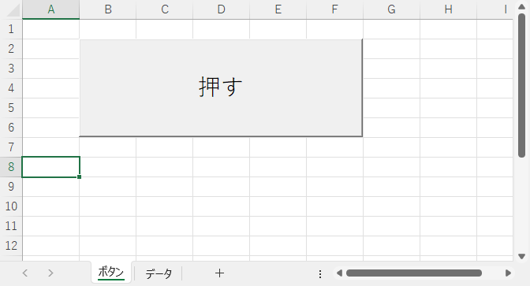
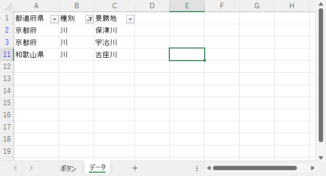
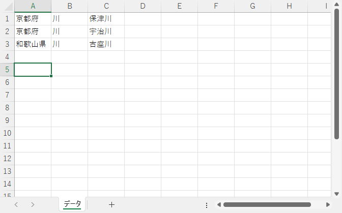

# 7 日目

## オートフィルター

Excel で使用頻度が高い機能としてオートフィルターがあります。


種別「川」でフィルタリングした結果です。


この機能を VBA で実現します。

### オートフィルターの範囲

オートフィルターを使用する場合、

- どのシートが対象か
- シート内のどのデータが対象か　＝　対象のセルの範囲はどこか

を決めなければなりません。上記の表では次のようになります。

表全体をした場合です。

```vb
Worksheets("データ").Range("A1:C11")
```

`CurrentRegion` を使用して書き直すと次のようになります。

```vb
Worksheets("データ").Range("A1").CurrentRegion
```

オートフィルターの範囲指定では `CurrentRegion` を省略できるので、最もシンプルなのは次のようになります。

```VB
Worksheets("データ").Range("A1")
```

`CurrentRegion` が効いているので、次の表の場合、13 行目はオートフィルターの範囲から除外されます。


### オートフィルターの設定

#### 絞り込みの値が 1 つの場合

```vb
シート名.Range(オートフィルターの範囲).AutoFilter 項目番号, 絞り込みの値
```

#### 絞り込みの値が 2 つの場合

```vb
シート名.Range(オートフィルターの範囲).AutoFilter 項目番号, 絞り込みの値1, xlOr, 絞り込みの値2
```

#### 項目番号

オートフィルターの対象列を指定します。指定方法は `Cells` と同様に番号で指定します。

| 列 | 列番号 |
| :---: | :---: |
| A | 1 |
| B | 2 |
| C | 3 |

#### 絞り込みの値

絞り込みに使用する値です。C 列の絞り込みに使用できる値は以下のとおりです。


絞り込みの値は最大 2 つまで指定できます。

### オートフィルターの使用例

#### 絞り込みの値が 1 つの場合の例

「種別」（ B 列）を "川" でオートフィルターを実行します。

```vb
Private Sub CommandButton1_Click()

    Worksheets("データ").Range("A1").AutoFilter 2, "川"
    
End Sub
```

実行前の状態です。




実行後の状態です。「種別」を "川" でオートフィルターを実行しました。



#### 絞り込みの値が 2 つの場合の例

「種別」（ B 列）を "川" か "山" でオートフィルターを実行します。

```vb
Private Sub CommandButton1_Click()

    Worksheets("データ").Range("A1").AutoFilter 2, "川", xlOr, "山"
    
End Sub
```

実行前の状態です。


実行後の状態です。「種別」を "川" か "山" でオートフィルターを実行しました。


#### オートフィルター後にデータが存在しない場合

オートフィルターの実行後、データが 1 件も残らなかった場合の例です。「都道府県」（ A 列）を "北海道" でオートフィルターを実行します。

```vb
Private Sub CommandButton1_Click()

    Worksheets("データ").Range("A1").AutoFilter 1, "北海道"
    
End Sub
```

実行前の状態です。


実行後の状態です。「都道府県」に "北海道" は存在しないため、オートフィルターで抽出されたデータは 0 件です。


#### オートフィルター後にもう一度オートフィルターを実行する

「種別」（ B 列）を "山" でオートフィルターを実行し、その後、「都道府県」（ A 列）を "奈良県" でオートフィルターを実行します。

```vb
Private Sub CommandButton1_Click()

    Worksheets("データ").Range("A1").AutoFilter 2, "山"
    Worksheets("データ").Range("A1").AutoFilter 1, "奈良県"
    
End Sub
```

実行前の状態です。


実行後の状態です。"山"　かつ　"奈良県" でオートフィルターを実行しました。


### オートフィルターの解除

オートフィルターで抽出したデータの処理後はオートフィルターを解除します。

```vb
シート名.Range(オートフィルターの範囲).AutoFilter
```

```vb
Private Sub CommandButton1_Click()

    Worksheets("データ").Range("A1").AutoFilter 2, "山"
    Worksheets("データ").Range("A1").AutoFilter 1, "奈良県"
    Worksheets("データ").Range("A1").AutoFilter                 ' オートフィルター解除
    
End Sub
```

実行前の状態です。


実行後の状態です。オートフィルターを解除したので、実行前の状態と同じです


### オートフィルターと最終行

この表の場合、最終行は 11 行目です。


オートフィルター後の最終行を確認します。

```vb
Private Sub CommandButton1_Click()

    With Worksheets("データ")
        .Range("A1").AutoFilter 2, "滝", xlOr, "高原"
        .Range("F1").Value = .Cells(Rows.Count, 1).End(xlUp).Row
    End With
    
End Sub
```

実行前の状態です。


実行後の状態です。最終行は元の表では 11 行目でしたが、オートフィルター後はその結果にもとづいて 8 行目になりました。


### オートフィルター後の結果をコピーする

オートフィルターで抽出したデータを別のシートへコピーします。 ｀CurrentRegion` を使用すると、オートフィルター後の表示されているデータで範囲指定します。それをコピーすることで、オートフィルターで選択した範囲だけを別シートへコピーできます。

```vb
Private Sub CommandButton1_Click()

    Worksheets("データ").Range("A1").AutoFilter 2, "滝", xlOr, "高原"
    Worksheets("データ").Range("A1").CurrentRegion.Copy Worksheets("データ２").Range("A1")
    
End Sub
```

実行前の状態です。コピー先のシート「データ２」は何も記録されていません。


実行後の状態です。シート「データ」はオートフィルター実行後の状態です。


シート「データ２」は上図の結果をコピーされました。


`CurrentRegion` ですが表の選択範囲のセルであれば、表示されている / いないに関わらず表示されているセルだけを対象にコピーします。例えば、表の右下のセル C11 （オートフィルター後は表示されてないセル）を指定しても同じ結果になります。

```vb
Private Sub CommandButton1_Click()

    Worksheets("データ").Range("A1").AutoFilter 2, "滝", xlOr, "高原"
    Worksheets("データ").Range("C11").CurrentRegion.Copy Worksheets("データ２").Range("A1")
    
End Sub
```

### Offset

`Offset` を使用すると、`Range` や `Range.CurrentRegion` で選択したサイズを変えずに範囲をずらすことができます。このずらす量をオフセットと呼びます。

```vb
Offset(行（縦）方向にずらす量, カラム（横）方向にずらす量)
```

| 行（縦）方向にずらす量 | ずらす方向 | 例 | 意味 |
| :---: | :---: | :---: | :---: |
| プラスの値 | 下方向にずらす | 10 | 選択範囲を下方向に 10 ずらす |
| マイナスの値 | 上方向にずらす | -10 | 選択範囲を上方向に 10 ずらす |

| カラム（横）方向にずらす量 | ずらす方向 | 例 | 意味 |
| :---: | :---: | :---: | :---: |
| プラスの値 | 右方向にずらす | 10 | 選択範囲を右方向に 10 ずらす |
| マイナスの値 | 左方向にずらす | -10 | 選択範囲を左方向に 10 ずらす |

`Offset` を使用しないで `CurrentRegion` で指定したセルの範囲を別のシートにコピーします。

```vb
Private Sub CommandButton1_Click()

    Worksheets("データ").Range("A1").CurrentRegion.Copy Worksheets("データ２").Range("A1")
    
End Sub
```

`Worksheets("データ").Range("A1").CurrentRegion` で指定される範囲はシート「データ」のセル A1 ～ C11 までの範囲です。

実行前の状態です。


実行後の状態です。オートフィルターを使用していないのでシート「データ」はそのままです。シート「データ２」に、シート「データ」のセル A1 ～ C11 までの範囲がコピーされました。


`Offset` を使用した例です。

```vb
Private Sub CommandButton1_Click()

    Worksheets("データ").Range("A1").CurrentRegion.Offset(2, 1).Copy Worksheets("データ２").Range("A1")
    
End Sub
```

`Offset(2, 1)` なので `CurrentRegion` で選択した範囲（下図の赤枠で囲まれた部分）と同サイズで下方向 2 、右方向に 1 ずらした部分（下図の青枠で囲まれた部分）が対象になります。本当は赤枠と青枠の両方で囲まれた範囲にリサイズするのが望ましいのですが、説明を簡単にするためここでは省略します。


実行前の状態です。


実行後のシート「データ２」の状態です。青枠で囲まれた部分がコピーされました。


### オートフィルター後の結果の見出しを除いてコピーする

`Offset` を用いてオートフィルター後の結果の見出し部分を除いて別シートへコピーします。見出しを除くだけなので `offset` は下方向に 1 だけずらします。

```vb
Offset(1, 0)
```


```vb
Private Sub CommandButton1_Click()
    
    Worksheets("データ").Range("A1").AutoFilter 2, "滝", xlOr, "高原"
    Worksheets("データ").Range("A1").CurrentRegion.Offset(1, 0).Copy Worksheets("データ２").Range("A1")
    
End Sub
```

実行前の状態です。


実行後のシート「データ」の状態です。指定した内容でオートフィルターされました。


実行後のシート「データ２」の状態です。オートフィルターした結果から見出し（ 1 行目）を除いてコピーしました。


### Resize

`Resize` を使用して `Range` で選択したセルの範囲のサイズを変更できます。範囲指定されたセルの左上のセルを起点としてサイズを変更します。行サイズまたはカラム（列）のサイズが元のサイズを引き継ぐ場合は省略します。

```vb
Resize(行のサイズ, カラム（列）のサイズ)
```

`CurrentRegion` で指定した範囲を行サイズ 5 、カラム（列）サイズ 2 に変更してコピーします。

```vb
Private Sub CommandButton1_Click()

    Worksheets("データ").Range("A1").CurrentRegion.Resize(5, 2).Copy Worksheets("データ２").Range("A1")
    
End Sub
```

赤枠で囲んだ部分が `CurrentRegion` で選択した範囲、青枠で囲んだ部分が `Resize(5, 2)` で選択しなした範囲です。上記のコードは青枠で囲んだ部分を対象にコピーします。


実行前の状態です。


実行後の状態です。シート「データ２」にリサイズした（青枠で囲んだ部分）がコピーされました。


### オートフィルター後の結果の見出しを除いてデータ部分だけをコピーする

`Resize` を使用し、オートフィルター後のデータ部分だけをコピーします。

```vb
Private Sub CommandButton1_Click()
    
    Dim RANGE_Area      As Range                                                    ' コピーするセルの範囲

    Worksheets("データ").Range("A1").AutoFilter 2, "滝", xlOr, "高原"               ' オートフィルター
    Set RANGE_Area = Worksheets("データ").Range("A1").CurrentRegion.Offset(1, 0)    ' 見出しを除いたコピー範囲
    Set RANGE_Area = RANGE_Area.Resize(RANGE_Area.Rows.Count - 1)                   ' 末尾の空白行を除いたコピー範囲
    RANGE_Area.Copy Worksheets("データ２").Range("A1")                              ' コピー
    
End Sub
```

実行前の状態です。


実行後の状態です。

オートフィルター後のシート「データ」の状態です。

```vb
    Worksheets("データ").Range("A1").AutoFilter 2, "滝", xlOr, "高原"               ' オートフィルター
```


`CurrentRegion.Offset(1, 0)` の実行で選択される範囲（赤枠）です。

```vb
    Set RANGE_Area = Worksheets("データ").Range("A1").CurrentRegion.Offset(1, 0)    ' 見出しを除いたコピー範囲
```


`Resize` で選択される範囲（青枠）です。今回はカラム（列）方向のサイズは変更しないため省略しています。行方向のサイズは赤枠で囲んだ最終行から 1 行減らすため `RANGE_Area.Rows.Count - 1` を指定しました。 `RANGE_Area.Rows.Count` は選択範囲の最終行位置を示します。

```vb
    Set RANGE_Area = RANGE_Area.Resize(RANGE_Area.Rows.Count - 1)                   ' 末尾の空白行を除いたコピー範囲
```


コピーする範囲が決まったので、その範囲のセルをシート「データ２」へコピーします。

```vb
    RANGE_Area.Copy Worksheets("データ２").Range("A1")                              ' コピー
```


### オートフィルターで抽出したデータを行ごと削除する

オートフィルターで不要なデータを抽出し、抽出したデータを行単位に一括で削除します。上述の「オートフィルター後の結果の見出しを除いてデータ部分だけをコピーする」と処理はほぼ同じです。最後がコピーではなく削除になります。

「種別」が "川" のデータを削除します。

```vb
Private Sub CommandButton1_Click()

    Dim RANGE_Area      As Range                                                    ' コピーするセルの範囲

    Worksheets("データ").Range("A1").AutoFilter 2, "川"                             ' オートフィルター
    Set RANGE_Area = Worksheets("データ").Range("A1").CurrentRegion.Offset(1, 0)    ' 見出しを除いた削除範囲
    Set RANGE_Area = RANGE_Area.Resize(RANGE_Area.Rows.Count - 1)                   ' 末尾の空白行を除いた削除範囲
    RANGE_Area.EntireRow.Delete                                                     ' 選択した行を削除
    Worksheets("データ").Range("A1").AutoFilter                                     ' オートフィルタを解除
        
End Sub
```

`EntireRow` は `Range` で示された範囲を含む行全体を指します。したがって下記は選択された範囲の行をすべて削除します。

```vb
    RANGE_Area.EntireRow.Delete                                                     ' 選択した行を削除
```

実行前の状態です。


実行後のシート「データ」の状態です。「種別」が "川" のデータが削除されました。


### オートフィルターで抽出したデータを行ごと塗りつぶす

オートフィルターでデータを抽出し、抽出したデータを行単位に塗りつぶします。上述の「オートフィルター後の結果の見出しを除いてデータ部分だけをコピーする」と処理はほぼ同じです。最後がコピーではなく塗りつぶしになります。

「種別」が "川" のデータを塗りつぶします。

```vb
Private Sub CommandButton1_Click()

    Dim RANGE_Area      As Range                                                    ' コピーするセルの範囲

    Worksheets("データ").Range("A1").AutoFilter 2, "川"                             ' オートフィルター
    Set RANGE_Area = Worksheets("データ").Range("A1").CurrentRegion.Offset(1, 0)    ' 見出しを除いた塗りつぶし範囲
    Set RANGE_Area = RANGE_Area.Resize(RANGE_Area.Rows.Count - 1)                   ' 末尾の空白行を除いた塗りつぶし範囲
    RANGE_Area.EntireRow.Interior.Color = vbYellow                                  ' 選択した行を塗りつぶし
    Worksheets("データ").Range("A1").AutoFilter                                     ' オートフィルタを解除
        
End Sub
```

実行前の状態です。


実行後のシート「データ」の状態です。「種別」が "川" のデータの行を黄色で塗りつぶしました。


## オートフィルターで抽出されたデータをセル単位で処理する

ここまでの説明はすべてオートフィルターで抽出された行すべてに対して何らかの処理（コピーする、削除する、塗りつぶす）をするものです。ここからは抽出した行ごとに、セル単位で処理をする場合になります。

オートフィルターで抽出した行の C 列の値を 1 つずつメッセージボックスで表示するコードです。

```vb
Private Sub CommandButton1_Click()

    Dim RANGE_Area      As Range                                                    ' コピーするセルの範囲
    Dim RANGE_Cell      As Range                                                    ' 取り出したセル

    Worksheets("データ").Range("A1").AutoFilter 2, "川"                             ' オートフィルター
    Set RANGE_Area = Worksheets("データ").Range("A1").CurrentRegion.Offset(1, 0)    ' 見出しを除いた削除範囲
    Set RANGE_Area = RANGE_Area.Resize(RANGE_Area.Rows.Count - 1)                   ' 末尾の空白行を除いた削除範囲
    Set RANGE_Area = RANGE_Area.SpecialCells(xlCellTypeVisible)                     ' 見えているセルだけ対象
    
    For Each RANGE_Cell In RANGE_Area.Rows                                          ' 対象を行単位で順番に取り出し
        MsgBox RANGE_Cell.Range("C1")                                               ' メッセージボックスで景勝地を表示
    Next RANGE_Cell
    
    Worksheets("データ").Range("A1").AutoFilter                                     ' オートフィルタを解除
        
End Sub
```

この 3 行でオートフィルターでデータを抽出し、データ部分だけ（赤枠で囲んだ部分）を指定します。

```vb
    Worksheets("データ").Range("A1").AutoFilter 2, "川"                             ' オートフィルター
    Set RANGE_Area = Worksheets("データ").Range("A1").CurrentRegion.Offset(1, 0)    ' 見出しを除いた削除範囲
    Set RANGE_Area = RANGE_Area.Resize(RANGE_Area.Rows.Count - 1)                   ' 末尾の空白行を除いた削除範囲
```


データの範囲から順番に値取り出す `For Each` ･･･ `Next` 文です。 `For Each` ･･･ `Next` 文は表示されていないセルの値まで対象にして順番に取り出します。上記コードの `Offset` や `Resize` によるデータ部分だけの指定は有効です。

```vb
    For Each RANGE_Cell In RANGE_Area.Rows                                          ' 対象を行単位で順番に取り出し
```

そのため、表示されている部分だけでデータの集合を作り直す必要があります。表示されている部分だけを指すのが `SpecialCells(xlCellTypeVisible)` です。そのため、上述の 3 行のコードでデータを絞り込み、さらに `SpecialCells(xlCellTypeVisible)` で表示されている部分だけでデータの集合を作り直します。

```vb
    Set RANGE_Area = RANGE_Area.SpecialCells(xlCellTypeVisible)                     ' 見えているセルだけ対象
```

`SpecialCells(xlCellTypeVisible)` で表示されているセルだけでデータの集合を作り直したイメージです。行番号でわかるとおり、オートフィルターで絞り込んだイメージではありません。



上記のデータを行単位でとりだすために `RANGE_Area` ではなく `RANGE_Area.Rows` を指定します。末尾の `.Rows` を省くとセル単位でデータを取り出します。

```vb
    For Each RANGE_Cell In RANGE_Area.Rows                                          ' 対象を行単位で順番に取り出し
```

今回は 3 行データがあるので 3 回ループします。ループの各回で取り出されるデータのイメージです。

1 回目のループ


2 回目のループ


3 回目のループ


順番に 1 行ずつ取り出されるので、上図のように何回目のループでもセル位置は常に同じになります。

- 都道府県　→　`Range("A1")` または `Cells(1, 1)`
- 種別　→　`Range("B1")` または `Cells(1, 2)`
- 景勝地　→　`Range("C1")` または `Cells(1, 3)`

ループごとにメッセージボックスで「景勝地」を表示するには次のコードになります。

```vb
        MsgBox RANGE_Cell.Range("C1")                                               ' メッセージボックスで景勝地を表示
```

「景勝地」を塗りつぶすのであれば次のコードになります。

```vb
        RANGE_Cell.Range("C1").Interior.Color = vbYellow                            ' 景勝地を黄色で塗りつぶす
```


