# 8 日目

## シート

シートの追加や削除の仕方は扱いました。ここでは、それ以外のシートの扱い方について説明します。

### 末尾にシートを移動する

最後（末尾）のシートの次にシートを移動する場合、次のコードを実行します。

```vb
Worksheets(移動するシート名).Move after:=Worksheets(Worksheets.Count)
```

```vb
Worksheets(移動するシート番号).Move after:=Worksheets(Worksheets.Count)
```

シート「データ」を末尾に移動するコードです。

```vb
Private Sub CommandButton1_Click()

    Worksheets("データ").Move after:=Worksheets(Worksheets.Count)

End Sub
```

実行前の状態です。

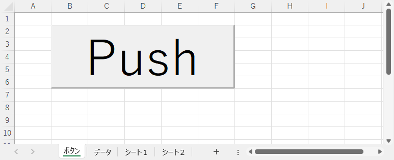

実行後の状態です。シート「データ」が末尾へ移動しました。

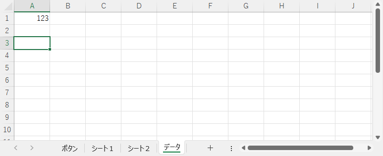

### 先頭にシートを移動する

最初（先頭）のシートの前にシートを移動する場合、次のコードを実行します。

```vb
Worksheets(移動するシート名).Move before:=Worksheets(1)
```

```vb
Worksheets(移動するシート番号).Move before:=Worksheets(1)
```

シート「データ」を先頭に移動するコードです。

```vb
Private Sub CommandButton1_Click()

    Worksheets("データ").Move before:=Worksheets(1)

End Sub
```

実行前の状態です。


実行後の状態です。シート「データ」が先頭に移動しました。

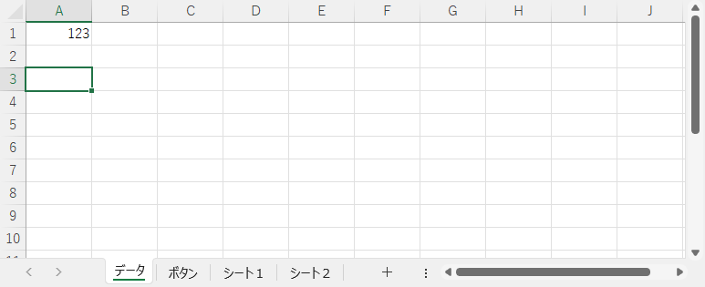

### 任意の位置にシートを移動する

任意の位置にシートを追加する場合、事前に次のことを決めておきます。

- どのシートを基準にするのか
- 基準のシートの前（ before ）／後（ after ）のどちらにシートを移動するのか

基準のシートは Worksheets(シート名) または Worksheets(シート番号) で指定します。

#### 基準のシートの前にシートを移動

```vb
Worksheets(移動するシート名).Move before:=Worksheets(基準のシート名)
```

```vb
Worksheets(移動するシート名).Move before:=Worksheets(基準のシート番号)
```

```vb
Worksheets(移動するシート番号).Move before:=Worksheets(基準のシート名)
```

```vb
Worksheets(移動するシート番号).Move before:=Worksheets(基準のシート番号)
```

#### 基準のシートの後にシートを移動

```vb
Worksheets(移動するシート名).Move after:=Worksheets(基準のシート名)
```

```vb
Worksheets(移動するシート名).Move after:=Worksheets(基準のシート番号)
```

```vb
Worksheets(移動するシート番号).Move after:=Worksheets(基準のシート名)
```

```vb
Worksheets(移動するシート番号).Move after:=Worksheets(基準のシート番号)
```

2 番目のシートをシート「シート１」の次に移動します

```vb
Private Sub CommandButton1_Click()

    Worksheets(2).Move after:=Worksheets("シート１")

End Sub
```

実行前の状態です。


実行後の状態です。2 番目のシート（シート「データ」）がシート「シート１」の次に移動しました。


### 末尾にシートをコピーする

最後（末尾）のシートの次にシートをコピーする場合、次のコードを実行します。

```vb
Worksheets(コピーするシート名).Copy after:=Worksheets(Worksheets.Count)
```

```vb
Worksheets(コピーするシート番号).Copy after:=Worksheets(Worksheets.Count)
```

シート「データ」を末尾にコピーするコードです。

```vb
Private Sub CommandButton1_Click()

    Worksheets("データ").Copy after:=Worksheets(Worksheets.Count)

End Sub
```

実行前の状態です。


実行後の状態です。シート「データ」を末尾にコピーしました。コピー後のシート名は手動で操作したときと同様に Excel 側で重複が起きないよう設定します。

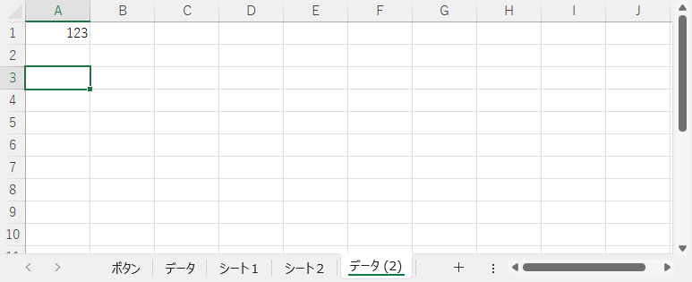

### 先頭にシートをコピーする

最初（先頭）のシートの前にシートをコピーする場合、次のコードを実行します。

```vb
Worksheets(コピーするシート名).Copy before:=Worksheets(1)
```

```vb
Worksheets(コピーするシート番号).Copy before:=Worksheets(1)
```

シート「データ」を先頭にコピーするコードです。

```vb
Private Sub CommandButton1_Click()

    Worksheets("データ").Copy before:=Worksheets(1)

End Sub
```

実行前の状態です。


実行後の状態です。シート「データ」を先頭にコピーしました。コピー後のシート名は手動で操作したときと同様に Excel 側で重複が起きないよう設定します。

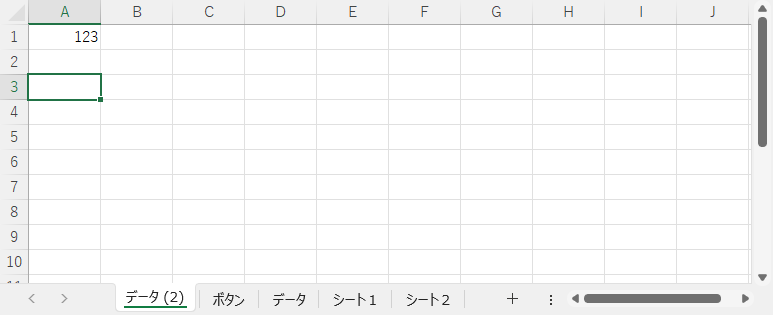

### 任意の位置にシートをコピーする

任意の位置にシートを追加する場合、事前に次のことを決めておきます。

- どのシートを基準にするのか
- 基準のシートの前（ before ）／後（ after ）のどちらにシートをコピーするのか

基準のシートは Worksheets(シート名) または Worksheets(シート番号) で指定します。

#### 基準のシートの前にシートをコピー

```vb
Worksheets(コピーするシート名).Copy before:=Worksheets(基準のシート名)
```

```vb
Worksheets(コピーするシート名).Copy before:=Worksheets(基準のシート番号)
```

```vb
Worksheets(コピーするシート番号).Copy before:=Worksheets(基準のシート名)
```

```vb
Worksheets(コピーするシート番号).Copy before:=Worksheets(基準のシート番号)
```

#### 基準のシートの後にシートをコピー

```vb
Worksheets(コピーするシート名).Copy after:=Worksheets(基準のシート名)
```

```vb
Worksheets(コピーするシート名).Copy after:=Worksheets(基準のシート番号)
```

```vb
Worksheets(コピーするシート番号).Copy after:=Worksheets(基準のシート名)
```

```vb
Worksheets(コピーするシート番号).Copy after:=Worksheets(基準のシート番号)
```

2 番目のシートをシート「シート１」の次にコピーするコードです。

```vb
Private Sub CommandButton1_Click()

    Worksheets(2).Copy after:=Worksheets("シート１")

End Sub
```

実行前の状態です。


実行後の状態です。2 番目のシート（シート「データ」）がシート「シート１」の次にコピーしました。コピー後のシート名は手動で操作したときと同様に Excel 側で重複が起きないよう設定します。

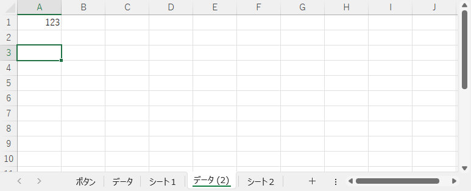

### 移動 / コピーしたシートのシート名を変更する

シートを移動すると移動後のシートが表示されます。シートをコピーするとコピー先のシートが表示されます。移動後 / コピー先のシートが `ActiveSheet` になるため、次のコードでシート名を設定します。

```vb
ActiveSheet.Name = "変更後のシート名"
```

シート「データ」を末尾にコピーし、シート名を「コピー後のデータ」に変更するコードです。

```vb
Private Sub CommandButton1_Click()

    Worksheets("データ").Copy after:=Worksheets(Worksheets.Count)
    ActiveSheet.Name = "コピー後のデータ"

End Sub
```

実行前の状態です。


実行後の状態です。シート「データ」を末尾にコピーし、シート名を「コピー後のデータ」に変更しました。

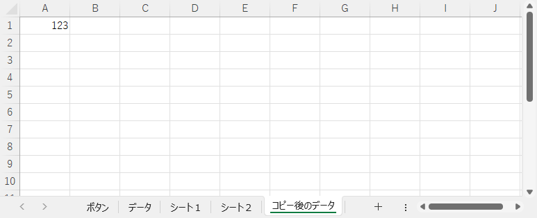

### シート名を変更する

シート名を変更する場合、次のコードを実行します。

```vb
Worksheets(シート名) = "変更後のシート名"
```

```vb
Worksheets(シート番号) = "変更後のシート名"
```

シート「シート２」の名前を「バックアップ」に変更するコードです。

```vb
Private Sub CommandButton1_Click()

    Worksheets("シート２").Name = "バックアップ"

End Sub
```

実行前の状態です。


実行後の状態です。シート「データ」を末尾にコピーし、シート名を「コピー後のデータ」に変更しました。シートの移動やコピーのときのようなシートの切り替わりはありません。

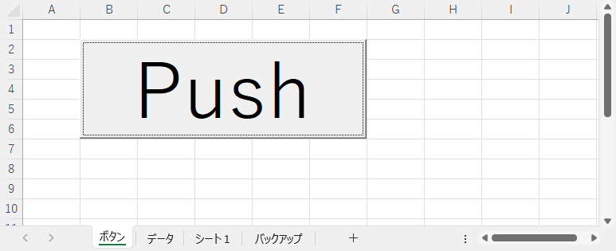

### シート見出し（シートのタブ）に色を設定する

シート見出し（シートのタブ）に色を設定する場合、次のコードを実行します。色を解除する場合は色コードに `xlNone` を指定するのですが、現状ではなぜか RGB(210, 239, 255) の色が設定されます。

```vb
Worksheets(シート名).Tab.Color = 色コード
```

```vb
Worksheets(シート名).Tab.Color = RGB(赤, 緑, 青)
```

シート「データ」のタブ色を解除し、シート「シート１」のタブ色をエンジ色に、シート「シート２」のタブ色を黄色に変更します。

```vb
Private Sub CommandButton1_Click()

    Worksheets("データ").Tab.Color = xlNone                 ' 色解除
    Worksheets("シート１").Tab.Color = RGB(229, 23, 31)     ' エンジ色
    Worksheets("シート２").Tab.Color = vbYellow             ' 黄色

End Sub
```

実行前の状態です。

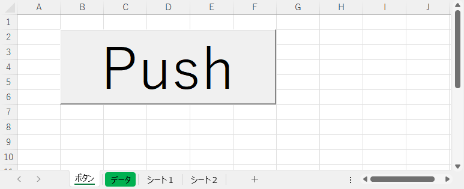

実行後の状態です。シートのタブを指定した色に変更しました。シートの移動やコピーのときのようなシートの切り替わりはありません。

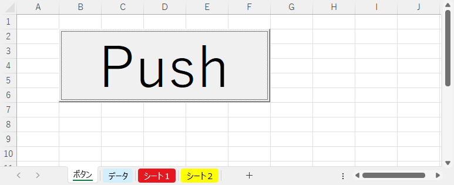

## 条件分岐

### If 文

日付をもとに日曜日、水曜日、土曜日、それ以外の曜日を異なる色でセルを塗りつぶすコードです。

```vb
Private Sub CommandButton1_Click()

    Dim LONG_Row        As Long                 ' 行番号
    Dim LONG_Week       As Long                 ' 曜日

    With Worksheets("データ")
    
        For LONG_Row = 1 To 10 Step 1
            
            With .Cells(LONG_Row, 1)
                LONG_Week = Weekday(.Value)     ' 曜日算出
                
                If LONG_Week = vbSunday Then
                    .Interior.Color = RGB(255, 99, 71)
                Else
                    If LONG_Week = vbWednesday Then
                        .Interior.Color = RGB(102, 205, 170)
                    Else
                        If LONG_Week = vbSaturday Then
                            .Interior.Color = RGB(30, 144, 255)
                        Else
                            .Interior.Color = RGB(255, 248, 220)
                        End If
                    End If
                End If
            End With
        
        Next LONG_Row
    
    End With

End Sub
```

実行前の状態です。

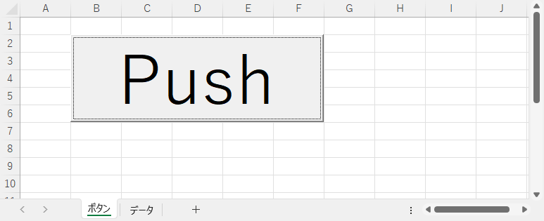

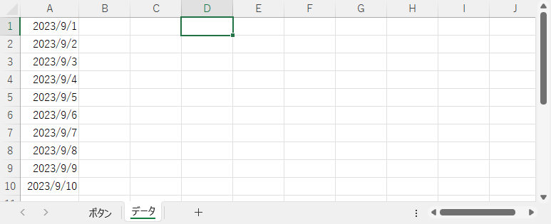

実行後の状態です。

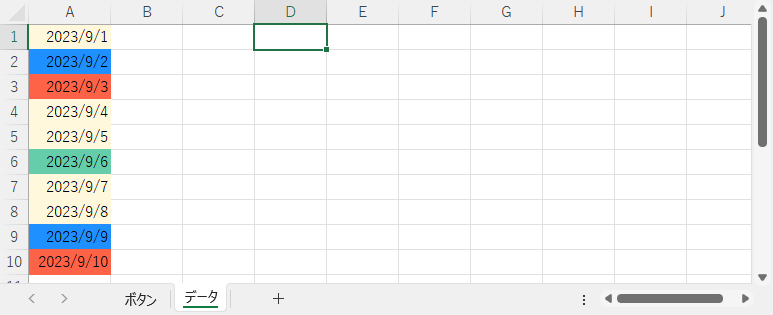

曜日判定の部分のコードです。`Else` の中に `IF` ･･･ `Else` ･･･ `End If` が書かれており、

```vb
                If LONG_Week = vbSunday Then
                    .Interior.Color = RGB(255, 99, 71)
                Else
                    If LONG_Week = vbWednesday Then
                        .Interior.Color = RGB(102, 205, 170)
                    Else
                        If LONG_Week = vbSaturday Then
                            .Interior.Color = RGB(30, 144, 255)
                        Else
                            .Interior.Color = RGB(255, 248, 220)
                        End If
                    End If
                End If
```

パッと見て `If` 文の構造がわかりにくい状態です。わかりやすくするため、`If` 文ごとに色分けしました。黄色の `Else` の中に緑色の `If` 文が含まれ、緑色の `Else` の中に青色の `If` 文が含まれています。

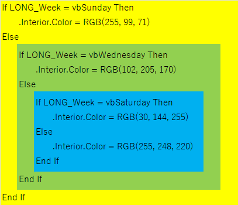

このように `Else` の中に `If` が含まれる構造の場合、次の構文で書き直すと読みやすくなります。

```vb
If 1つめの条件式 Then
    1つめの条件が成立したとき実行する VBA のコード
ElseIf 2つめの条件式 then
    2つめの条件が成立のときに実行する VBA のコード
ElseIf 3つめの条件式 then
    3つめの条件が成立のときに実行する VBA のコード
Else
    どの条件にも該当しなかったときに実行する VBA のコード
End If
```

「どの条件にも該当しなかったときに実行する VBA のコード」が不要な場合は次のとおりです。

```vb
If 1つめの条件式 Then
    1つめの条件が成立したとき実行する VBA のコード
ElseIf 2つめの条件式 then
    2つめの条件が成立のときに実行する VBA のコード
ElseIf 3つめの条件式 then
    3つめの条件が成立のときに実行する VBA のコード
End If
```

4 つめ、5 つめの条件式がある場合は `ElseIf` を追加します。

この構文で書き直したコードです。最初のコードよりシンプルになりました。

```vb
Private Sub CommandButton1_Click()

    Dim LONG_Row        As Long                 ' 行番号
    Dim LONG_Week       As Long                 ' 曜日

    With Worksheets("データ")
    
        For LONG_Row = 1 To 10 Step 1
            
            With .Cells(LONG_Row, 1)
                LONG_Week = Weekday(.Value)     ' 曜日算出
                
                If LONG_Week = vbSunday Then
                    .Interior.Color = RGB(255, 99, 71)
                ElseIf LONG_Week = vbWednesday Then
                    .Interior.Color = RGB(102, 205, 170)
                ElseIf LONG_Week = vbSaturday Then
                    .Interior.Color = RGB(30, 144, 255)
                Else
                    .Interior.Color = RGB(255, 248, 220)
                End If
            End With
        
        Next LONG_Row
    
    End With

End Sub
```

### Select 文

このコードをさらに改善します。

```vb
Private Sub CommandButton1_Click()

    Dim LONG_Row        As Long                 ' 行番号
    Dim LONG_Week       As Long                 ' 曜日

    With Worksheets("データ")
    
        For LONG_Row = 1 To 10 Step 1
            
            With .Cells(LONG_Row, 1)
                LONG_Week = Weekday(.Value)     ' 曜日算出
                
                If LONG_Week = vbSunday Then
                    .Interior.Color = RGB(255, 99, 71)
                ElseIf LONG_Week = vbWednesday Then
                    .Interior.Color = RGB(102, 205, 170)
                ElseIf LONG_Week = vbSaturday Then
                    .Interior.Color = RGB(30, 144, 255)
                Else
                    .Interior.Color = RGB(255, 248, 220)
                End If
            End With
        
        Next LONG_Row
    
    End With

End Sub
```

上記のコードの `If` 文には次の特徴があります。

- 条件式に同じ変数（今回は変数 LONG_Week ）を使用している
- 条件式の比較演算子が `=` だけである

この特徴を満たす場合、`Select` 文を使用してさらにわかりやすく書き直せます。

```vb
Select Case 変数
    Case 値1
        「変数 = 値1」のときに実行する VBA コード
    Case 値2
        「変数 = 値2」のときに実行する VBA コード
    Case 値3
        「変数 = 値3」のときに実行する VBA コード
    Case Else
        変数の値が値1 ～ 値3 のどれにも合致しなかったときに実行する VBA のコード
End Select
```

「変数の値が値1 ～ 値3 のどれにも合致しなかったときに実行する VBA のコード」が不要な場合は次のとおりです。

```vb
Select Case 変数
    Case 値1
        「変数 = 値1」のときに実行する VBA コード
    Case 値2
        「変数 = 値2」のときに実行する VBA コード
    Case 値3
        「変数 = 値3」のときに実行する VBA コード
End Select
```

比較する値が 値4 、値5 とある場合は `Case 値` を追加します。

`Select` 文を使用して書き直したコードです。さらにシンプルになりました。

```vb
Private Sub CommandButton1_Click()

    Dim LONG_Row        As Long                 ' 行番号
    Dim LONG_Week       As Long                 ' 曜日

    With Worksheets("データ")
    
        For LONG_Row = 1 To 10 Step 1
            
            With .Cells(LONG_Row, 1)
                LONG_Week = Weekday(.Value)     ' 曜日算出
                
                Select Case LONG_Week
                    Case vbSunday
                        .Interior.Color = RGB(255, 99, 71)
                    Case vbWednesday
                        .Interior.Color = RGB(102, 205, 170)
                    Case vbSaturday
                        .Interior.Color = RGB(30, 144, 255)
                    Case Else
                        .Interior.Color = RGB(255, 248, 220)
                End Select
            End With
        
        Next LONG_Row
    
    End With

End Sub
```

## 繰り返し

`For` ･･･ `Next` または `For Each` ･･･ `Next` は予め繰り返し（ループ）の回数がわかっている場合に使用します。繰り返し回数が決まっていない場合は `Do` ･･･ `Loop` でループを作成します。 `Do` ･･･ `Loop` のループは終了条件により 2 とおりあります。

### 条件を満たしている間繰り返す

条件を満たしている間（ While ）、VBA のコードを実行します。

```vb
Do While 条件

    VBA のコード

Loop
```

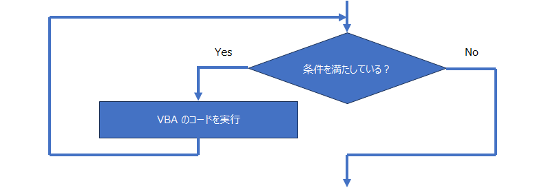

シート「データ」の A 列の値をチェックし、値がプラスの間はセルに色を塗るコードです。

```vb
Private Sub CommandButton1_Click()

    Dim LONG_Row        As Long                                     ' 行番号
    
    LONG_Row = 1                                                    ' １行目から調べる
    With Worksheets("データ")
    
        Do While .Cells(LONG_Row, 1).Value > 0                      ' A 列の値がプラスの間は繰り返す
            .Cells(LONG_Row, 1).Interior.Color = RGB(255, 99, 71)   ' 色を塗る
            LONG_Row = LONG_Row + 1                                 ' 次の行へ
        Loop
    
    End With

End Sub
```

実行前の状態です。


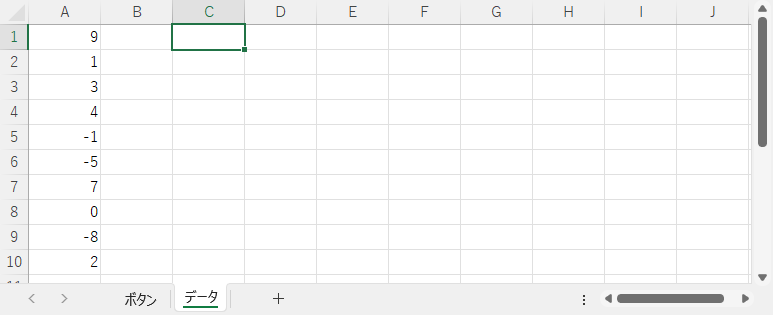

実行後の状態です。値がプラスの間、塗りつぶしました。

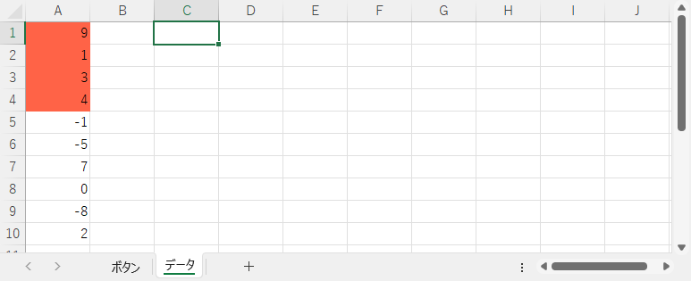

### 条件を満たすまで繰り返す

条件を満たすまで（ Until ）、VBA のコードを実行します。

```vb
Do Until 条件

    VBA のコード

Loop
```

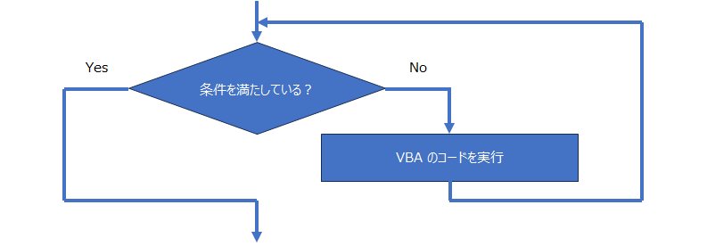

シート「データ」の A 列の値をチェックし、値が 0 かマイナスになるまでセルに色を塗るコードです。

```vb
Private Sub CommandButton1_Click()

    Dim LONG_Row        As Long                                     ' 行番号
    
    LONG_Row = 1                                                    ' １行目から調べる
    With Worksheets("データ")
    
        Do Until .Cells(LONG_Row, 1).Value <= 0                     ' A 列の値が 0 か マイナスになるまで繰り返す
            .Cells(LONG_Row, 1).Interior.Color = RGB(255, 99, 71)   ' 色を塗る
            LONG_Row = LONG_Row + 1                                 ' 次の行へ
        Loop
    
    End With

End Sub
```

実行前の状態です。


実行後の状態です。最初のマイナス値（ -1 ）のセルの前まで塗りつぶしました。


### For ループを中断する

シート「データ」の A 列の値をチェックし、値がプラスの間はセルに色を塗るコードです。繰り返しに `For` ･･･ `Next` を使用します。

```vb
Private Sub CommandButton1_Click()

    Dim LONG_Row        As Long                                         ' 行番号
    
    With Worksheets("データ")
    
        For LONG_Row = 1 To 10 Step 1
            If .Cells(LONG_Row, 1) > 0 Then                             ' A 列の値はプラスか？
                .Cells(LONG_Row, 1).Interior.Color = RGB(255, 99, 71)       ' 色を塗る
            Else                                                        ' A 列の
                Exit For                                                    ' For ループを中断する
            End If
        Next LONG_Row
    
    End With

End Sub
```

実行前の状態です。


実行後の状態です。値がプラスの間、塗りつぶしました。


ここでのポイントはこのコードです。

```vb
            If .Cells(LONG_Row, 1) > 0 Then                             ' A 列の値はプラスか？
                .Cells(LONG_Row, 1).Interior.Color = RGB(255, 99, 71)       ' 色を塗る
            Else                                                        ' A 列の値がプラスではない
                Exit For                                                    ' For ループを中断する
            End If
```

A 列の値がプラスならセルに色を塗り、プラスでないのなら次のコードを実行します。

```vb
Exit For
```

これは `For` ･･･ `Next` の処理を強制的に中断し、ループから抜けるという働きをします。ループから抜けたあとは `Next` の次の行を実行します。`Exit For` は `For Each` ･･･ `Next` を使用したループでも使用できます。

上記の `If` 文で A 列の値がプラスでないとき、`Exit For` でループを強制的に中断し `Next` の次の行である `End With` を実行します。

### Do ループを中断する

`Do` ･･･ `Loop` によるループを強制的に中断し `Loop` の次の行に実行するには次のコードを実行します。

```vb
Exit Do
```

シート「データ」の A 列の値をチェックし、値がプラスの間はセルに色を塗るコードです。A 列にプラスではない値が出てきたら `Exit Do` で強制的にループを中断し、`Loop` の次の行を実行します。

```vb
Private Sub CommandButton1_Click()

    Dim LONG_Row        As Long                                     ' 行番号
    Dim BOOL_Flag       As Boolean                                  ' ループ制御用
    
    With Worksheets("データ")
    
        LONG_Row = 1                                                    ' １行目から調べる
        BOOL_Flag = True
        
        Do While BOOL_Flag = True
            If .Cells(LONG_Row, 1).Value > 0 Then                       ' A 列の値がプラス？
                .Cells(LONG_Row, 1).Interior.Color = RGB(255, 99, 71)       ' 色を塗る
            Else                                                        ' A 列の値がプラスでない
                Exit Do                                                     ' Do ループを中断する
            End If
            LONG_Row = LONG_Row + 1                                 ' 次の行へ
        Loop
    
    End With

End Sub
```

実行前の状態です。


実行後の状態です。値がプラスの間、塗りつぶしました。


