# 9 日目の復習 ＋ α

## 複数のコマンドボタン

例題を使用して複数のコマンドボタンを配置したときに意識すべきこと、注意すべきことなどを見ていきます。

### 例題

シート「伝票」をもとに、商品 A001 と A002 を併せた日ごとの合計売上金額を記載したシートを作成します。各シートの記載内容は以下のとおり。

- シート「伝票」
  - 売り上げた順番に、売り上げた商品の品コードと売上数を記録している

   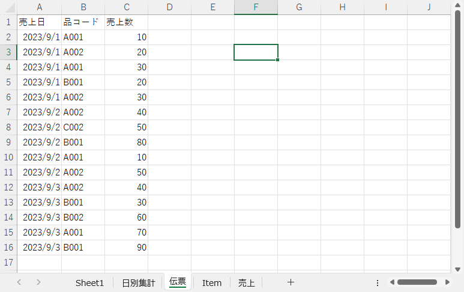

- シート「Item」
  - 商品の名前、単価を記録している

   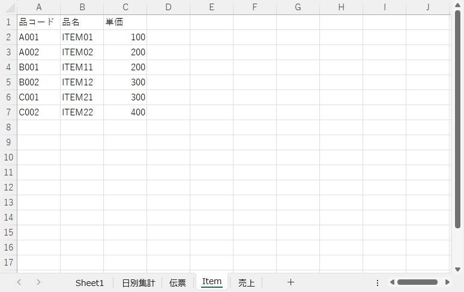

日毎の合計売上金額を記載したシートのイメージです。

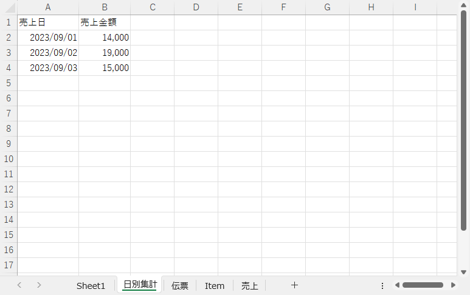

処理は次の 2 つに分けます。コマンドボタンをクリックしたら処理します。

1. データ抽出と計算  
  ・シート「伝票」から必要なデータを抽出し、別シートにコピーする  
  ・別シートにコピーした内容とシート「Item」を使用して売上金額を計算する
2. 日ごとの合計売上金額を算出  
  ・別シートの売上金額をもとに日ごとの合計売上金額を算出する

### 最初の状態

8 日目までのサンプルはすべてコマンドボタンが 1 つだけでした。コマンドボタンは必要な数だけ配置できます。下図は 2 つのコマンドボタンを配置直後の状態です。

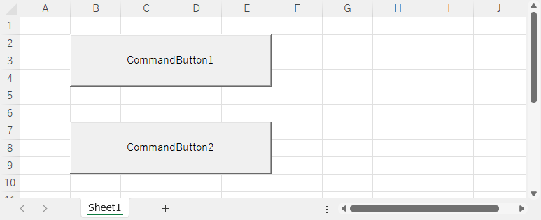

実際は下記のように `Caption` を処理の内容を表すものに変更すると思います。

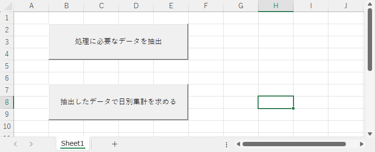

### コードを確認

コマンドボタン CommandButton1 のプロパティです。

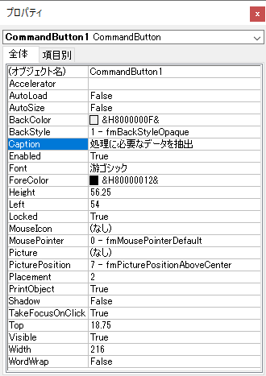

コマンドボタン CommandButton2 のプロパティです。

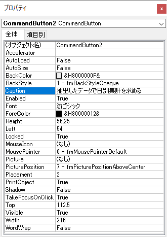

一番上に **(オブジェクト名)** があり、それぞれ CommandButton1 と CommandButton2 いう文字列が設定されています。

コードを表示しました。コマンドボタンが 2 つなので、`Sub` ･･･ `End Sub` のコードもオブジェクトごとに 2 つ分あります。

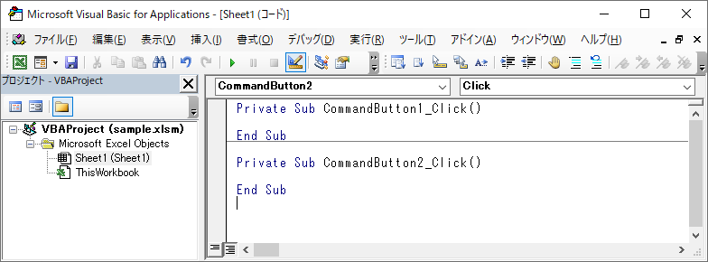

コードが長くなったり、コマンドボタンが増えることも想定してこんな風にコメントを入れておくと、後から確認したときにわかりやすいでしょう。

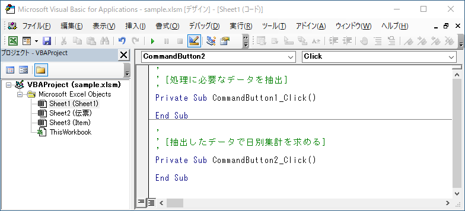

### コメントを書く

サンプルとしてコードを書きました。後から見返したときや他の人が見ることを考慮し、下記のコードのように適宜コメントを付けることを推奨します。

```vb
'
' [処理に必要なデータを抽出]
'
Private Sub CommandButton1_Click()

'
'   概要
'   1. シート「伝票」から品コード A001 と A002 のデータを取り出し、シート「売上」に保存する。
'   2. シート「Item」の情報と紐づけ、売上金額を算出する。
'
    
    Dim WS_Sheet                As Worksheet                            ' 取り出したワークシート
    
    Dim RANGE_Item              As Range                                ' シート「Item」の品コード（A列）
    Dim RANGE_Tanka             As Range                                ' シート「Item」の単価（C列）
    
    Dim LONG_LastRow            As Long                                 ' 最終行
    Dim LONG_Row                As Long                                 ' 行位置
    Dim LONG_Tanka              As Long                                 ' 単価

    ' シート「売上」を削除する
    For Each WS_Sheet In Worksheets
        If WS_Sheet.Name = "売上" Then                                  ' シート名が「売上」？
            Application.DisplayAlerts = False                               ' 警告メッセージ off
            WS_Sheet.Delete                                                 ' シートを削除
            Application.DisplayAlerts = True                                '  警告メッセージ on
            Exit For
        End If
    Next WS_Sheet
    
    ' シート「売上」を作成する
    Worksheets.Add after:=Worksheets(Worksheets.Count)                  ' 新規シートを作成
    ActiveSheet.Name = "売上"                                           ' シート名を「売上」に変更
    
    ' シート「伝票」から必要データをシート「売上」へコピーする
    With Worksheets("伝票")
        .Range("A1").AutoFilter 2, "A001", xlOr, "A002"                 ' 商品コードが A001 or A002 を抽出
        .Range("A1").CurrentRegion.Copy Worksheets("売上").Range("A1")  ' 抽出したデータをシート「売上」へコピー
        .Range("A1").AutoFilter
    End With
    
    ' シート「Item」から単価情報を保存する
    With Worksheets("Item")
        Set RANGE_Item = .Columns("A")                                  ' 品コード
        Set RANGE_Tanka = .Columns("C")                                 ' 単価
    End With
    
    ' シート「売上」で売上金額を算出する
    With Worksheets("売上")
        .Cells(1, 4).Value = "売上金額"
        LONG_LastRow = .Cells(Rows.Count, 1).End(xlUp).Row              ' 最終行取得
        For LONG_Row = 2 To LONG_LastRow
            LONG_Tanka = WorksheetFunction.XLookup(.Cells(LONG_Row, 2), RANGE_Item, RANGE_Tanka, 0) ' 単価取得
            .Cells(LONG_Row, 4).Value = .Cells(LONG_Row, 3).Value * LONG_Tanka                      ' 売上金額計算
        Next LONG_Row
    End With

End Sub

'
' [抽出したデータで日別集計を求める]
'
Private Sub CommandButton2_Click()

'
'   概要
'   1. シート「日別集計」を作成する。
'   2. シート「売上」をもとに日別の合計売上金額を算出し、シート「日別集計」に記録する。
'

    Dim WS_Sheet                As Worksheet                            ' 取り出したワークシート
    
    Dim RANGE_Date              As Range                                ' シート「売上」の日付の範囲
    
    Dim STRING_MaxDate          As String                               ' 日付の最大値
    Dim STRING_MinDate          As String                               ' 日付の最小値
    Dim STRING_Date             As String                               ' 日付

    Dim LONG_LastRow            As Long                                 ' 最終行
    Dim LONG_Row                As Long                                 ' 行位置
    
    ' シート「日別集計」を削除する
    For Each WS_Sheet In Worksheets
        If WS_Sheet.Name = "日別集計" Then
            Application.DisplayAlerts = False
            WS_Sheet.Delete
            Application.DisplayAlerts = True
            Exit For
        End If
    Next WS_Sheet
    
    ' シート「日別集計」を作成する
    Worksheets.Add after:=Worksheets(1)
    ActiveSheet.Name = "日別集計"

    ' シート「売上」の中の最大 / 最小日付を取得する
    With Worksheets("売上")
        ' 日付の範囲
        Set RANGE_Date = .Columns(1)
        ' 日付の最小値を取得
        STRING_MinDate = Format(WorksheetFunction.Min(RANGE_Date), "yyyy/mm/dd")
        ' 日付の最大値を取得
        STRING_MaxDate = Format(WorksheetFunction.Max(RANGE_Date), "yyyy/mm/dd")
    End With
    
    ' シート「日別集計」の見出しを作成する等
    With Worksheets("日別集計")
        ' 見出し
        .Cells(1, 1) = "売上日"
        .Cells(1, 2) = "売上金額"
        ' 売上日（A 列）の書式
        With .Columns(1)
            .NumberFormatLocal = "yyyy/mm/dd"
            .ColumnWidth = 12
        End With
        ' 売上金額（B 列）の書式
        With .Columns(2)
            .NumberFormatLocal = "#,###,##0"
            .ColumnWidth = 10
        End With
        ' 日付作成
        LONG_Row = 2
        STRING_Date = STRING_MinDate
        Do Until STRING_Date > STRING_MaxDate
            .Cells(LONG_Row, 1).Value = STRING_Date
            STRING_Date = DateAdd("d", 1, STRING_Date)
            LONG_Row = LONG_Row + 1
        Loop
        ' 最終行取得
        LONG_LastRow = .Cells(Rows.Count, 1).End(xlUp).Row
    End With
    
    ' シート「売上」をもとに日別の合計売上金額を算出しシート「日別集計」に記録する
    With Worksheets("売上")
        For LONG_Row = 2 To LONG_LastRow Step 1
            ' シート「日別集計」の"売上日"でシート「売上」をフィルタリング
            .Range("A1").AutoFilter 1, Format(Worksheets("日別集計").Cells(LONG_Row, 1).Value, "yyyy/m/d")
            ' 絞り込んだデータで合計売上金額を算出
            Worksheets("日別集計").Cells(LONG_Row, 2).Value = WorksheetFunction.Subtotal(9, .Columns("D"))
            ' オートフィルターを解除
            .Range("A1").AutoFilter
        Next LONG_Row
    End With

End Sub
```

コード **CommandButton1_Click** はメインのコメントはコードと同じ位置に、メインのコメントを補うサブ（補助）のコメントはコードの後ろに記述するスタイルです。

```vb
    ' シート「Item」から単価情報を保存する　←　メインのコメント
    With Worksheets("Item")
        Set RANGE_Item = .Columns("A")                                  ' 品コード　←　サブのコメント
        Set RANGE_Tanka = .Columns("C")                                 ' 単価　　　←　サブのコメント
    End With
```

コード **CommandButton2_Click** はメインとサブのコメントをコードと同じ位置記述するスタイルです。

```vb
    ' シート「売上」の中の最大 / 最小日付を取得する　←　メインのコメント
    With Worksheets("売上")
        ' 日付の範囲　←　サブのコメント
        Set RANGE_Date = .Columns(1)
        ' 日付の最小値を取得　←　サブのコメント
        STRING_MinDate = Format(WorksheetFunction.Min(RANGE_Date), "yyyy/mm/dd")
        ' 日付の最大値を取得　←　サブのコメント
        STRING_MaxDate = Format(WorksheetFunction.Max(RANGE_Date), "yyyy/mm/dd")
    End With
```

メインのコメントを目立たせるのであれば次のように書いても良いでしょう。

```vb
    '
    ' シート「売上」の中の最大 / 最小日付を取得する　←　メインのコメント
    '
```

```vb
    '************************************************************************
    '* シート「売上」の中の最大 / 最小日付を取得する　←　メインのコメント         *
    '************************************************************************
```

VBA は「 `'` から行末までがコメントになる」と決まっていますが、コメントの内容の書き方のルールはありません。どの様なコメントを書くかは、コードを書く人に任されています。気をつけなければいけないことは、機能の追加や削除などでコードを修正・変更したりするとき、**コメントの修正・変更も忘れずに行わなければならない**（手間が増えます）ということです。会社などでコメントのルールがあればそれに従えば良いです。ルールがない場合、どの程度のコメントを書くのかは、書く前に決めておくと良いでしょう。

### 変数の適用範囲

#### 適用範囲（スコープ）

今回のように複数の `Sub` ･･･ `End Sub` が存在する場合、`Dim` を使用して宣言した変数の **適用範囲** を正しく認識しなければなりません。**適用範囲** とは、宣言した変数に値を設定したり参照したりできる場所（範囲）のことです。適用範囲のことを「スコープ」とも呼びます。

変数の適用範囲を図示しました。

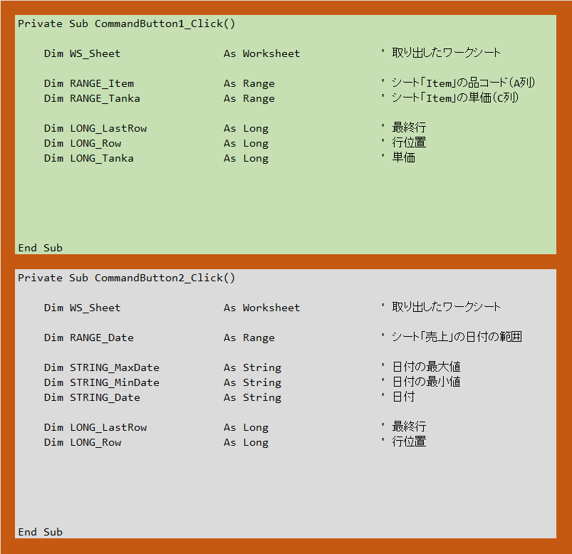

色で適用範囲を示しています。この図の適用範囲は次の 3 つです。

- 濃いオレンジ部分
- 薄い緑色の部分
- 灰色の部分

変数は宣言した色の範囲で有効です。同じ名前の変数であっても宣言した場所の色が異なれば VBA は別の変数として扱います。次の 2 つの変数は別のモノとして扱われます。

- （薄緑色の）WS_Sheet
- （灰色の）WS_Sheet

コードで書くときカッコの中の色は書きません（書けません）が、別々の WS_Sheet として扱われています。

複雑なのが濃いオレンジ色と薄い緑色 / 灰色の関係です。薄い緑色の外側は濃いオレンジ色です。外側の色で宣言した変数は内側の色も適用範囲に含みます。しかし、内側の色で宣言した変数は、外側の色は適用範囲外になります。上図の場合、濃いオレンジ色の部分で宣言した変数は薄い緑色の中でも有効になります。しかし薄い緑色で宣言した変数は濃いオレンジ色には出ていけません。これは灰色にも適用されます。

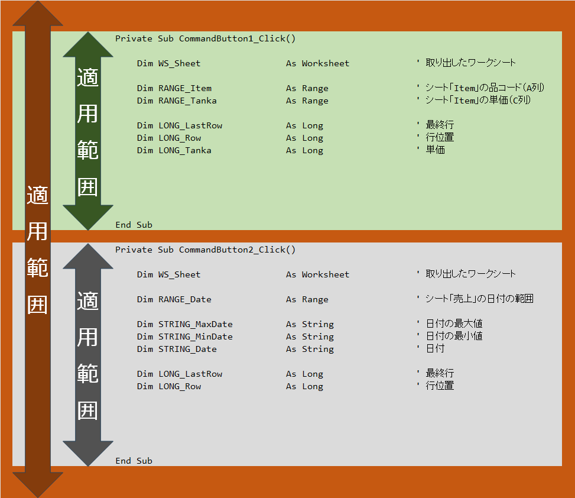

#### ローカル変数

`Sub` ･･･ `End Sub` の間で宣言した変数のことです。適用範囲は宣言した `Sub` ･･･ `End Sub` の間だけです。

#### グローバル変数

`Sub` ･･･ `End Sub` の外で宣言した変数のことです。すべての  `Sub` ･･･ `End Sub` の間が適用範囲になります。

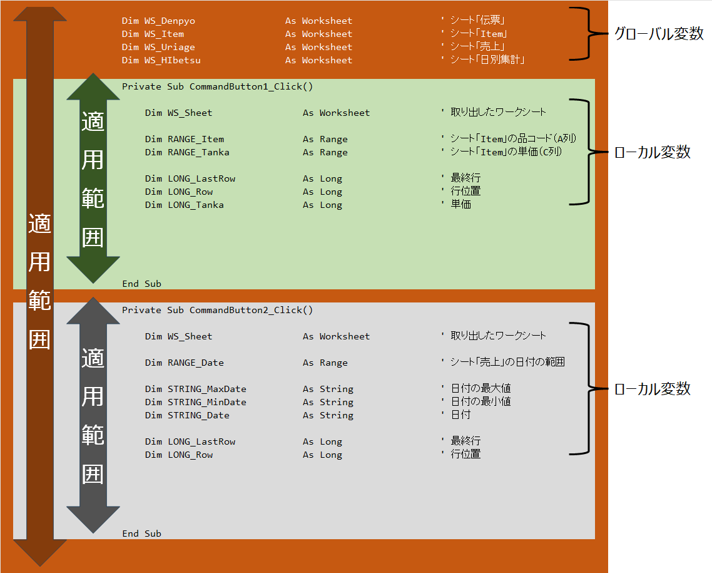

変数部分だけ記述すると、コードの画面ではこのようになります。

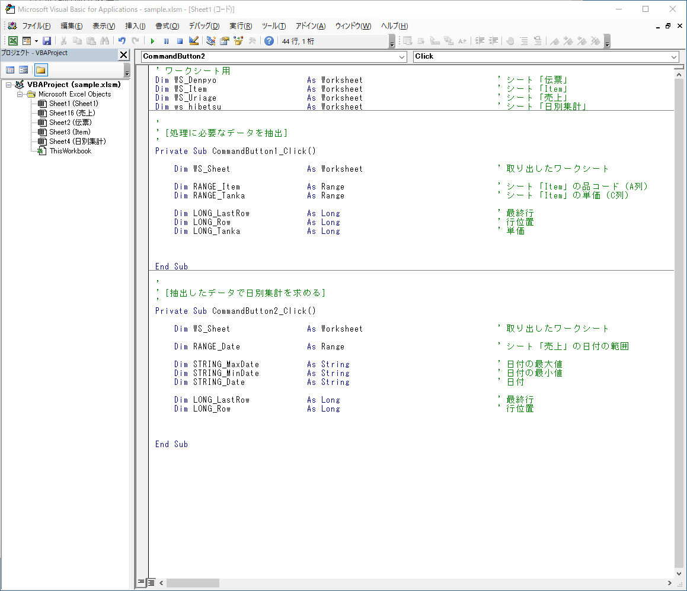

ローカル変数とグローバル変数は宣言する場所、適用範囲の違いはありますが、宣言してしまえば同じように使用できます。グローバル変数を多用すると、コードの修正がしづらいなどの問題が出やすくなります。グローバル変数の使用は最小限にしておくのが望ましいです。

## 関数を作成する

VBA では VBA 関数やワークシート関数を使用できます。これら以外に、自分で関数を作成し、それを使用できます。4 日目の資料でも記述した関数の定義です。

- 0 個以上の引数を与えると予め決まったルールに則って変換したり、計算したりする仕組みのこと
- 仕組みに基づいて処理した結果（戻り値）を返す

一般的に関数を作成する場合、正常に処理ができた / できなかっただけを結果を戻り値で返す場合、0 が正常終了、 0 以外（ 1 が多い）が異常終了とすることが多いです。

### 関数の構文

関数を作成するときの構文です。

```vb
Private Function 関数名(ByVal 引数1 As データ型, ByVal 引数2 As データ型, ・・・) As 戻り値のデータ型

    実行する VBA のコード

End Function
```

### 関数を作成

今回はシート名を与えると、そのシート名のシートを削除する関数を作成します。シートを削除したら戻り値は 0 、シートがなかった場合は戻り値は 1 とします。関数名は WS_Del にします。

構文を今回作成する関数に当てはめます。

```vb
Private Function WS_Del(ByVal 引数1 As データ型, ByVal 引数2 As データ型, ・・・) As 戻り値のデータ型
```

次に引数です。引数はシート名の 1 つだけです。シート名なのでデータ型は `String` です。引数名は STRING_Name にします。

```vb
Private Function WS_Del(ByVal STRING_Name As string) As 戻り値のデータ型
```

戻り値は 0 または 1 なのでデータ型は `Long` です。

```vb
Private Function WS_Del(ByVal STRING_Name As string) As Long
```

「実行する VBA のコード」をシートを削除するコードに置き換えます。シート名の部分は変数 STRING_Name になります。

```vb
Private Function WS_Del(ByVal STRING_Name As string) As Long

    Dim WS_Sheet                As Worksheet                            ' 取り出したワークシート

    ' STRING_Name に設定された名前と同じシートを削除する
    For Each WS_Sheet In Worksheets
        If WS_Sheet.Name = STRING_Name Then
            Application.DisplayAlerts = False
            WS_Sheet.Delete
            Application.DisplayAlerts = True
            Exit For
        End If
    Next WS_Sheet

End Function
```

戻り値を設定します。戻り値は関数名に設定します。最初に 1 を設定し、シートを削除したら 0 を設定します。

```vb
Private Function WS_Del(ByVal STRING_Name As string) As Long

    Dim WS_Sheet                As Worksheet                            ' 取り出したワークシート

    ' STRING_Name に設定された名前と同じシートを削除する
    WS_Del = 1                                                          ' シート未削除状態
    For Each WS_Sheet In Worksheets
        If WS_Sheet.Name = STRING_Name Then
            Application.DisplayAlerts = False
            WS_Sheet.Delete
            Application.DisplayAlerts = True
            WS_Del = 0                                                  ' シート削除状態
            Exit For
        End If
    Next WS_Sheet

End Function
```

上記関数をコードに組み込みました。

```vb
'
' [処理に必要なデータを抽出]
'
Private Sub CommandButton1_Click()

'
'   概要
'   1. シート「伝票」から品コード A001 と A002 のデータを取り出し、シート「売上」に保存する。
'   2. シート「Item」の情報と紐づけ、売上金額を算出する。
'
    
    Dim RANGE_Item              As Range                                ' シート「Item」の品コード（A列）
    Dim RANGE_Tanka             As Range                                ' シート「Item」の単価（C列）
    
    Dim LONG_LastRow            As Long                                 ' 最終行
    Dim LONG_Row                As Long                                 ' 行位置
    Dim LONG_Tanka              As Long                                 ' 単価
    Dim LONG_Kekka              As Long                                 ' 関数 WS_Del の実行結果

    ' シート「売上」を削除する
    LONG_Kekka = WS_Del("売上")
    
    ' シート「売上」を作成する
    Worksheets.Add after:=Worksheets(Worksheets.Count)                  ' 新規シートを作成
    ActiveSheet.Name = "売上"                                           ' シート名を「売上」に変更
    
    ' シート「伝票」から必要データをシート「売上」へコピーする
    With Worksheets("伝票")
        .Range("A1").AutoFilter 2, "A001", xlOr, "A002"                 ' 商品コードが A001 or A002 を抽出
        .Range("A1").CurrentRegion.Copy Worksheets("売上").Range("A1")  ' 抽出したデータをシート「売上」へコピー
        .Range("A1").AutoFilter
    End With
    
    ' シート「Item」から単価情報を保存する
    With Worksheets("Item")
        Set RANGE_Item = .Columns("A")                                  ' 品コード
        Set RANGE_Tanka = .Columns("C")                                 ' 単価
    End With
    
    ' シート「売上」で売上金額を算出する
    With Worksheets("売上")
        .Cells(1, 4).Value = "売上金額"
        LONG_LastRow = .Cells(Rows.Count, 1).End(xlUp).Row              ' 最終行取得
        For LONG_Row = 2 To LONG_LastRow
            LONG_Tanka = WorksheetFunction.XLookup(.Cells(LONG_Row, 2), RANGE_Item, RANGE_Tanka, 0) ' 単価取得
            .Cells(LONG_Row, 4).Value = .Cells(LONG_Row, 3).Value * LONG_Tanka                      ' 売上金額計算
        Next LONG_Row
    End With

End Sub

'
' [抽出したデータで日別集計を求める]
'
Private Sub CommandButton2_Click()

'
'   概要
'   1. シート「日別集計」を作成する。
'   2. シート「売上」をもとに日別の合計売上金額を算出し、シート「日別集計」に記録する。
'
    
    Dim RANGE_Date              As Range                                ' シート「売上」の日付の範囲
    
    Dim STRING_MaxDate          As String                               ' 日付の最大値
    Dim STRING_MinDate          As String                               ' 日付の最小値
    Dim STRING_Date             As String                               ' 日付

    Dim LONG_LastRow            As Long                                 ' 最終行
    Dim LONG_Row                As Long                                 ' 行位置
    Dim LONG_Kekka              As Long                                 ' 関数 WS_Del の実行結果
    
    ' シート「日別集計」を削除する
    LONG_Kekka = WS_Del("日別集計")
    
    ' シート「日別集計」を作成する
    Worksheets.Add after:=Worksheets(1)
    ActiveSheet.Name = "日別集計"

    ' シート「売上」の中の最大 / 最小日付を取得する
    With Worksheets("売上")
        ' 日付の範囲
        Set RANGE_Date = .Columns(1)
        ' 日付の最小値を取得
        STRING_MinDate = Format(WorksheetFunction.Min(RANGE_Date), "yyyy/mm/dd")
        ' 日付の最大値を取得
        STRING_MaxDate = Format(WorksheetFunction.Max(RANGE_Date), "yyyy/mm/dd")
    End With
    
    ' シート「日別集計」の見出しを作成する等
    With Worksheets("日別集計")
        ' 見出し
        .Cells(1, 1) = "売上日"
        .Cells(1, 2) = "売上金額"
        ' 売上日（A 列）の書式
        With .Columns(1)
            .NumberFormatLocal = "yyyy/mm/dd"
            .ColumnWidth = 12
        End With
        ' 売上金額（B 列）の書式
        With .Columns(2)
            .NumberFormatLocal = "#,###,##0"
            .ColumnWidth = 10
        End With
        ' 日付作成
        LONG_Row = 2
        STRING_Date = STRING_MinDate
        Do Until STRING_Date > STRING_MaxDate
            .Cells(LONG_Row, 1).Value = STRING_Date
            STRING_Date = DateAdd("d", 1, STRING_Date)
            LONG_Row = LONG_Row + 1
        Loop
        ' 最終行取得
        LONG_LastRow = .Cells(Rows.Count, 1).End(xlUp).Row
    End With
    
    ' シート「売上」をもとに日別の合計売上金額を算出しシート「日別集計」に記録する
    With Worksheets("売上")
        For LONG_Row = 2 To LONG_LastRow Step 1
            ' シート「日別集計」の"売上日"でシート「売上」をフィルタリング
            .Range("A1").AutoFilter 1, Format(Worksheets("日別集計").Cells(LONG_Row, 1).Value, "yyyy/m/d")
            ' 絞り込んだデータで合計売上金額を算出
            Worksheets("日別集計").Cells(LONG_Row, 2).Value = WorksheetFunction.Subtotal(9, .Columns("D"))
            ' オートフィルターを解除
            .Range("A1").AutoFilter
        Next LONG_Row
    End With

End Sub

'
' 指定した名前のシートを削除する関数
' ・引数　：シート名
' ・戻り値： 0　→　シートを削除した
'            1　→　シートが見つからなかった
'
Private Function WS_Del(ByVal STRING_Name As String) As Long

    Dim WS_Sheet                As Worksheet                            ' 取り出したワークシート

    ' STRING_Name に設定された名前と同じシートを削除する
    WS_Del = 1                                                          ' シート未削除状態
    For Each WS_Sheet In Worksheets
        If WS_Sheet.Name = STRING_Name Then
            Application.DisplayAlerts = False
            WS_Sheet.Delete
            Application.DisplayAlerts = True
            WS_Del = 0                                                  ' シート削除状態
            Exit For
        End If
    Next WS_Sheet

End Function
```

## プロシージャーを作成する

**プロシージャー** （ procedure ）を日本語でいうと「手続き」や「手順」になります。この **プローシージャー** は今まで何度も出てきています。 `Sub` ･･･ `End Sub` や`Function` ･･･ `End Function` でくくられた変数の宣言やのコードのことです。

これが `Sub` プロシージャーの例です。

```vb
Private Sub CommandButton1_Click()

   VBA のコード

End Sub
```

これが `Function` プロシージャの例です。通常は `Function` プロシージャと呼ばず、関数と呼びます。

```vb
Private Function WS_Del(ByVal STRING_Name As String) As Long

    VBA のコード

End Function
```

`Function` プロシージャは作成済みなので `Sub` 型のプロシージャを作成します。

### Sub プロシージャの構文

`Sub` プロシージャーを作成するときの構文です。

```vb
Private Sub 手続名(ByVal 引数1 As データ型, ByVal 引数2 As データ型, ・・・)

    実行する VBA のコード

End Sub
```

`Sub` プロシージャーには戻り値がないため、戻り値のデータ型の定義がありません。

### Sub プロシージャを作成

今回は `Worksheet` 型のグローバル変数にシートを設定する `Sub` プロシージャを作成します。引数はありません。手続き名は WS_set にします。

構文を今回作成する `Sub` プロシージャに当てはめます。

```vb
Private Sub WS_Set()
```

今回使用する `Worksheet` 型の変数はグローバル変数として定義済みです。

```vb
' ワークシート用
Dim WS_Denpyo                   As Worksheet                            ' シート「伝票」
Dim WS_Item                     As Worksheet                            ' シート「Item」
Dim WS_Uriage                   As Worksheet                            ' シート「売上」
Dim ws_hibetsu                  As Worksheet                            ' シート「日別集計」
```

「実行する VBA のコード」を `Worksheet` 型のグローバル変数にシートを設定する内容に置き換えます。シート「日別集計」は処理のタイミングによっては存在していないので、シートの有無をチェックし、あれば設定しています。

```vb
Private Sub WS_Set()

    Dim WS_Sheet                As Worksheet                            ' 取り出したワークシート
    
    ' シートを設定する
    Set WS_Denpyo = Worksheets("伝票")                                  ' シート「伝票」
    Set WS_Item = Worksheets("Item")                                    ' シート「Item」
    Set WS_Uriage = Worksheets("売上")                                  ' シート「売上」

    For Each WS_Sheet In Worksheets
        If WS_Sheet.Name = "日別集計" Then
            Set WS_Hibetsu = Worksheets("日別集計")                     ' シート「日別集計」
            Exit For
        End If
    Next WS_Sheet

End Sub
```

*** 作成した Sub プロシージャを呼び出す

`Sub` プロシージャー **CommandButton1_Click** や **CommandButton2_Click** から作成した `Sub` プロシージャを呼び出して使用するコードです。

```vb
Call 手続き名(引数1, 引数2, ・・・)
```

引数がない場合です。

```vb
Call 手続き名
```

今回は引数がないので、次のとおりです。

```vb
Call WS_Set
```

コード全体です。

```vb
' ワークシート用
Dim WS_Denpyo                   As Worksheet                            ' シート「伝票」
Dim WS_Item                     As Worksheet                            ' シート「Item」
Dim WS_Uriage                   As Worksheet                            ' シート「売上」
Dim WS_Hibetsu                  As Worksheet                            ' シート「日別集計」

'
' [処理に必要なデータを抽出]
'
Private Sub CommandButton1_Click()

'
'   概要
'   1. シート「伝票」から品コード A001 と A002 のデータを取り出し、シート「売上」に保存する。
'   2. シート「Item」の情報と紐づけ、売上金額を算出する。
'
    
    Dim RANGE_Item              As Range                                ' シート「Item」の品コード（A列）
    Dim RANGE_Tanka             As Range                                ' シート「Item」の単価（C列）
    
    Dim LONG_LastRow            As Long                                 ' 最終行
    Dim LONG_Row                As Long                                 ' 行位置
    Dim LONG_Tanka              As Long                                 ' 単価
    Dim LONG_Kekka              As Long                                 ' 関数 WS_Del の実行結果

    ' シート「売上」を削除する
    LONG_Kekka = WS_Del("売上")
    
    ' シート「売上」を作成する
    Worksheets.Add after:=Worksheets(Worksheets.Count)                  ' 新規シートを作成
    ActiveSheet.Name = "売上"                                           ' シート名を「売上」に変更
    
    ' シートを設定する
    Call WS_Set
    
    ' シート「伝票」から必要データをシート「売上」へコピーする
    With WS_Denpyo
        .Range("A1").AutoFilter 2, "A001", xlOr, "A002"                 ' 商品コードが A001 or A002 を抽出
        .Range("A1").CurrentRegion.Copy WS_Uriage.Range("A1")           ' 抽出したデータをシート「売上」へコピー
        .Range("A1").AutoFilter
    End With
    
    ' シート「Item」から単価情報を保存する
    With WS_Item
        Set RANGE_Item = .Columns("A")                                  ' 品コード
        Set RANGE_Tanka = .Columns("C")                                 ' 単価
    End With
    
    ' シート「売上」で売上金額を算出する
    With WS_Uriage
        .Cells(1, 4).Value = "売上金額"
        LONG_LastRow = .Cells(Rows.Count, 1).End(xlUp).Row              ' 最終行取得
        For LONG_Row = 2 To LONG_LastRow
            LONG_Tanka = WorksheetFunction.XLookup(.Cells(LONG_Row, 2), RANGE_Item, RANGE_Tanka, 0) ' 単価取得
            .Cells(LONG_Row, 4).Value = .Cells(LONG_Row, 3).Value * LONG_Tanka                      ' 売上金額計算
        Next LONG_Row
    End With

End Sub

'
' [抽出したデータで日別集計を求める]
'
Private Sub CommandButton2_Click()

'
'   概要
'   1. シート「日別集計」を作成する。
'   2. シート「売上」をもとに日別の合計売上金額を算出し、シート「日別集計」に記録する。
'
    
    Dim RANGE_Date              As Range                                ' シート「売上」の日付の範囲
    
    Dim STRING_MaxDate          As String                               ' 日付の最大値
    Dim STRING_MinDate          As String                               ' 日付の最小値
    Dim STRING_Date             As String                               ' 日付

    Dim LONG_LastRow            As Long                                 ' 最終行
    Dim LONG_Row                As Long                                 ' 行位置
    Dim LONG_Kekka              As Long                                 ' 関数 WS_Del の実行結果
    
    ' シート「日別集計」を削除する
    LONG_Kekka = WS_Del("日別集計")
    
    ' シート「日別集計」を作成する
    Worksheets.Add after:=Worksheets(1)
    ActiveSheet.Name = "日別集計"

    ' シートを設定する
    Call WS_Set
    
    ' シート「売上」の中の最大 / 最小日付を取得する
    With WS_Uriage
        ' 日付の範囲
        Set RANGE_Date = .Columns(1)
        ' 日付の最小値を取得
        STRING_MinDate = Format(WorksheetFunction.Min(RANGE_Date), "yyyy/mm/dd")
        ' 日付の最大値を取得
        STRING_MaxDate = Format(WorksheetFunction.Max(RANGE_Date), "yyyy/mm/dd")
    End With
    
    ' シート「日別集計」の見出しを作成する等
    With WS_Hibetsu
        ' 見出し
        .Cells(1, 1) = "売上日"
        .Cells(1, 2) = "売上金額"
        ' 売上日（A 列）の書式
        With .Columns(1)
            .NumberFormatLocal = "yyyy/mm/dd"
            .ColumnWidth = 12
        End With
        ' 売上金額（B 列）の書式
        With .Columns(2)
            .NumberFormatLocal = "#,###,##0"
            .ColumnWidth = 10
        End With
        ' 日付作成
        LONG_Row = 2
        STRING_Date = STRING_MinDate
        Do Until STRING_Date > STRING_MaxDate
            .Cells(LONG_Row, 1).Value = STRING_Date
            STRING_Date = DateAdd("d", 1, STRING_Date)
            LONG_Row = LONG_Row + 1
        Loop
        ' 最終行取得
        LONG_LastRow = .Cells(Rows.Count, 1).End(xlUp).Row
    End With
    
    ' シート「売上」をもとに日別の合計売上金額を算出しシート「日別集計」に記録する
    With WS_Uriage
        For LONG_Row = 2 To LONG_LastRow Step 1
            ' シート「日別集計」の"売上日"でシート「売上」をフィルタリング
            .Range("A1").AutoFilter 1, Format(WS_Hibetsu.Cells(LONG_Row, 1).Value, "yyyy/m/d")
            ' 絞り込んだデータで合計売上金額を算出
            WS_Hibetsu.Cells(LONG_Row, 2).Value = WorksheetFunction.Subtotal(9, .Columns("D"))
            ' オートフィルターを解除
            .Range("A1").AutoFilter
        Next LONG_Row
    End With

End Sub

'
' 指定した名前のシートを削除する関数
' ・引数　：シート名
' ・戻り値： 0　→　シートを削除した
'            1　→　シートが見つからなかった
'
Private Function WS_Del(ByVal STRING_Name As String) As Long

    Dim WS_Sheet                As Worksheet                            ' 取り出したワークシート

    ' STRING_Name に設定された名前と同じシートを削除する
    WS_Del = 1                                                          ' シート未削除状態
    For Each WS_Sheet In Worksheets
        If WS_Sheet.Name = STRING_Name Then
            Application.DisplayAlerts = False
            WS_Sheet.Delete
            Application.DisplayAlerts = True
            WS_Del = 0                                                  ' シート削除状態
            Exit For
        End If
    Next WS_Sheet

End Function

'
' WorkSheet 型のグローバル変数にシートを設定するプロシージャ
'
Private Sub WS_Set()

    Dim WS_Sheet                As Worksheet                            ' 取り出したワークシート
    
    ' シートを設定する
    Set WS_Denpyo = Worksheets("伝票")                                  ' シート「伝票」
    Set WS_Item = Worksheets("Item")                                    ' シート「Item」
    Set WS_Uriage = Worksheets("売上")                                  ' シート「売上」

    For Each WS_Sheet In Worksheets
        If WS_Sheet.Name = "日別集計" Then
            Set WS_Hibetsu = Worksheets("日別集計")                     ' シート「日別集計」
            Exit For
        End If
    Next WS_Sheet

End Sub
```
